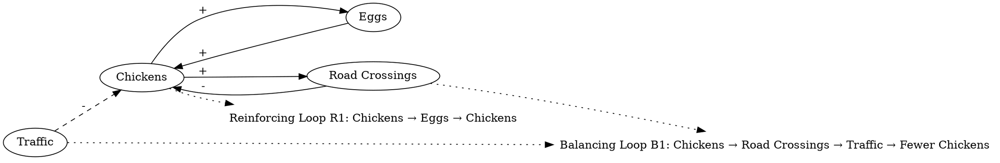

More chickens lay more eggs, which hatch and add to the chicken population. The more chickens, the more road crossing they will attempt. If there is any traffic, more road crossings will lead to fewer chickens. 
### Step 1: Identify Primary Variables  
The key entities or components in the text are:  

1. **Chickens**  
2. **Eggs**  
3. **Road Crossings**  
4. **Traffic**  

---

### Step 2: Break Down Sub-Factors  

For each primary variable, here are the nuanced sub-factors:  

1. **Chickens**  
   - Chicken population size  
   - Rate of chicken population growth (due to hatching eggs)  
   - Chickens attempting to cross roads  

2. **Eggs**  
   - Number of eggs laid  
   - Rate of eggs hatching  

3. **Road Crossings**  
   - Frequency of road crossing attempts by chickens  
   - Success rate of road crossings  

4. **Traffic**  
   - Presence of traffic  
   - Severity or density of traffic impacting road crossings  

---

### Causal Relationships  

1. **Chickens → Eggs**  
   - More chickens lay more eggs.  

2. **Eggs → Chickens**  
   - More eggs hatch, increasing the chicken population.  

3. **Chickens → Road Crossings**  
   - A larger chicken population leads to more road crossing attempts.  

4. **Road Crossings + Traffic → Chickens**  
   - More road crossings in the presence of traffic reduce the chicken population.  

These relationships can be visualized in a Causal Loop Diagram (CLD) with reinforcing and balancing loops:  
- **Reinforcing Loop (R1)**: Chickens → Eggs → Chickens (population growth).  
- **Balancing Loop (B1)**: Chickens → Road Crossings → Traffic → Fewer Chickens (population reduction due to road crossing fatalities).  ### Step 3: Map Causal Relationships  

1. **Chickens --> (+) Eggs**  
   **Reasoning:** An increase in the chicken population leads to more chickens laying eggs, which increases the total number of eggs.  
   **Relevant Text:** "More chickens lay more eggs..."  

2. **Eggs --> (+) Chickens**  
   **Reasoning:** Eggs hatch into chickens, which directly increases the chicken population.  
   **Relevant Text:** "...which hatch and add to the chicken population."  

3. **Chickens --> (+) Road Crossings**  
   **Reasoning:** A larger chicken population results in more chickens attempting to cross roads.  
   **Relevant Text:** "The more chickens, the more road crossing they will attempt."  

4. **Road Crossings --> (-) Chickens**  
   **Reasoning:** Increased road crossings, especially in the presence of traffic, lead to a reduction in the chicken population due to fatalities.  
   **Relevant Text:** "If there is any traffic, more road crossings will lead to fewer chickens."  

5. **Traffic --> (-) Chickens (via Road Crossings)**  
   **Reasoning:** The presence of traffic exacerbates the danger of road crossings, further reducing the chicken population.  
   **Relevant Text:** "If there is any traffic, more road crossings will lead to fewer chickens."  

---

### Summary of Relationships  

- **Reinforcing Loop (R1):** Chickens → (+) Eggs → (+) Chickens  
- **Balancing Loop (B1):** Chickens → (+) Road Crossings → (-) Chickens (via Traffic)  

These loops illustrate the dynamics of chicken population growth and reduction, influenced by both natural reproduction and external hazards like traffic.### Feedback Loops  

1. **Loop R1 (Reinforcing): Chicken Population Growth**  
   - **Path:** Chickens → (+) Eggs → (+) Chickens  
   - **Explanation:** This reinforcing loop demonstrates population growth. As the number of chickens increases, more eggs are laid, which hatch into more chickens, further amplifying the population.  

2. **Loop B1 (Balancing): Road Crossings and Traffic Impact**  
   - **Path:** Chickens → (+) Road Crossings → (-) Chickens (via Traffic)  
   - **Explanation:** This balancing loop stabilizes or reduces the chicken population. As the chicken population grows, more road crossings occur. In the presence of traffic, these crossings lead to fatalities, reducing the chicken population.  

---

### Delays  

1. **Egg Hatching Delay:**  
   - There is a time delay between eggs being laid and hatching into chickens. This slows the reinforcing loop (R1), as the population growth effect is not immediate.  

2. **Traffic Impact Delay:**  
   - There may be a delay between increased road crossings and the observed reduction in the chicken population due to traffic-related fatalities. This could weaken the immediate balancing effect of loop B1.  

---

### Suggestions  

1. **Reduce Road Crossing Fatalities:**  
   - Implement barriers or designated crossing zones to minimize chicken fatalities caused by traffic. This would weaken the balancing loop (B1) and allow the chicken population to grow more sustainably.  

2. **Control Population Growth:**  
   - Introduce measures to regulate the chicken population, such as limiting egg production or managing hatching rates, to prevent overpopulation and excessive road crossings.  

3. **Monitor Traffic Patterns:**  
   - Analyze traffic density and timing to identify high-risk periods for road crossings. Implement traffic calming measures or temporary road closures during peak crossing times to protect the chicken population.  

By addressing these factors, the system can be managed to balance population growth with safety, ensuring a more stable chicken population.

---

Here is the Graphviz script to visualize the causal relationships and feedback loops described:

### Explanation of the Script:
1. **Nodes and Relationships**:
   - The nodes represent the key variables: "Chickens," "Eggs," "Road Crossings," and "Traffic."
   - Arrows between nodes represent causal relationships, labeled with their respective signs (+ or -).
   - A dashed arrow from "Traffic" to "Chickens" indicates an indirect effect via "Road Crossings."

2. **Feedback Loops**:
   - **Reinforcing Loop R1**: This loop captures the positive feedback between "Chickens" and "Eggs."
   - **Balancing Loop B1**: This loop captures the balancing effect of "Road Crossings" and "Traffic" on the chicken population.

3. **Styling**:
   - Feedback loops are labeled as plaintext nodes and connected to relevant nodes with dotted lines for clarity.

This script can be rendered using Graphviz to produce a clear visualization of the causal relationships and feedback loops in the system.
