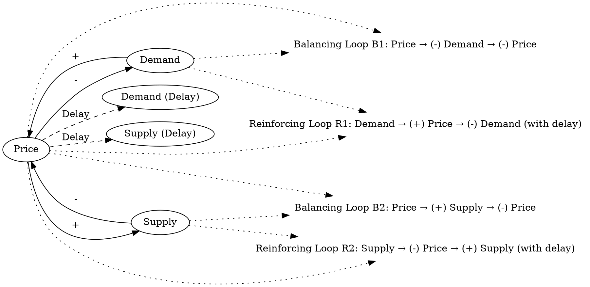

a change in price changes demand and supply with some delay, and demand and supply in turn influence price.
### Step 1: Identify Primary Variables  
The key entities or components in the text are:  

1. **Price**  
2. **Demand**  
3. **Supply**  
4. **Delay**  

---

### Step 2: Break Down Sub-Factors  

For each primary variable, here are the nuanced sub-factors:  

1. **Price**  
   - Current price level  
   - Changes in price over time  
   - Dependency on demand and supply  

2. **Demand**  
   - Quantity of goods or services desired by consumers  
   - Sensitivity of demand to price changes (price elasticity of demand)  
   - Time delay in demand response to price changes  

3. **Supply**  
   - Quantity of goods or services available in the market  
   - Sensitivity of supply to price changes (price elasticity of supply)  
   - Time delay in supply response to price changes  

4. **Delay**  
   - Time lag between a change in price and its effect on demand  
   - Time lag between a change in price and its effect on supply  

---

### Causal Relationships (for CLD Construction)  

1. **Price → Demand**: A change in price influences demand (e.g., higher prices may reduce demand).  
2. **Price → Supply**: A change in price influences supply (e.g., higher prices may incentivize increased supply).  
3. **Demand → Price**: Changes in demand influence price (e.g., higher demand may drive prices up).  
4. **Supply → Price**: Changes in supply influence price (e.g., higher supply may drive prices down).  
5. **Delay**: Both demand and supply responses to price changes occur with some delay.  

This forms a feedback loop where price, demand, and supply continuously influence each other over time.### Step 3: Map Causal Relationships  

1. **Price --> (-) Demand**  
   **Reasoning:** An increase in price typically reduces demand due to the inverse relationship between price and quantity demanded (law of demand).  
   **Relevant Text:** "A change in price changes demand..."  

2. **Price --> (+) Supply**  
   **Reasoning:** An increase in price incentivizes producers to supply more goods or services, as higher prices often lead to higher potential profits.  
   **Relevant Text:** "A change in price changes... supply..."  

3. **Demand --> (+) Price**  
   **Reasoning:** Higher demand for a product or service can drive prices up, as consumers are willing to pay more for scarce goods.  
   **Relevant Text:** "...demand and supply in turn influence price."  

4. **Supply --> (-) Price**  
   **Reasoning:** An increase in supply can lead to a decrease in price, as greater availability of goods or services reduces scarcity and competition among buyers.  
   **Relevant Text:** "...demand and supply in turn influence price."  

5. **Price --> (Delay) Demand**  
   **Reasoning:** The effect of a price change on demand is not immediate; consumers may take time to adjust their purchasing behavior based on the new price.  
   **Relevant Text:** "...with some delay..."  

6. **Price --> (Delay) Supply**  
   **Reasoning:** The effect of a price change on supply is not immediate; producers may need time to adjust production levels or bring additional goods to market.  
   **Relevant Text:** "...with some delay..."  

---

### Summary of Relationships  

1. **Price --> (-) Demand**  
2. **Price --> (+) Supply**  
3. **Demand --> (+) Price**  
4. **Supply --> (-) Price**  
5. **Price --> (Delay) Demand**  
6. **Price --> (Delay) Supply**  

These relationships form a feedback loop where price, demand, and supply continuously interact, with delays influencing the timing of adjustments.### Feedback Loops  

**Loop B1 (Balancing): Price-Demand-Supply Stabilization**  
- **Path:** Price → (-) Demand → (-) Price  
- **Explanation:** This balancing loop demonstrates how an increase in price reduces demand, which in turn lowers price. This stabilizing effect prevents runaway price increases or decreases.  

**Loop B2 (Balancing): Price-Supply-Demand Stabilization**  
- **Path:** Price → (+) Supply → (-) Price  
- **Explanation:** This balancing loop shows how an increase in price incentivizes higher supply, which then reduces price. This loop helps stabilize the market by preventing excessive price increases.  

**Loop R1 (Reinforcing): Demand-Driven Price Increase**  
- **Path:** Demand → (+) Price → (-) Demand (with delay)  
- **Explanation:** This reinforcing loop highlights how increased demand drives up prices, which may take time to reduce demand due to delays in consumer response. This can lead to short-term price surges.  

**Loop R2 (Reinforcing): Supply-Driven Price Adjustment**  
- **Path:** Supply → (-) Price → (+) Supply (with delay)  
- **Explanation:** This reinforcing loop illustrates how increased supply reduces prices, which may take time to incentivize further supply adjustments. This can lead to short-term price drops.  

---

### Delays  

1. **Price → Demand (Delay):**  
   - Consumers take time to adjust their purchasing behavior in response to price changes. This delay can cause temporary mismatches between demand and price, leading to short-term market imbalances.  

2. **Price → Supply (Delay):**  
   - Producers require time to adjust production levels or bring additional goods to market in response to price changes. This delay can result in temporary shortages or surpluses.  

---

### Suggestions  

1. **Reduce Demand Response Delays:**  
   - Implement real-time pricing information systems to help consumers quickly adapt to price changes. This could stabilize demand more rapidly.  

2. **Improve Supply Chain Flexibility:**  
   - Invest in flexible production systems and just-in-time inventory management to reduce the time lag in supply adjustments.  

3. **Monitor and Predict Market Trends:**  
   - Use predictive analytics to anticipate demand and supply changes, allowing for proactive price adjustments and capacity planning.  

4. **Introduce Price Stabilization Policies:**  
   - Implement measures such as price caps or floors to prevent extreme price fluctuations caused by delays in demand and supply responses.  

By addressing delays and improving market responsiveness, these interventions can help stabilize the feedback loops and create a more balanced system.

---

Here is the Graphviz script to visualize the causal relationships and feedback loops described:

### Explanation of the Script:
1. **Nodes and Relationships**:
   - The nodes represent the key variables: `Price`, `Demand`, `Supply`, and their delayed responses (`Demand (Delay)` and `Supply (Delay)`).
   - Arrows between nodes represent causal relationships, labeled with the sign of the relationship (`+` or `-`) or with "Delay" for time-lagged effects.

2. **Feedback Loops**:
   - Each feedback loop is labeled as either balancing (B) or reinforcing (R) and described in plain text.
   - Dotted lines connect the loops to the relevant nodes to indicate their involvement in the feedback process.

3. **Delays**:
   - Dashed arrows represent the delays in the system, showing that the effects of price changes on demand and supply are not immediate.

This script can be rendered using Graphviz to produce a clear visualization of the causal relationships and feedback loops in the system.
