The United States responds to a perceived Threat to Americans by increasing U.S. military activities, which increases the Perceived Aggressiveness of the U.S., which leads to more Terrorist Recruits, which eventually leads to more Terrorist Activities and increases the Threat to the United States, which leads to more U.S. military activities, which increases the Terrorist Recruits.
### Step 1: Identify Primary Variables  
The key entities or components in the text are:  

1. **Threat to Americans**  
2. **U.S. Military Activities**  
3. **Perceived Aggressiveness of the U.S.**  
4. **Terrorist Recruits**  
5. **Terrorist Activities**  

---

### Step 2: Break Down Sub-Factors  

For each primary variable, here are the nuanced sub-factors:  

1. **Threat to Americans**  
   - Perceived threat level to American citizens  
   - Actual threat level based on terrorist activities  

2. **U.S. Military Activities**  
   - Frequency of military operations  
   - Scale and intensity of military actions  

3. **Perceived Aggressiveness of the U.S.**  
   - Global perception of U.S. military actions as aggressive  
   - Sensitivity of perception to the scale of U.S. military activities  

4. **Terrorist Recruits**  
   - Number of individuals recruited by terrorist organizations  
   - Recruitment rate influenced by perceived U.S. aggressiveness  

5. **Terrorist Activities**  
   - Frequency of terrorist attacks  
   - Severity and scale of terrorist operations  

---

### Causal Relationships for CLD  

1. **Threat to Americans → U.S. Military Activities**  
   - A higher perceived or actual threat to Americans leads to an increase in U.S. military activities.  

2. **U.S. Military Activities → Perceived Aggressiveness of the U.S.**  
   - Increased U.S. military activities heighten the perception of U.S. aggressiveness.  

3. **Perceived Aggressiveness of the U.S. → Terrorist Recruits**  
   - A more aggressive perception of the U.S. leads to an increase in terrorist recruits.  

4. **Terrorist Recruits → Terrorist Activities**  
   - More terrorist recruits result in an increase in terrorist activities.  

5. **Terrorist Activities → Threat to Americans**  
   - Increased terrorist activities raise the threat level to Americans.  

6. **Threat to Americans → U.S. Military Activities (Reinforcing Loop)**  
   - The cycle repeats as the threat to Americans leads to further U.S. military activities, perpetuating the loop.  

---

### Feedback Loops  

1. **Reinforcing Loop (R1): Threat to Americans → U.S. Military Activities → Perceived Aggressiveness of the U.S. → Terrorist Recruits → Terrorist Activities → Threat to Americans**  
   - This is a self-reinforcing loop where each variable amplifies the next, leading to a continuous escalation of the cycle.  

This structure can now be used to construct a Causal Loop Diagram (CLD). Let me know if you'd like further assistance!### Step 3: Map Causal Relationships  

Below are the causal relationships identified from the text, along with reasoning and relevant text excerpts:

---

1. **Threat to Americans → (+) U.S. Military Activities**  
   **Reasoning:** A perceived or actual increase in the threat to Americans prompts the U.S. to escalate military activities as a response to mitigate the threat.  
   **Relevant Text:** "The United States responds to a perceived Threat to Americans by increasing U.S. military activities."

---

2. **U.S. Military Activities → (+) Perceived Aggressiveness of the U.S.**  
   **Reasoning:** An increase in U.S. military activities is likely to be perceived as aggressive by others, particularly those affected by these actions.  
   **Relevant Text:** "...increasing U.S. military activities, which increases the Perceived Aggressiveness of the U.S."

---

3. **Perceived Aggressiveness of the U.S. → (+) Terrorist Recruits**  
   **Reasoning:** A heightened perception of U.S. aggressiveness can fuel anti-U.S. sentiment, making it easier for terrorist organizations to recruit individuals.  
   **Relevant Text:** "...which increases the Perceived Aggressiveness of the U.S., which leads to more Terrorist Recruits..."

---

4. **Terrorist Recruits → (+) Terrorist Activities**  
   **Reasoning:** An increase in the number of terrorist recruits provides more resources (e.g., manpower) for terrorist organizations to carry out attacks, leading to more terrorist activities.  
   **Relevant Text:** "...which leads to more Terrorist Recruits, which eventually leads to more Terrorist Activities..."

---

5. **Terrorist Activities → (+) Threat to Americans**  
   **Reasoning:** An increase in terrorist activities directly raises the threat level to Americans, either through actual attacks or the perception of increased danger.  
   **Relevant Text:** "...which eventually leads to more Terrorist Activities and increases the Threat to the United States..."

---

6. **U.S. Military Activities → (+) Terrorist Recruits**  
   **Reasoning:** Increased U.S. military activities can directly contribute to terrorist recruitment by creating grievances or resentment among affected populations.  
   **Relevant Text:** "...which leads to more U.S. military activities, which increases the Terrorist Recruits."

---

### Feedback Loop  

**Reinforcing Loop (R1):**  
**Threat to Americans → (+) U.S. Military Activities → (+) Perceived Aggressiveness of the U.S. → (+) Terrorist Recruits → (+) Terrorist Activities → (+) Threat to Americans**  

**Reasoning:** This is a self-reinforcing loop where each variable amplifies the next, creating a cycle of escalation. As the threat to Americans increases, it triggers more U.S. military activities, which heightens the perception of U.S. aggressiveness. This, in turn, fuels terrorist recruitment, leading to more terrorist activities and further increasing the threat to Americans.  

**Relevant Text:** The entire passage describes this reinforcing loop:  
"The United States responds to a perceived Threat to Americans by increasing U.S. military activities, which increases the Perceived Aggressiveness of the U.S., which leads to more Terrorist Recruits, which eventually leads to more Terrorist Activities and increases the Threat to the United States, which leads to more U.S. military activities, which increases the Terrorist Recruits."  

---

This analysis provides a clear structure for constructing a Causal Loop Diagram (CLD) that captures the dynamics described in the text. Let me know if you'd like further clarification or assistance!### Feedback Loops  

1. **Reinforcing Loop (R1): Escalation of Threat and Military Response**  
   **Path:** Threat to Americans → (+) U.S. Military Activities → (+) Perceived Aggressiveness of the U.S. → (+) Terrorist Recruits → (+) Terrorist Activities → (+) Threat to Americans  
   **Explanation:** This loop demonstrates a self-reinforcing cycle where an increase in the threat to Americans prompts more U.S. military activities. These activities heighten the perception of U.S. aggressiveness, which fuels terrorist recruitment. More recruits lead to increased terrorist activities, further escalating the threat to Americans. This cycle perpetuates itself, leading to continuous escalation.  

---

### Delays  

1. **Recruitment and Radicalization Delay:**  
   - There may be a time delay between the perception of U.S. aggressiveness and the actual recruitment and radicalization of individuals into terrorist organizations. This delay can slow the immediate impact of U.S. military activities on terrorist activities.  

2. **Operational Delay in Terrorist Activities:**  
   - After recruitment, there may be a delay before recruits are trained and operational, which could temporarily mask the impact of increased recruitment on terrorist activities.  

3. **Response Delay in U.S. Military Activities:**  
   - The U.S. response to perceived threats may involve decision-making and logistical delays, which could affect the timing of military actions and their subsequent impact on the system.  

---

### Suggestions  

1. **Reduce Perceived Aggressiveness:**  
   - Implement diplomatic strategies and community engagement programs to counteract the perception of U.S. aggressiveness. This could reduce the recruitment rate of terrorist organizations.  

2. **Focus on Non-Military Interventions:**  
   - Invest in non-military solutions, such as economic aid, education, and conflict resolution programs, to address the root causes of terrorism and reduce recruitment.  

3. **Improve Intelligence and Targeted Actions:**  
   - Enhance intelligence capabilities to ensure that military actions are precise and minimize collateral damage, which could otherwise fuel anti-U.S. sentiment and recruitment.  

4. **Address Recruitment Drivers:**  
   - Work with local governments and communities to address grievances and socio-economic conditions that make individuals susceptible to terrorist recruitment.  

5. **Monitor and Mitigate Delays:**  
   - Use predictive models to anticipate recruitment and operational delays, allowing for proactive measures to disrupt the escalation cycle before it intensifies.  

By addressing the reinforcing loop and mitigating delays, these interventions aim to break the cycle of escalation and stabilize the system.

---

Here is the Graphviz script for the Causal Loop Diagram (CLD) based on the analysis:

```dot
digraph CausalLoopDiagram {
    rankdir=LR; // Left-to-right layout for better readability

    // Define nodes and relationships
    "Threat to Americans" -> "U.S. Military Activities" [label="+"];
    "U.S. Military Activities" -> "Perceived Aggressiveness of the U.S." [label="+"];
    "Perceived Aggressiveness of the U.S." -> "Terrorist Recruits" [label="+"];
    "Terrorist Recruits" -> "Terrorist Activities" [label="+"];
    "Terrorist Activities" -> "Threat to Americans" [label="+"];

    // Additional direct relationship
    "U.S. Military Activities" -> "Terrorist Recruits" [label="+"];

    // Label feedback loop
    "Loop R1" [shape=plaintext, label="Reinforcing Loop R1"];
    "Threat to Americans" -> "Loop R1" [style=dotted];
    "Loop R1" -> "U.S. Military Activities" [style=dotted];
}
```

### Explanation of the Script:
1. **Nodes and Relationships**:
   - Each variable (e.g., "Threat to Americans", "U.S. Military Activities") is represented as a node.
   - Arrows between nodes represent causal relationships, labeled with the sign of the relationship (`+` for positive feedback).

2. **Feedback Loop**:
   - The reinforcing loop (R1) is explicitly labeled as "Reinforcing Loop R1".
   - Dotted arrows connect the loop label to the relevant nodes to visually indicate the feedback loop.

3. **Additional Relationship**:
   - The direct relationship between "U.S. Military Activities" and "Terrorist Recruits" is included to capture the full dynamics described in the text.

This script can be rendered using Graphviz to produce a clear visualization of the causal relationships and the reinforcing feedback loop. Let me know if you need further assistance!
