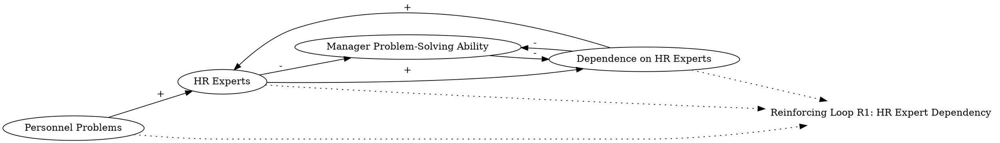

Busy managers are often tempted to bring in human resource specialists to sort out personnel problems. The HR expert may solve the problem, but the manager's ability to solve other related problems has not improved. Eventually, other personnel issues will arise and the manager will be just as dependent on the HR expert as before. The very fact that the outside expert was used successfully before makes it even easier to turn to expert again.
### Step 1: Identify Primary Variables  
The key entities or components in the text are:  

1. **Managers**  
2. **Personnel Problems**  
3. **HR Experts**  
4. **Manager Problem-Solving Ability**  
5. **Dependence on HR Experts**  

---

### Step 2: Break Down Sub-Factors  

For each primary variable, here are the nuanced sub-factors:  

1. **Managers**  
   - Manager's role in addressing personnel problems  
   - Manager's reliance on external resources  

2. **Personnel Problems**  
   - Frequency of personnel issues arising  
   - Complexity of personnel problems  

3. **HR Experts**  
   - HR expert's ability to solve personnel problems  
   - Frequency of HR expert involvement  

4. **Manager Problem-Solving Ability**  
   - Manager's skill in resolving personnel issues  
   - Impact of HR expert involvement on manager's learning  

5. **Dependence on HR Experts**  
   - Manager's reliance on HR experts for problem resolution  
   - Reinforcement of dependence due to past success with HR experts  

---

### Causal Relationships to Consider for CLD  
- **Managers → Personnel Problems**: Managers may face recurring personnel problems.  
- **Personnel Problems → HR Experts**: HR experts are brought in to solve personnel problems.  
- **HR Experts → Manager Problem-Solving Ability**: HR expert involvement prevents managers from improving their own problem-solving skills.  
- **Manager Problem-Solving Ability → Dependence on HR Experts**: Lack of improvement in problem-solving skills increases dependence on HR experts.  
- **Dependence on HR Experts → HR Experts**: Successful use of HR experts reinforces the tendency to rely on them in the future.  
- **Dependence on HR Experts → Managers**: Increased dependence reduces the manager's autonomy in handling personnel issues.  

This feedback loop highlights a reinforcing cycle where reliance on HR experts perpetuates itself, preventing managers from developing their own problem-solving capabilities.### Step 3: Map Causal Relationships  

1. **Personnel Problems --> (+) HR Experts**  
   **Reasoning:** When personnel problems arise, managers are tempted to bring in HR experts to resolve them. This increases the involvement of HR experts.  
   **Relevant Text:** "Busy managers are often tempted to bring in human resource specialists to sort out personnel problems."  

2. **HR Experts --> (-) Manager Problem-Solving Ability**  
   **Reasoning:** When HR experts solve personnel problems, managers do not gain the experience or skills needed to address similar issues in the future, thereby reducing their problem-solving ability.  
   **Relevant Text:** "The HR expert may solve the problem, but the manager's ability to solve other related problems has not improved."  

3. **Manager Problem-Solving Ability --> (-) Dependence on HR Experts**  
   **Reasoning:** If managers improve their problem-solving ability, they would rely less on HR experts. Conversely, a lack of improvement in problem-solving ability increases dependence on HR experts.  
   **Relevant Text:** "The manager will be just as dependent on the HR expert as before."  

4. **Dependence on HR Experts --> (+) HR Experts**  
   **Reasoning:** The successful use of HR experts in the past makes it easier for managers to turn to them again, reinforcing their involvement.  
   **Relevant Text:** "The very fact that the outside expert was used successfully before makes it even easier to turn to expert again."  

5. **HR Experts --> (+) Dependence on HR Experts**  
   **Reasoning:** The more HR experts are used to solve problems, the more managers become reliant on them for future issues, creating a reinforcing loop.  
   **Relevant Text:** "Eventually, other personnel issues will arise and the manager will be just as dependent on the HR expert as before."  

6. **Dependence on HR Experts --> (-) Manager Problem-Solving Ability**  
   **Reasoning:** Increased dependence on HR experts reduces the opportunities for managers to develop their own problem-solving skills, further weakening their ability.  
   **Relevant Text:** "The manager's ability to solve other related problems has not improved."  

---

### Summary of Relationships  

1. **Personnel Problems --> (+) HR Experts**  
2. **HR Experts --> (-) Manager Problem-Solving Ability**  
3. **Manager Problem-Solving Ability --> (-) Dependence on HR Experts**  
4. **Dependence on HR Experts --> (+) HR Experts**  
5. **HR Experts --> (+) Dependence on HR Experts**  
6. **Dependence on HR Experts --> (-) Manager Problem-Solving Ability**  

This forms a reinforcing feedback loop where reliance on HR experts perpetuates itself, inhibiting the development of managers' problem-solving skills and increasing their dependence on external expertise.### Feedback Loops

**Loop R1 (Reinforcing): HR Expert Dependency**  
- **Path:** Personnel Problems → (+) HR Experts → (-) Manager Problem-Solving Ability → (+) Dependence on HR Experts → (+) HR Experts  
- **Explanation:** This reinforcing loop demonstrates how reliance on HR experts perpetuates itself. When personnel problems arise, HR experts are brought in to resolve them. However, this reduces the manager's opportunity to develop problem-solving skills, increasing their dependence on HR experts. The successful use of HR experts in the past further reinforces this dependency, creating a cycle of reliance.

---

### Delays

1. **Learning Delay:**  
   - There is a delay in the manager's ability to develop problem-solving skills because they are not actively solving personnel problems themselves. This delay weakens the potential for breaking the reinforcing loop.  

2. **Problem Recurrence Delay:**  
   - Personnel problems may not arise immediately after the resolution of a previous issue, creating a time gap that masks the long-term consequences of relying on HR experts.  

---

### Suggestions

1. **Encourage Managerial Skill Development:**  
   - Implement training programs or mentorship opportunities to enhance managers' problem-solving abilities. This could reduce their reliance on HR experts over time.  

2. **Limit HR Expert Involvement:**  
   - Establish guidelines for when HR experts should be involved, ensuring that managers handle less complex personnel problems themselves to build their skills.  

3. **Feedback Mechanism for Managers:**  
   - Create a system where managers receive constructive feedback on their problem-solving efforts, helping them improve and gain confidence in addressing personnel issues.  

4. **Monitor and Reduce Dependency:**  
   - Track the frequency of HR expert involvement and set targets to gradually reduce reliance on external specialists.  

By addressing the reinforcing loop and introducing interventions to improve managerial capabilities, the system can shift toward a more balanced and sustainable approach to personnel problem-solving.

---

Here is the Graphviz script to visualize the causal relationships and the reinforcing feedback loop (R1) described in the analysis:

### Explanation of the Script:
1. **Nodes and Relationships**:
   - Each causal relationship is represented as a directed edge between nodes, with a label indicating the sign of the relationship (`+` for positive, `-` for negative).
   - For example, `"Personnel Problems" -> "HR Experts" [label="+"];` indicates that an increase in personnel problems leads to an increase in the involvement of HR experts.

2. **Feedback Loop**:
   - The reinforcing loop (R1) is labeled as `"Loop R1"` and connected to relevant nodes with dotted lines for clarity.
   - The loop demonstrates how reliance on HR experts perpetuates itself, as described in the analysis.

3. **Layout**:
   - The `rankdir=LR` directive ensures a left-to-right layout, making the diagram easier to read.

This script can be rendered using Graphviz to produce a clear visualization of the causal loop diagram and the reinforcing feedback loop.
