Alcohol drinking lifts some tension, at least for a while. It relieves the problem symptom. If it didn’t, people wouldn’t drink. But it also gives the person the feeling of having solved the problem, thereby diverting attention from the fundamental problem—controlling the workload. Failing to take a stand may well cause the workload to gradually increase further, since most of us are continually besieged by more demand on our time than we can possibly respond to. Over time, the workload continues to build, the stress returns, and the pressure to drink increases.
### Step 1: Identify Primary Variables  
The key entities or components in the text are:  

1. **Alcohol Drinking**  
2. **Tension/Stress**  
3. **Problem Symptom Relief**  
4. **Workload**  
5. **Pressure to Drink**  
6. **Fundamental Problem (Controlling Workload)**  

---

### Step 2: Break Down Sub-Factors  

For each primary variable, here are the nuanced sub-factors:  

1. **Alcohol Drinking**  
   - Frequency of drinking  
   - Amount of alcohol consumed  
   - Dependency on alcohol for stress relief  

2. **Tension/Stress**  
   - Level of stress experienced  
   - Temporary reduction in stress due to alcohol  
   - Stress caused by increasing workload  

3. **Problem Symptom Relief**  
   - Temporary relief of tension/stress  
   - Perception of having solved the problem  

4. **Workload**  
   - Amount of work or demands on time  
   - Gradual increase in workload over time  
   - Lack of control over workload  

5. **Pressure to Drink**  
   - Emotional or psychological pressure to drink  
   - Dependency on alcohol as a coping mechanism  
   - Increase in pressure due to unresolved workload issues  

6. **Fundamental Problem (Controlling Workload)**  
   - Inability to manage or reduce workload  
   - Lack of attention to addressing the root cause of stress  
   - Gradual worsening of the workload problem  

---

### Causal Relationships for a Causal Loop Diagram (CLD)  

1. **Alcohol Drinking → Temporary Relief of Tension/Stress**  
   - Drinking reduces stress temporarily, creating a reinforcing loop.  

2. **Temporary Relief of Tension/Stress → Perception of Problem Solved**  
   - The temporary relief gives the illusion that the problem is resolved, diverting attention from the root cause.  

3. **Perception of Problem Solved → Lack of Attention to Workload Control**  
   - Believing the problem is solved reduces efforts to address the fundamental issue of workload control.  

4. **Lack of Attention to Workload Control → Gradual Increase in Workload**  
   - Without addressing the root cause, the workload continues to grow over time.  

5. **Gradual Increase in Workload → Increased Stress**  
   - As the workload builds, stress levels rise again.  

6. **Increased Stress → Pressure to Drink**  
   - Rising stress increases the pressure to drink as a coping mechanism.  

7. **Pressure to Drink → Alcohol Drinking**  
   - The pressure to drink leads to more alcohol consumption, completing the reinforcing loop.  

---

### Feedback Loops  

1. **Reinforcing Loop (R1): Stress Relief and Drinking**  
   - Alcohol Drinking → Temporary Relief of Tension/Stress → Perception of Problem Solved → Lack of Attention to Workload Control → Gradual Increase in Workload → Increased Stress → Pressure to Drink → Alcohol Drinking  

This loop highlights how alcohol drinking temporarily relieves stress but ultimately exacerbates the problem by diverting attention from the root cause (workload control).  

2. **Balancing Loop (B1): Workload Management (Hypothetical)**  
   - If the fundamental problem of workload control is addressed, it could break the reinforcing loop by reducing workload and stress, thereby decreasing the pressure to drink.  

### Causal Relationships for a Causal Loop Diagram (CLD)

1. **Alcohol Drinking --> (+) Temporary Relief of Tension/Stress**  
   **Reasoning:** Alcohol consumption temporarily reduces tension or stress, providing immediate symptom relief.  
   **Relevant Text:** "Alcohol drinking lifts some tension, at least for a while. It relieves the problem symptom."  

2. **Temporary Relief of Tension/Stress --> (+) Perception of Problem Solved**  
   **Reasoning:** The temporary relief from stress creates the illusion that the underlying problem has been resolved, even though it hasn’t.  
   **Relevant Text:** "But it also gives the person the feeling of having solved the problem, thereby diverting attention from the fundamental problem—controlling the workload."  

3. **Perception of Problem Solved --> (-) Attention to Workload Control**  
   **Reasoning:** Believing the problem is solved reduces the motivation to address the root cause of stress, which is controlling the workload.  
   **Relevant Text:** "But it also gives the person the feeling of having solved the problem, thereby diverting attention from the fundamental problem—controlling the workload."  

4. **Attention to Workload Control --> (-) Gradual Increase in Workload**  
   **Reasoning:** A lack of attention to managing workload allows it to grow unchecked over time.  
   **Relevant Text:** "Failing to take a stand may well cause the workload to gradually increase further, since most of us are continually besieged by more demand on our time than we can possibly respond to."  

5. **Gradual Increase in Workload --> (+) Increased Stress**  
   **Reasoning:** As workload increases, it leads to higher levels of stress.  
   **Relevant Text:** "Over time, the workload continues to build, the stress returns..."  

6. **Increased Stress --> (+) Pressure to Drink**  
   **Reasoning:** Rising stress levels increase the psychological or emotional pressure to drink as a coping mechanism.  
   **Relevant Text:** "...the stress returns, and the pressure to drink increases."  

7. **Pressure to Drink --> (+) Alcohol Drinking**  
   **Reasoning:** The pressure to drink leads to more alcohol consumption, perpetuating the cycle.  
   **Relevant Text:** "...the stress returns, and the pressure to drink increases."  

---

### Feedback Loops

1. **Reinforcing Loop (R1): Stress Relief and Drinking**  
   - **Causal Chain:** Alcohol Drinking → (+) Temporary Relief of Tension/Stress → (+) Perception of Problem Solved → (-) Attention to Workload Control → (+) Gradual Increase in Workload → (+) Increased Stress → (+) Pressure to Drink → (+) Alcohol Drinking  
   **Explanation:** This loop demonstrates how alcohol drinking temporarily relieves stress but ultimately worsens the problem by diverting attention from workload control, leading to increased stress and more drinking.  

2. **Balancing Loop (B1): Workload Management (Hypothetical)**  
   - **Causal Chain:** Attention to Workload Control → (-) Gradual Increase in Workload → (-) Increased Stress → (-) Pressure to Drink → (-) Alcohol Drinking  
   **Explanation:** If attention is redirected to managing workload, it could reduce workload and stress, breaking the reinforcing loop and decreasing the reliance on alcohol.  

### Feedback Loops

1. **Reinforcing Loop (R1): Stress Relief and Drinking**  
   - **Causal Chain:** Alcohol Drinking → (+) Temporary Relief of Tension/Stress → (+) Perception of Problem Solved → (-) Attention to Workload Control → (+) Gradual Increase in Workload → (+) Increased Stress → (+) Pressure to Drink → (+) Alcohol Drinking  
   - **Explanation:** This reinforcing loop illustrates how alcohol drinking provides temporary stress relief, creating the illusion of solving the problem. However, this diverts attention from addressing the root cause (workload control), leading to a gradual increase in workload and stress, which further fuels the pressure to drink.  

2. **Balancing Loop (B1): Workload Management (Hypothetical)**  
   - **Causal Chain:** Attention to Workload Control → (-) Gradual Increase in Workload → (-) Increased Stress → (-) Pressure to Drink → (-) Alcohol Drinking  
   - **Explanation:** This hypothetical balancing loop suggests that if attention is redirected to managing workload, it could reduce workload and stress, thereby decreasing the pressure to drink and breaking the reinforcing loop.  

---

### Delays  

1. **Stress Relief Delay:**  
   - There is a delay between drinking alcohol and the temporary relief of stress. This delay may create a false sense of immediate effectiveness, reinforcing the behavior.  

2. **Workload Increase Delay:**  
   - The gradual increase in workload occurs over time, making it harder to immediately perceive the negative consequences of neglecting workload control.  

3. **Stress Build-Up Delay:**  
   - Stress levels may not rise immediately as workload increases, creating a lag in recognizing the need to address the root cause.  

---

### Suggestions  

1. **Address the Root Cause (Workload Control):**  
   - Implement time management strategies, prioritize tasks, or delegate responsibilities to reduce workload and prevent stress from building up.  

2. **Promote Alternative Stress-Relief Mechanisms:**  
   - Encourage healthier coping mechanisms, such as exercise, meditation, or therapy, to reduce reliance on alcohol for stress relief.  

3. **Raise Awareness of the Reinforcing Loop:**  
   - Educate individuals about the cyclical nature of alcohol consumption and stress to help them recognize the need to address the root cause rather than relying on temporary symptom relief.  

4. **Introduce Deliberate Interventions:**  
   - Set up regular check-ins or accountability systems to monitor workload and stress levels, ensuring that the fundamental problem is addressed before it escalates.  

By breaking the reinforcing loop and strengthening the balancing loop, these interventions can help stabilize the system and reduce dependency on alcohol as a coping mechanism.

---

Here is the Graphviz script for the causal loop diagram based on the relationships and feedback loops identified:

```dot
digraph CausalLoopDiagram {
    rankdir=LR; // Left-to-right layout for better readability

    // Define nodes and relationships
    "Alcohol Drinking" -> "Temporary Relief of Tension/Stress" [label="+"];
    "Temporary Relief of Tension/Stress" -> "Perception of Problem Solved" [label="+"];
    "Perception of Problem Solved" -> "Attention to Workload Control" [label="-"];
    "Attention to Workload Control" -> "Gradual Increase in Workload" [label="-"];
    "Gradual Increase in Workload" -> "Increased Stress" [label="+"];
    "Increased Stress" -> "Pressure to Drink" [label="+"];
    "Pressure to Drink" -> "Alcohol Drinking" [label="+"];

    // Label feedback loops
    "Loop R1" [shape=plaintext, label="Reinforcing Loop R1: Stress Relief and Drinking"];
    "Alcohol Drinking" -> "Loop R1" [style=dotted];
    "Loop R1" -> "Temporary Relief of Tension/Stress" [style=dotted];

    "Loop B1" [shape=plaintext, label="Balancing Loop B1: Workload Management (Hypothetical)"];
    "Attention to Workload Control" -> "Loop B1" [style=dotted];
    "Loop B1" -> "Gradual Increase in Workload" [style=dotted];
}
```

### Explanation of the Script:
1. **Nodes and Relationships**:
   - Each variable (e.g., "Alcohol Drinking", "Temporary Relief of Tension/Stress") is represented as a node.
   - Arrows between nodes represent causal relationships, labeled with the sign of the relationship (`+` for positive, `-` for negative).

2. **Feedback Loops**:
   - **Reinforcing Loop (R1)**: This loop captures the cycle where alcohol drinking temporarily relieves stress but ultimately exacerbates the problem by increasing workload and stress, leading to more drinking.
   - **Balancing Loop (B1)**: This hypothetical loop suggests that addressing workload control could reduce stress and break the reinforcing loop.

3. **Dotted Arrows**:
   - Dotted arrows connect feedback loops to the relevant nodes, visually linking the loops to the causal relationships they describe.

This script can be rendered using Graphviz to produce a clear visualization of the causal loop diagram.
