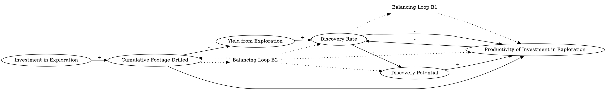

The productivity  of  investment in exploration is negatively influenced by the discovery rate. Suppose the discovery rate is increased. Then less remains to be discovered with current technology, and the productivity of further investment in exploration  is reduced. It  is assumed that the yield  from exploration is exponentially  decreasing with cumulative footage drilled, and that the footage drilled per dollar  invested is constant . The reduction in  productivity  feeds back to the discovery rate, implying a  reduction in the discovery potential  provided by any given level of exploration activity. 
### Step 1: Identify Primary Variables  
The key entities or components in the text are:  

1. **Investment in Exploration**  
2. **Discovery Rate**  
3. **Productivity of Investment in Exploration**  
4. **Cumulative Footage Drilled**  
5. **Yield from Exploration**  
6. **Footage Drilled per Dollar Invested**  
7. **Discovery Potential**  

---

### Step 2: Break Down Sub-Factors  

For each primary variable, here are the nuanced sub-factors:  

1. **Investment in Exploration**  
   - Amount of money invested in exploration activities  
   - Dependency on perceived discovery potential  

2. **Discovery Rate**  
   - Rate at which new resources are discovered  
   - Dependency on productivity of exploration  

3. **Productivity of Investment in Exploration**  
   - Efficiency of investment in yielding discoveries  
   - Negatively influenced by cumulative footage drilled  
   - Dependency on discovery rate  

4. **Cumulative Footage Drilled**  
   - Total amount of drilling conducted over time  
   - Increases with exploration activity  
   - Negatively impacts productivity of exploration  

5. **Yield from Exploration**  
   - Amount of resources discovered per unit of exploration effort  
   - Exponentially decreases with cumulative footage drilled  

6. **Footage Drilled per Dollar Invested**  
   - Efficiency of drilling in terms of cost  
   - Assumed constant in the scenario  

7. **Discovery Potential**  
   - Remaining resources available to be discovered  
   - Reduced as cumulative footage drilled increases  
   - Dependency on discovery rate and exploration activity  

---

### Causal Relationships for Causal Loop Diagram (CLD):  

1. **Discovery Rate → (-) Productivity of Investment in Exploration**  
   - As the discovery rate increases, the productivity of further investment in exploration decreases.  

2. **Cumulative Footage Drilled → (-) Productivity of Investment in Exploration**  
   - As cumulative footage drilled increases, the productivity of exploration decreases.  

3. **Productivity of Investment in Exploration → (-) Discovery Rate**  
   - Lower productivity reduces the discovery rate.  

4. **Discovery Rate → (-) Discovery Potential**  
   - Higher discovery rates reduce the remaining discovery potential.  

5. **Discovery Potential → (+) Productivity of Investment in Exploration**  
   - Higher discovery potential increases the productivity of exploration.  

6. **Investment in Exploration → (+) Cumulative Footage Drilled**  
   - More investment leads to more footage drilled.  

7. **Cumulative Footage Drilled → (-) Yield from Exploration**  
   - As cumulative footage drilled increases, the yield from exploration decreases exponentially.  

8. **Yield from Exploration → (+) Discovery Rate**  
   - Higher yield increases the discovery rate.  

---

### Feedback Loops:  

1. **Balancing Loop (B1):**  
   - **Discovery Rate → (-) Productivity of Investment in Exploration → (-) Discovery Rate**  
   - Higher discovery rates reduce productivity, which in turn reduces the discovery rate.  

2. **Balancing Loop (B2):**  
   - **Cumulative Footage Drilled → (-) Productivity of Investment in Exploration → (-) Discovery Rate → (-) Discovery Potential → (+) Productivity of Investment in Exploration**  
   - Increased cumulative footage drilled reduces productivity, which lowers the discovery rate and reduces discovery potential, eventually feeding back to improve productivity.  

These relationships and feedback loops can be used to construct a detailed Causal Loop Diagram (CLD). Let me know if you'd like further clarification or assistance!### Causal Relationships for Causal Loop Diagram (CLD)

Below is the detailed breakdown of causal relationships based on the provided text:

---

1. **Discovery Rate → (-) Productivity of Investment in Exploration**  
   **Reasoning:** As the discovery rate increases, fewer resources remain to be discovered with current technology, reducing the productivity of further investment in exploration.  
   **Relevant Text:** "Suppose the discovery rate is increased. Then less remains to be discovered with current technology, and the productivity of further investment in exploration is reduced."

---

2. **Cumulative Footage Drilled → (-) Productivity of Investment in Exploration**  
   **Reasoning:** The productivity of investment in exploration decreases as cumulative footage drilled increases, due to diminishing returns.  
   **Relevant Text:** "It is assumed that the yield from exploration is exponentially decreasing with cumulative footage drilled."

---

3. **Productivity of Investment in Exploration → (-) Discovery Rate**  
   **Reasoning:** Lower productivity of investment in exploration reduces the rate at which new resources are discovered.  
   **Relevant Text:** "The reduction in productivity feeds back to the discovery rate, implying a reduction in the discovery potential provided by any given level of exploration activity."

---

4. **Discovery Rate → (-) Discovery Potential**  
   **Reasoning:** A higher discovery rate depletes the remaining resources available for discovery, reducing the discovery potential.  
   **Relevant Text:** "Then less remains to be discovered with current technology."

---

5. **Discovery Potential → (+) Productivity of Investment in Exploration**  
   **Reasoning:** Higher discovery potential increases the productivity of investment in exploration, as more resources are available to be discovered.  
   **Relevant Text:** "The reduction in productivity feeds back to the discovery rate, implying a reduction in the discovery potential provided by any given level of exploration activity."

---

6. **Investment in Exploration → (+) Cumulative Footage Drilled**  
   **Reasoning:** Increased investment in exploration leads to more drilling activity, which increases the cumulative footage drilled.  
   **Relevant Text:** "It is assumed that the footage drilled per dollar invested is constant."

---

7. **Cumulative Footage Drilled → (-) Yield from Exploration**  
   **Reasoning:** As cumulative footage drilled increases, the yield from exploration decreases exponentially due to diminishing returns.  
   **Relevant Text:** "It is assumed that the yield from exploration is exponentially decreasing with cumulative footage drilled."

---

8. **Yield from Exploration → (+) Discovery Rate**  
   **Reasoning:** Higher yield from exploration increases the rate at which new resources are discovered.  
   **Relevant Text:** "The reduction in productivity feeds back to the discovery rate."

---

### Feedback Loops

1. **Balancing Loop (B1):**  
   - **Discovery Rate → (-) Productivity of Investment in Exploration → (-) Discovery Rate**  
   **Explanation:** A higher discovery rate reduces the productivity of investment in exploration, which in turn lowers the discovery rate.  

2. **Balancing Loop (B2):**  
   - **Cumulative Footage Drilled → (-) Productivity of Investment in Exploration → (-) Discovery Rate → (-) Discovery Potential → (+) Productivity of Investment in Exploration**  
   **Explanation:** Increased cumulative footage drilled reduces productivity, which lowers the discovery rate and reduces discovery potential. This eventually feeds back to improve productivity as fewer resources are being discovered.  

---

These relationships and feedback loops provide a comprehensive understanding of the system dynamics described in the text. Let me know if you need further clarification or additional analysis!### Consolidated Output

---

### Feedback Loops

1. **Balancing Loop (B1):**  
   - **Path:** Discovery Rate → (-) Productivity of Investment in Exploration → (-) Discovery Rate  
   - **Explanation:** As the discovery rate increases, the productivity of investment in exploration decreases due to diminishing resources. This reduced productivity, in turn, lowers the discovery rate, stabilizing the system.  

2. **Balancing Loop (B2):**  
   - **Path:** Cumulative Footage Drilled → (-) Productivity of Investment in Exploration → (-) Discovery Rate → (-) Discovery Potential → (+) Productivity of Investment in Exploration  
   - **Explanation:** Increased cumulative footage drilled reduces productivity, which lowers the discovery rate and depletes discovery potential. As fewer resources remain undiscovered, productivity eventually improves, creating a stabilizing effect.  

---

### Delays

1. **Cumulative Footage Drilled and Yield from Exploration:**  
   - **Impact:** The exponential decrease in yield from exploration as cumulative footage drilled increases introduces a delay in the system. This delay slows the feedback between exploration activity and the discovery rate.  

2. **Discovery Potential and Productivity of Investment in Exploration:**  
   - **Impact:** The reduction in discovery potential due to high discovery rates may take time to manifest in reduced productivity, introducing a lag in the balancing loops.  

---

### Suggestions

1. **Optimize Exploration Investments:**  
   - Focus investments on areas with higher discovery potential to maximize productivity and delay diminishing returns.  

2. **Adopt Advanced Exploration Technologies:**  
   - Invest in technologies that can improve the yield from exploration, even as cumulative footage drilled increases.  

3. **Monitor and Adjust Discovery Rates:**  
   - Use predictive models to monitor discovery rates and adjust exploration activities to avoid over-exploitation of resources, maintaining a balance between discovery potential and productivity.  

4. **Incorporate Resource Mapping:**  
   - Develop detailed resource maps to identify areas with higher discovery potential, reducing the risk of diminishing returns from exploration.  

---

This analysis provides a clear understanding of the system dynamics and actionable recommendations to improve exploration outcomes. Let me know if further refinements are needed!

---

Here is the Graphviz script to visualize the causal relationships and feedback loops described in the text:

### Explanation of the Script:
1. **Nodes and Relationships**:
   - Each variable (e.g., "Discovery Rate", "Productivity of Investment in Exploration") is represented as a node.
   - Arrows between nodes represent causal relationships, with labels indicating the sign of the relationship (`+` for positive, `-` for negative).

2. **Feedback Loops**:
   - Two balancing loops are identified:
     - **Balancing Loop B1**: "Discovery Rate → (-) Productivity of Investment in Exploration → (-) Discovery Rate".
     - **Balancing Loop B2**: "Cumulative Footage Drilled → (-) Productivity of Investment in Exploration → (-) Discovery Rate → (-) Discovery Potential → (+) Productivity of Investment in Exploration".
   - These loops are labeled as "Loop B1" and "Loop B2" and connected to the relevant nodes with dotted lines.

3. **Graph Layout**:
   - The `rankdir=LR` directive ensures a left-to-right layout for better readability.

This script can be rendered using Graphviz to produce a clear and visually appealing Causal Loop Diagram (CLD). Let me know if you need further assistance!
