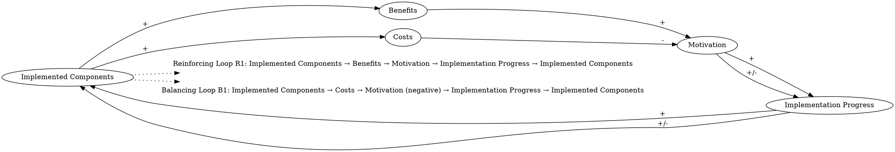

we consider the impact of implemented components on the carry-out and store operations. Some components may lead to new costs, e.g., for acquiring healthier ingredients and finding new suppliers. Benefits may also ensue, including financial benefits due to increased sales or incentives for participation in the study, reputational benefits, and the personal satisfaction of making a contribution to community health. An increase in motivation due to observation of such benefits can lead to further implementation of components, and thus even more benefits… On the other hand, if the storeowner perceives the costs (both financial and time costs) to exceed those benefits, then a balancing loop may dominate which reduces motivation in response to progress, and slows down further implementation.
### Step 1: Identify Primary Variables  
The key entities or components in the text are:  

1. **Implemented Components**  
2. **Costs**  
3. **Benefits**  
4. **Motivation**  
5. **Implementation Progress**  

---

### Step 2: Break Down Sub-Factors  

For each primary variable, here are the nuanced sub-factors:  

1. **Implemented Components**  
   - Number of components implemented  
   - Types of components implemented (e.g., healthier ingredients, new suppliers)  

2. **Costs**  
   - Financial costs (e.g., acquiring healthier ingredients, finding new suppliers)  
   - Time costs (e.g., effort required for implementation)  

3. **Benefits**  
   - Financial benefits (e.g., increased sales, incentives for participation)  
   - Reputational benefits (e.g., improved public perception)  
   - Personal satisfaction (e.g., contributing to community health)  

4. **Motivation**  
   - Increase in motivation due to observed benefits  
   - Decrease in motivation due to perceived high costs  

5. **Implementation Progress**  
   - Rate of implementation of new components  
   - Dependency on motivation and cost-benefit perception  

---

### Causal Relationships for Causal Loop Diagram (CLD):  

1. **Reinforcing Loop (R1):**  
   - **Implemented Components** → **Benefits** → **Motivation** → **Implementation Progress** → **Implemented Components**  
   - Explanation: As more components are implemented, benefits increase, which boosts motivation, leading to further implementation of components.  

2. **Balancing Loop (B1):**  
   - **Implemented Components** → **Costs** → **Motivation** (negative impact) → **Implementation Progress** → **Implemented Components**  
   - Explanation: If the perceived costs of implementation outweigh the benefits, motivation decreases, slowing down further implementation.  

This structure captures the dynamic interplay between costs, benefits, motivation, and implementation progress.### Step 3: Map Causal Relationships  

Here are the causal relationships identified from the text, broken down systematically:

---

1. **Implemented Components --> (+) Benefits**  
   **Reasoning:** As more components are implemented, benefits such as financial gains, reputational improvements, and personal satisfaction increase. This is because the implementation of healthier ingredients or new suppliers can lead to increased sales, incentives, and community health contributions.  
   **Relevant Text:** "Benefits may also ensue, including financial benefits due to increased sales or incentives for participation in the study, reputational benefits, and the personal satisfaction of making a contribution to community health."

---

2. **Benefits --> (+) Motivation**  
   **Reasoning:** Observing benefits from implemented components increases motivation. For example, financial and reputational gains, as well as personal satisfaction, can encourage further action.  
   **Relevant Text:** "An increase in motivation due to observation of such benefits can lead to further implementation of components..."

---

3. **Motivation --> (+) Implementation Progress**  
   **Reasoning:** Higher motivation drives faster or more extensive implementation of new components, as motivated storeowners are more likely to take action.  
   **Relevant Text:** "...motivation due to observation of such benefits can lead to further implementation of components..."

---

4. **Implementation Progress --> (+) Implemented Components**  
   **Reasoning:** As implementation progresses, the number of implemented components increases. This is a direct result of taking action to adopt new practices or systems.  
   **Relevant Text:** "...further implementation of components, and thus even more benefits."

---

5. **Implemented Components --> (+) Costs**  
   **Reasoning:** Implementing new components often incurs costs, such as acquiring healthier ingredients or finding new suppliers. These costs are a direct consequence of the implementation process.  
   **Relevant Text:** "Some components may lead to new costs, e.g., for acquiring healthier ingredients and finding new suppliers."

---

6. **Costs --> (-) Motivation**  
   **Reasoning:** If the perceived costs (both financial and time-related) are too high, they can reduce motivation to continue implementing components. This creates a balancing effect.  
   **Relevant Text:** "...if the storeowner perceives the costs (both financial and time costs) to exceed those benefits, then a balancing loop may dominate which reduces motivation..."

---

7. **Motivation --> (+/-) Implementation Progress**  
   **Reasoning:** Motivation can either accelerate or slow down implementation progress. High motivation leads to faster implementation, while low motivation (due to high costs) slows it down.  
   **Relevant Text:** "...reduces motivation in response to progress, and slows down further implementation."

---

8. **Implementation Progress --> (+/-) Implemented Components**  
   **Reasoning:** The rate of implementation directly affects the number of implemented components. Faster progress increases the number of components, while slower progress reduces the rate of increase.  
   **Relevant Text:** "...slows down further implementation."

---

### Summary of Causal Relationships  

1. **Implemented Components --> (+) Benefits**  
2. **Benefits --> (+) Motivation**  
3. **Motivation --> (+) Implementation Progress**  
4. **Implementation Progress --> (+) Implemented Components**  
5. **Implemented Components --> (+) Costs**  
6. **Costs --> (-) Motivation**  
7. **Motivation --> (+/-) Implementation Progress**  
8. **Implementation Progress --> (+/-) Implemented Components**  

These relationships form two key feedback loops:  

- **Reinforcing Loop (R1):** Implemented Components → Benefits → Motivation → Implementation Progress → Implemented Components  
- **Balancing Loop (B1):** Implemented Components → Costs → Motivation (negative impact) → Implementation Progress → Implemented Components  

This structure captures the dynamic interplay between costs, benefits, motivation, and implementation progress, as described in the text.### Feedback Loops

1. **Loop R1 (Reinforcing): Positive Feedback from Benefits**  
   - **Path:** Implemented Components → (+) Benefits → (+) Motivation → (+) Implementation Progress → (+) Implemented Components  
   - **Explanation:** This reinforcing loop demonstrates how implementing components generates benefits (e.g., financial, reputational, and personal satisfaction), which increases motivation. Higher motivation drives further implementation, creating a cycle of growth and improvement.

2. **Loop B1 (Balancing): Negative Feedback from Costs**  
   - **Path:** Implemented Components → (+) Costs → (-) Motivation → (-) Implementation Progress → (+) Implemented Components  
   - **Explanation:** This balancing loop highlights how the costs associated with implementing components (e.g., financial and time costs) can reduce motivation. Lower motivation slows implementation progress, which limits the number of new components being adopted, stabilizing or reducing the system's growth.

---

### Delays

1. **Perception of Benefits:**  
   - There may be a delay between implementing components and observing the resulting benefits (e.g., increased sales or reputational gains). This delay could slow the reinforcing loop (R1), as motivation might not immediately increase.  

2. **Perception of Costs:**  
   - Costs, especially time-related ones, may not be immediately apparent. For example, the effort required to find new suppliers might only become evident after implementation begins, potentially weakening motivation over time.  

3. **Implementation Progress:**  
   - The process of implementing components itself may involve delays, such as sourcing healthier ingredients or negotiating with suppliers. These delays could slow both feedback loops (R1 and B1).  

---

### Suggestions

1. **Highlight Immediate Benefits:**  
   - Emphasize short-term benefits (e.g., incentives for participation or quick reputational gains) to counteract delays in observing long-term benefits. This could strengthen the reinforcing loop (R1) by maintaining motivation during the early stages of implementation.

2. **Reduce Perceived Costs:**  
   - Provide financial or logistical support to reduce the burden of costs (e.g., subsidies for healthier ingredients or assistance in finding suppliers). This intervention would weaken the balancing loop (B1) by minimizing the negative impact of costs on motivation.

3. **Streamline Implementation Processes:**  
   - Simplify the steps required to implement components (e.g., pre-approved supplier lists or standardized procedures) to reduce time costs and delays. This would accelerate implementation progress and strengthen the reinforcing loop (R1).

4. **Monitor and Adjust Perceptions:**  
   - Regularly communicate progress and benefits to storeowners to ensure they perceive the value of their efforts. This could help maintain motivation and prevent the balancing loop (B1) from dominating.

By addressing delays and balancing the cost-benefit perception, these interventions can help sustain motivation and drive continued implementation of components, ultimately maximizing the system's benefits.

---

Here is the Graphviz script to visualize the causal relationships and feedback loops described:

### Explanation of the Script:
1. **Nodes and Relationships**:
   - Each primary variable (e.g., "Implemented Components", "Benefits", etc.) is represented as a node.
   - Arrows between nodes represent causal relationships, labeled with the sign of the relationship (`+` or `-`).

2. **Feedback Loops**:
   - **Reinforcing Loop (R1)**: A positive feedback loop where benefits increase motivation, leading to further implementation of components.
   - **Balancing Loop (B1)**: A negative feedback loop where costs reduce motivation, slowing down implementation progress.

3. **Loop Labels**:
   - Feedback loops are labeled as plaintext nodes (`Loop R1` and `Loop B1`) with detailed descriptions.
   - Dotted arrows connect the loops to the relevant nodes for clarity.

This script can be rendered using Graphviz to produce a clear and visually intuitive Causal Loop Diagram (CLD).
