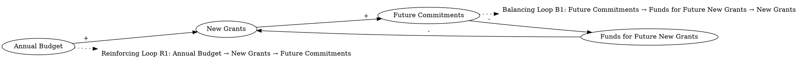

Fulfilling the past commitments [is shown]. Increased annual budget leads to more new grants, more new grants result in more future commitments, and that in turn decreases funds for future new grants.
### Step 1: Identify Primary Variables  
The key entities or components in the text are:  

1. **Past Commitments**  
2. **Annual Budget**  
3. **New Grants**  
4. **Future Commitments**  
5. **Funds for Future New Grants**  

---

### Step 2: Break Down Sub-Factors  

For each primary variable, here are the nuanced sub-factors:  

1. **Past Commitments**  
   - Fulfillment of past commitments  
   - Impact of past commitments on available funds  

2. **Annual Budget**  
   - Total annual budget allocation  
   - Dependency on external factors (e.g., revenue, funding sources)  

3. **New Grants**  
   - Number of new grants issued  
   - Rate of new grant approvals  

4. **Future Commitments**  
   - Accumulation of obligations from new grants  
   - Dependency on the number of new grants  

5. **Funds for Future New Grants**  
   - Remaining funds available for issuing new grants  
   - Dependency on future commitments and annual budget  

---

### Causal Relationships (Optional for CLD Construction)  

- **Increased Annual Budget → More New Grants**  
- **More New Grants → More Future Commitments**  
- **More Future Commitments → Decreased Funds for Future New Grants**  
- **Decreased Funds for Future New Grants → Limits on New Grants**  

This feedback loop can be visualized in a Causal Loop Diagram (CLD) to show the reinforcing and balancing dynamics. Let me know if you'd like further assistance!### Step 3: Map Causal Relationships  

1. **Annual Budget --> (+) New Grants**  
   **Reasoning:** An increase in the annual budget allows for more resources to be allocated toward issuing new grants.  
   **Relevant Text:** "Increased annual budget leads to more new grants..."  

2. **New Grants --> (+) Future Commitments**  
   **Reasoning:** Issuing more new grants creates additional obligations for the future, as these grants come with commitments that must be fulfilled over time.  
   **Relevant Text:** "...more new grants result in more future commitments..."  

3. **Future Commitments --> (-) Funds for Future New Grants**  
   **Reasoning:** As future commitments increase, they consume a larger portion of the available funds, leaving fewer resources for issuing new grants in the future.  
   **Relevant Text:** "...and that in turn decreases funds for future new grants."  

4. **Funds for Future New Grants --> (-) New Grants**  
   **Reasoning:** A decrease in the funds available for future new grants limits the ability to issue additional new grants. This creates a balancing feedback loop.  
   **Relevant Text:** Implied from the relationship: "...decreases funds for future new grants," which would naturally limit the issuance of new grants.  

---

### Feedback Loop Dynamics  

- **Reinforcing Loop (R1):**  
   - **Annual Budget (+) → New Grants (+) → Future Commitments (+)**  
     This loop shows how an increase in the annual budget can lead to a reinforcing cycle of issuing more grants and accumulating future commitments.  

- **Balancing Loop (B1):**  
   - **Future Commitments (+) → Funds for Future New Grants (-) → New Grants (-)**  
     This loop demonstrates how increasing future commitments reduces the funds available for new grants, eventually limiting the issuance of additional grants.  

This structure highlights the tension between expanding grant programs and managing long-term financial sustainability. Let me know if you'd like further clarification or additional analysis!### Feedback Loops  

1. **Reinforcing Loop (R1): Budget-Grant Expansion**  
   - **Path:** Annual Budget → (+) New Grants → (+) Future Commitments → (+) Annual Budget (indirectly, through justification for increased funding)  
   - **Explanation:** This reinforcing loop illustrates how an increase in the annual budget leads to more new grants, which in turn create future commitments. These commitments may justify further increases in the annual budget, perpetuating the cycle of growth.  

2. **Balancing Loop (B1): Commitment Constraint**  
   - **Path:** Future Commitments → (+) Funds for Future New Grants → (-) New Grants → (+) Future Commitments  
   - **Explanation:** This balancing loop shows how rising future commitments reduce the funds available for issuing new grants. This limitation on new grants helps stabilize the system by preventing unchecked growth in commitments.  

---

### Delays  

1. **Commitment Fulfillment Delay:**  
   - There is likely a time delay between issuing new grants and the realization of their associated future commitments. This delay can obscure the immediate impact of new grants on available funds, potentially leading to overcommitment.  

2. **Budget Adjustment Delay:**  
   - Adjustments to the annual budget in response to rising commitments may not occur immediately, creating a lag in the system's ability to address funding constraints.  

---

### Suggestions  

1. **Cap New Grants:**  
   - Introduce a cap on the number of new grants issued annually to prevent excessive accumulation of future commitments.  

2. **Improve Forecasting:**  
   - Use predictive models to estimate the long-term impact of new grants on future commitments and funds availability. This can help in better aligning grant issuance with budget constraints.  

3. **Introduce Commitment Buffer:**  
   - Allocate a portion of the annual budget as a buffer to account for unforeseen increases in future commitments, ensuring funds remain available for new grants.  

4. **Reduce Commitment Fulfillment Delays:**  
   - Streamline processes to fulfill commitments more quickly, reducing the lag between grant issuance and its financial impact.  

By implementing these interventions, the system can achieve a better balance between expanding grant programs and maintaining financial sustainability.

---

Here is the Graphviz script to visualize the causal relationships and feedback loops described:

### Explanation of the Script:
1. **Nodes and Relationships**:
   - The nodes represent the key variables: "Annual Budget," "New Grants," "Future Commitments," and "Funds for Future New Grants."
   - The directional arrows (`->`) represent causal relationships, with labels (`[label="+"]` or `[label="-"]`) indicating whether the relationship is positive (+) or negative (-).

2. **Feedback Loops**:
   - **Reinforcing Loop (R1)**: This loop shows how an increase in the annual budget leads to more new grants, which in turn increases future commitments, potentially justifying further increases in the budget.
   - **Balancing Loop (B1)**: This loop demonstrates how rising future commitments reduce the funds available for new grants, which limits the issuance of additional grants, stabilizing the system.

3. **Loop Labels**:
   - The feedback loops are labeled as "Loop R1" and "Loop B1" using `shape=plaintext` to make them visually distinct from the main nodes.
   - Dotted arrows (`[style=dotted]`) connect the loops to their respective starting points for clarity.

This script can be rendered using Graphviz to produce a clear and concise visualization of the causal relationships and feedback loops in the system.
