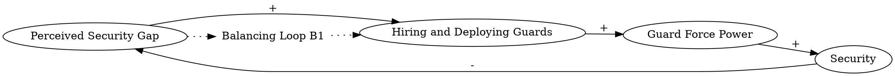

In the redundancy solution, when people perceive a gap between the desired level of security and the current level, they go on hiring and deploying more guards, which causes the guard force power to increase. By increasing the guard force power, without considering any other effect, the security rises and adjusts to the desired level. Thus, this dynamic solution suggests that we should continue deploying guards until we feel that security is at its desired level.
### Step 1: Identify Primary Variables  
The key entities or components in the text are:  

1. **Desired Level of Security**  
2. **Current Level of Security**  
3. **Perceived Security Gap**  
4. **Guard Force Power**  
5. **Security**  

---

### Step 2: Break Down Sub-Factors  

For each primary variable, here are the nuanced sub-factors:  

1. **Desired Level of Security**  
   - The target or ideal level of security perceived by people.  
   - May vary based on external or internal factors (e.g., perceived threats).  

2. **Current Level of Security**  
   - The actual level of security being experienced.  
   - May depend on factors such as guard force power, external threats, or other security measures.  

3. **Perceived Security Gap**  
   - The difference between the desired level of security and the current level of security.  
   - Drives the decision to hire and deploy more guards.  

4. **Guard Force Power**  
   - The strength or effectiveness of the deployed guard force.  
   - Increases with the hiring and deployment of more guards.  

5. **Security**  
   - The overall level of security achieved.  
   - Directly influenced by guard force power.  

---

### Causal Relationships  

1. **Perceived Security Gap → Hiring and Deploying Guards → Guard Force Power**  
   - When people perceive a gap between the desired and current levels of security, they hire and deploy more guards, increasing the guard force power.  

2. **Guard Force Power → Security**  
   - An increase in guard force power leads to a rise in the overall level of security.  

3. **Security → Perceived Security Gap**  
   - As security rises, the perceived gap between the desired and current levels of security decreases, reducing the need for further action.  

This forms a balancing feedback loop:  
- **Perceived Security Gap → Hiring Guards → Guard Force Power → Security → Reduced Perceived Security Gap.**### Step 3: Map Causal Relationships  

1. **Perceived Security Gap --> (+) Hiring and Deploying Guards**  
   **Reasoning:** When people perceive a gap between the desired and current levels of security, they respond by hiring and deploying more guards to address the gap.  
   **Relevant Text:** "When people perceive a gap between the desired level of security and the current level, they go on hiring and deploying more guards..."  

2. **Hiring and Deploying Guards --> (+) Guard Force Power**  
   **Reasoning:** Hiring and deploying more guards directly increases the strength and effectiveness of the guard force.  
   **Relevant Text:** "...they go on hiring and deploying more guards, which causes the guard force power to increase."  

3. **Guard Force Power --> (+) Security**  
   **Reasoning:** An increase in the guard force power leads to an improvement in the overall level of security.  
   **Relevant Text:** "By increasing the guard force power, without considering any other effect, the security rises..."  

4. **Security --> (-) Perceived Security Gap**  
   **Reasoning:** As the level of security rises, the gap between the desired and current levels of security decreases, reducing the perceived need for further action.  
   **Relevant Text:** "...the security rises and adjusts to the desired level. Thus, this dynamic solution suggests that we should continue deploying guards until we feel that security is at its desired level."  

---

### Summary of Relationships  

1. **Perceived Security Gap --> (+) Hiring and Deploying Guards**  
2. **Hiring and Deploying Guards --> (+) Guard Force Power**  
3. **Guard Force Power --> (+) Security**  
4. **Security --> (-) Perceived Security Gap**  

This forms a **Balancing Feedback Loop**:  
- **Perceived Security Gap → Hiring Guards → Guard Force Power → Security → Reduced Perceived Security Gap.**### Feedback Loops  

**Loop B1 (Balancing): Security Adjustment**  
- **Path:** Perceived Security Gap → (+) Hiring and Deploying Guards → (+) Guard Force Power → (+) Security → (-) Perceived Security Gap  
- **Explanation:** This balancing loop works to stabilize the system by reducing the perceived security gap. When people perceive a gap between the desired and current levels of security, they hire and deploy more guards, increasing the guard force power. This, in turn, raises the level of security, which reduces the perceived gap. The loop continues until the perceived security gap is minimized or eliminated.  

---

### Delays  

1. **Hiring and Deployment Delay:**  
   - There may be a delay between perceiving the security gap and the actual hiring and deployment of guards. This delay could slow the system's response to the perceived gap, temporarily leaving the security level below the desired level.  

2. **Effectiveness Delay:**  
   - Once guards are deployed, there may be a delay before their presence translates into a measurable increase in security. This could weaken the immediate impact of the feedback loop.  

---

### Suggestions  

1. **Streamline Hiring and Deployment Processes:**  
   - Reduce the time required to hire and deploy guards by improving recruitment processes or maintaining a reserve force that can be quickly mobilized. This would minimize the hiring and deployment delay, allowing the system to respond more quickly to perceived security gaps.  

2. **Enhance Guard Training and Effectiveness:**  
   - Invest in training programs to ensure that newly deployed guards can contribute to security improvements more rapidly. This would reduce the effectiveness delay and amplify the impact of increased guard force power on security.  

3. **Implement Alternative Security Measures:**  
   - Consider complementary security measures (e.g., surveillance systems, community awareness programs) to reduce reliance on guard force power alone. This could help achieve the desired level of security more efficiently and sustainably.  

4. **Monitor and Adjust Desired Security Levels:**  
   - Regularly reassess the desired level of security to ensure it aligns with actual needs and threats. Overestimating the desired level could lead to unnecessary hiring and resource allocation.  

By addressing delays and optimizing the system's response, these interventions can improve the efficiency and effectiveness of the security adjustment process.

---

Here is the Graphviz script to visualize the causal relationships and the balancing feedback loop described in the text:

### Explanation of the Script:
1. **Nodes and Relationships**:
   - Each variable (e.g., "Perceived Security Gap", "Hiring and Deploying Guards") is represented as a node.
   - Arrows between nodes represent causal relationships, labeled with their respective signs (`+` or `-`).

2. **Feedback Loop**:
   - The balancing feedback loop (B1) is labeled as "Loop B1".
   - Dotted arrows connect the loop label to the relevant nodes to indicate its presence.

3. **Layout**:
   - The `rankdir=LR` directive ensures a left-to-right layout for better readability.

This script can be rendered using Graphviz to produce a clear visualization of the causal relationships and the balancing feedback loop.
