In most firms the advertising budget grows roughly as the company and revenue grow. Larger advertising budgets have two effects: (1) more potential customers are made aware of the product and choose to enter the market; (2) to the extent the advertising is effective, more of those who are aware and in market are likely to buy the product offered by the company. Similarly, the larger the revenue of the firm, the greater the sales budget. The more sales representatives, and the greater their skill and experience, the more calls they can make, the more time they can spend with customers, and the more effective their calls will be, increasing both total industry demand and the share of the total demand won by the firm.
### Step 1: Identify Primary Variables  
The key entities or components in the text are:  

1. **Advertising Budget**  
2. **Revenue**  
3. **Potential Customers**  
4. **Market Awareness**  
5. **Product Sales**  
6. **Sales Budget**  
7. **Sales Representatives**  
8. **Industry Demand**  
9. **Firm's Market Share**  

---

### Step 2: Break Down Sub-Factors  

For each primary variable, here are the nuanced sub-factors:  

1. **Advertising Budget**  
   - Size of the advertising budget  
   - Growth of the advertising budget (linked to revenue growth)  

2. **Revenue**  
   - Total revenue generated by the firm  
   - Dependency on product sales  

3. **Potential Customers**  
   - Number of potential customers entering the market  
   - Dependency on market awareness  

4. **Market Awareness**  
   - Awareness of the product among potential customers  
   - Dependency on advertising effectiveness  

5. **Product Sales**  
   - Number of products sold by the firm  
   - Dependency on market awareness and customer conversion  

6. **Sales Budget**  
   - Size of the sales budget  
   - Dependency on revenue growth  

7. **Sales Representatives**  
   - Number of sales representatives  
   - Skill and experience of sales representatives  
   - Effectiveness of sales calls  

8. **Industry Demand**  
   - Total demand for the product in the industry  
   - Dependency on sales efforts and market awareness  

9. **Firm's Market Share**  
   - Proportion of total industry demand captured by the firm  
   - Dependency on sales representatives' effectiveness and product sales  

---

### Causal Relationships (for Causal Loop Diagram Construction)  

1. **Advertising Budget → Market Awareness → Potential Customers → Product Sales → Revenue → Advertising Budget**  
   - Larger advertising budgets increase market awareness, which attracts more potential customers, leading to higher product sales and revenue. Higher revenue allows for further growth in the advertising budget.  

2. **Revenue → Sales Budget → Sales Representatives → Product Sales → Revenue**  
   - Higher revenue increases the sales budget, enabling the firm to hire more sales representatives or improve their skills. This leads to more effective sales efforts, increasing product sales and revenue.  

3. **Sales Representatives → Industry Demand → Firm's Market Share → Product Sales → Revenue**  
   - More skilled and experienced sales representatives can increase total industry demand and capture a larger share of that demand for the firm, boosting product sales and revenue.  

These relationships can be used to construct feedback loops in the Causal Loop Diagram (CLD).### Causal Relationships for Causal Loop Diagram (CLD)

1. **Advertising Budget --> (+) Market Awareness**  
   **Reasoning:** A larger advertising budget allows the company to reach more potential customers, increasing awareness of the product.  
   **Relevant Text:** "Larger advertising budgets have two effects: (1) more potential customers are made aware of the product..."  

2. **Market Awareness --> (+) Potential Customers**  
   **Reasoning:** Increased market awareness attracts more potential customers to enter the market.  
   **Relevant Text:** "...more potential customers are made aware of the product and choose to enter the market."  

3. **Potential Customers --> (+) Product Sales**  
   **Reasoning:** As more potential customers enter the market, the likelihood of product purchases increases, leading to higher sales.  
   **Relevant Text:** "...more of those who are aware and in market are likely to buy the product offered by the company."  

4. **Product Sales --> (+) Revenue**  
   **Reasoning:** Higher product sales directly contribute to increased revenue for the firm.  
   **Relevant Text:** "Similarly, the larger the revenue of the firm, the greater the sales budget."  

5. **Revenue --> (+) Advertising Budget**  
   **Reasoning:** As revenue grows, the advertising budget also grows, creating a reinforcing loop.  
   **Relevant Text:** "In most firms the advertising budget grows roughly as the company and revenue grow."  

6. **Revenue --> (+) Sales Budget**  
   **Reasoning:** Higher revenue allows the firm to allocate more resources to the sales budget.  
   **Relevant Text:** "Similarly, the larger the revenue of the firm, the greater the sales budget."  

7. **Sales Budget --> (+) Sales Representatives**  
   **Reasoning:** A larger sales budget enables the firm to hire more sales representatives or improve their skills and experience.  
   **Relevant Text:** "The more sales representatives, and the greater their skill and experience..."  

8. **Sales Representatives --> (+) Product Sales**  
   **Reasoning:** More skilled and experienced sales representatives can make more effective calls, increasing product sales.  
   **Relevant Text:** "...the more calls they can make, the more time they can spend with customers, and the more effective their calls will be, increasing...the share of the total demand won by the firm."  

9. **Sales Representatives --> (+) Industry Demand**  
   **Reasoning:** Effective sales efforts by representatives can increase total industry demand for the product.  
   **Relevant Text:** "...increasing both total industry demand and the share of the total demand won by the firm."  

10. **Industry Demand --> (+) Firm's Market Share**  
    **Reasoning:** As total industry demand grows, the firm can capture a larger share of that demand through effective sales efforts.  
    **Relevant Text:** "...increasing both total industry demand and the share of the total demand won by the firm."  

11. **Firm's Market Share --> (+) Product Sales**  
    **Reasoning:** A larger market share directly translates to higher product sales for the firm.  
    **Relevant Text:** "...the share of the total demand won by the firm."  

---

### Feedback Loops

1. **Reinforcing Loop 1 (Advertising Budget Loop):**  
   Advertising Budget → (+) Market Awareness → (+) Potential Customers → (+) Product Sales → (+) Revenue → (+) Advertising Budget  

2. **Reinforcing Loop 2 (Sales Budget Loop):**  
   Revenue → (+) Sales Budget → (+) Sales Representatives → (+) Product Sales → (+) Revenue  

3. **Reinforcing Loop 3 (Industry Demand Loop):**  
   Sales Representatives → (+) Industry Demand → (+) Firm's Market Share → (+) Product Sales → (+) Revenue → (+) Sales Budget  

These loops illustrate how advertising and sales efforts reinforce each other to drive growth in revenue, market share, and overall demand.### Feedback Loops

1. **Reinforcing Loop R1 (Advertising Growth Loop):**  
   **Path:** Advertising Budget → (+) Market Awareness → (+) Potential Customers → (+) Product Sales → (+) Revenue → (+) Advertising Budget  
   **Explanation:** This loop demonstrates how increased advertising budgets lead to greater market awareness, attracting more potential customers and driving product sales. The resulting revenue growth allows for further increases in the advertising budget, creating a cycle of growth.

2. **Reinforcing Loop R2 (Sales Expansion Loop):**  
   **Path:** Revenue → (+) Sales Budget → (+) Sales Representatives → (+) Product Sales → (+) Revenue  
   **Explanation:** Higher revenue enables the firm to expand its sales budget, which allows for hiring more sales representatives or improving their effectiveness. This leads to increased product sales, further boosting revenue and perpetuating the cycle.

3. **Reinforcing Loop R3 (Market Share Loop):**  
   **Path:** Sales Representatives → (+) Industry Demand → (+) Firm's Market Share → (+) Product Sales → (+) Revenue → (+) Sales Budget  
   **Explanation:** Effective sales representatives increase total industry demand and help the firm capture a larger market share. This drives product sales and revenue, which in turn supports further investment in sales efforts, reinforcing the firm's competitive position.

---

### Delays

1. **Advertising Effectiveness Delay:**  
   There may be a time lag between increasing the advertising budget and seeing its full impact on market awareness and customer behavior. This delay can slow the reinforcing effect of Loop R1.  

2. **Sales Representative Training Delay:**  
   Hiring and training new sales representatives or improving their skills takes time. This delay can weaken the immediate impact of Loop R2 on product sales and revenue.  

3. **Market Share Adjustment Delay:**  
   Changes in industry demand and market share may take time to materialize due to customer decision-making processes and competitive dynamics. This delay affects the speed of Loop R3.  

---

### Suggestions

1. **Optimize Advertising Effectiveness:**  
   - Use data-driven strategies to target advertising more effectively, reducing the time delay between budget increases and market awareness growth.  
   - Monitor and adjust campaigns in real-time to maximize their impact on potential customers.  

2. **Invest in Sales Training:**  
   - Provide ongoing training and development for sales representatives to improve their effectiveness more quickly.  
   - Use technology (e.g., CRM systems) to enhance sales efficiency and reduce the time required to see results from new hires.  

3. **Balance Growth Across Loops:**  
   - Ensure that advertising and sales efforts are aligned to avoid over-investing in one area while neglecting the other. For example, rapid growth in advertising without sufficient sales capacity could lead to missed opportunities.  
   - Monitor industry demand and market share trends to anticipate shifts and adjust strategies proactively.  

4. **Shorten Delays:**  
   - Streamline hiring and onboarding processes for sales representatives to reduce training delays.  
   - Use predictive analytics to anticipate market trends and adjust advertising and sales budgets before delays impact performance.  

By addressing these delays and optimizing the reinforcing loops, the firm can sustain growth in revenue, market share, and overall demand.

---

Here is the Graphviz script for the Causal Loop Diagram (CLD) based on the relationships and feedback loops identified:

```dot
digraph CausalLoopDiagram {
    rankdir=LR; // Left-to-right layout for better readability

    // Define nodes and relationships
    "Advertising Budget" -> "Market Awareness" [label="+"];
    "Market Awareness" -> "Potential Customers" [label="+"];
    "Potential Customers" -> "Product Sales" [label="+"];
    "Product Sales" -> "Revenue" [label="+"];
    "Revenue" -> "Advertising Budget" [label="+"];

    "Revenue" -> "Sales Budget" [label="+"];
    "Sales Budget" -> "Sales Representatives" [label="+"];
    "Sales Representatives" -> "Product Sales" [label="+"];
    "Sales Representatives" -> "Industry Demand" [label="+"];
    "Industry Demand" -> "Firm's Market Share" [label="+"];
    "Firm's Market Share" -> "Product Sales" [label="+"];

    // Label feedback loops
    "Loop R1" [shape=plaintext, label="Reinforcing Loop R1: Advertising Growth"];
    "Advertising Budget" -> "Loop R1" [style=dotted];
    "Loop R1" -> "Revenue" [style=dotted];

    "Loop R2" [shape=plaintext, label="Reinforcing Loop R2: Sales Expansion"];
    "Revenue" -> "Loop R2" [style=dotted];
    "Loop R2" -> "Sales Representatives" [style=dotted];

    "Loop R3" [shape=plaintext, label="Reinforcing Loop R3: Market Share"];
    "Sales Representatives" -> "Loop R3" [style=dotted];
    "Loop R3" -> "Firm's Market Share" [style=dotted];
}
```

### Explanation of the Script:
1. **Nodes and Relationships**:
   - Each variable (e.g., "Advertising Budget", "Market Awareness") is represented as a node.
   - Arrows (`->`) represent causal relationships between nodes, with labels (`[label="+"]` or `[label="-"]`) indicating the sign of the relationship.

2. **Feedback Loops**:
   - Three reinforcing loops (R1, R2, R3) are labeled as plaintext nodes (e.g., `"Loop R1" [shape=plaintext]`).
   - Dotted arrows (`[style=dotted]`) connect the relevant nodes to the feedback loop labels for clarity.

3. **Layout**:
   - The `rankdir=LR` directive ensures a left-to-right layout, making the diagram easier to read.

### Feedback Loops in the Diagram:
- **Reinforcing Loop R1 (Advertising Growth)**:
  - Path: Advertising Budget → Market Awareness → Potential Customers → Product Sales → Revenue → Advertising Budget
  - This loop shows how advertising drives growth through increased awareness and sales.

- **Reinforcing Loop R2 (Sales Expansion)**:
  - Path: Revenue → Sales Budget → Sales Representatives → Product Sales → Revenue
  - This loop highlights how revenue growth enables investment in sales efforts, which further boosts revenue.

- **Reinforcing Loop R3 (Market Share)**:
  - Path: Sales Representatives → Industry Demand → Firm's Market Share → Product Sales → Revenue → Sales Budget
  - This loop demonstrates how effective sales efforts increase market share and revenue, reinforcing the firm's competitive position.

### Rendering:
To visualize the diagram, save the script as a `.dot` file (e.g., `causal_loop_diagram.dot`) and render it using Graphviz tools such as `dot` or online Graphviz editors.
