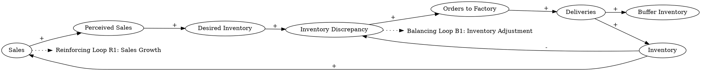

The car dealer needs to keep some inventory because deliveries and purchases don’t match perfectly every day. Customers make purchases that are unpredictable on a day-to-day basis. The car dealer also needs to provide herself with some extra inventory (a buffer) in case deliveries from suppliers are delayed occasionally. The dealer monitors sales (perceived sales), and if, for example, they seem to be rising, she adjusts orders to the factory to bring inventory up to her new desired inventory that provides ten days’ coverage at the higher sales rate. So, higher sales mean higher perceived sales, which means a higher discrepancy between inventory and desired inventory, which means higher orders, which will bring in more deliveries, which will raise inventory so it can comfortably supply the higher rate of sales.
### Step 1: Identify Primary Variables  
The key entities or components in the text are:  

1. **Inventory**  
2. **Deliveries**  
3. **Purchases (Sales)**  
4. **Perceived Sales**  
5. **Desired Inventory**  
6. **Orders to Factory**  

---

### Step 2: Break Down Sub-Factors  

For each primary variable, here are the nuanced sub-factors:  

1. **Inventory**  
   - Current inventory level  
   - Buffer inventory (extra inventory for delays)  
   - Inventory coverage (measured in days of sales)  

2. **Deliveries**  
   - Frequency of deliveries from suppliers  
   - Quantity of deliveries  

3. **Purchases (Sales)**  
   - Unpredictable daily customer purchases  
   - Rate of sales  

4. **Perceived Sales**  
   - Dealer’s perception of sales trends (e.g., rising or falling)  
   - Dependency on actual sales  

5. **Desired Inventory**  
   - Inventory level required to cover ten days of sales  
   - Dependency on perceived sales rate  

6. **Orders to Factory**  
   - Number of orders placed with the factory  
   - Dependency on the discrepancy between current inventory and desired inventory  

---

### Step 3: Causal Relationships  

Here are the causal relationships between the variables:  

1. **Sales → Perceived Sales**  
   - Higher sales lead to higher perceived sales.  

2. **Perceived Sales → Desired Inventory**  
   - Higher perceived sales increase the desired inventory level (to maintain ten days’ coverage).  

3. **Desired Inventory → Inventory Discrepancy**  
   - Desired inventory minus current inventory creates a discrepancy.  

4. **Inventory Discrepancy → Orders to Factory**  
   - A higher inventory discrepancy leads to more orders placed with the factory.  

5. **Orders to Factory → Deliveries**  
   - More orders result in more deliveries from the factory.  

6. **Deliveries → Inventory**  
   - Deliveries increase the current inventory level.  

7. **Inventory → Sales**  
   - Sufficient inventory ensures the ability to meet customer purchases (sales).  

8. **Inventory → Inventory Discrepancy**  
   - Higher inventory reduces the discrepancy between current and desired inventory.  

9. **Deliveries → Buffer Inventory**  
   - Delayed deliveries necessitate maintaining a buffer inventory.  

---

### Summary of Feedback Loops  

1. **Balancing Loop (B1): Inventory Adjustment**  
   - Higher sales → Higher perceived sales → Higher desired inventory → Higher inventory discrepancy → Higher orders → More deliveries → Higher inventory → Inventory meets sales demand.  

2. **Reinforcing Loop (R1): Sales Growth**  
   - Higher sales → Higher perceived sales → Higher desired inventory → Higher inventory discrepancy → Higher orders → More deliveries → Higher inventory → Ability to meet higher sales → Higher sales.  

This structure captures the dynamics of inventory management, sales, and ordering processes for the car dealer.### Step 3: Causal Relationships  

Here are the causal relationships derived from the text, following the specified format:

---

1. **Sales → (+) Perceived Sales**  
   **Reasoning:** Higher sales lead to the dealer perceiving an increase in sales trends, which influences her decision-making regarding inventory adjustments.  
   **Relevant Text:** "The dealer monitors sales (perceived sales), and if, for example, they seem to be rising, she adjusts orders to the factory..."  

---

2. **Perceived Sales → (+) Desired Inventory**  
   **Reasoning:** When perceived sales increase, the dealer adjusts the desired inventory to maintain ten days’ coverage at the higher sales rate.  
   **Relevant Text:** "...she adjusts orders to the factory to bring inventory up to her new desired inventory that provides ten days’ coverage at the higher sales rate."  

---

3. **Desired Inventory → (+) Inventory Discrepancy**  
   **Reasoning:** An increase in desired inventory creates a larger gap (discrepancy) between the current inventory and the desired inventory level.  
   **Relevant Text:** "...higher perceived sales, which means a higher discrepancy between inventory and desired inventory..."  

---

4. **Inventory Discrepancy → (+) Orders to Factory**  
   **Reasoning:** A larger inventory discrepancy prompts the dealer to place more orders with the factory to close the gap.  
   **Relevant Text:** "...a higher discrepancy between inventory and desired inventory, which means higher orders..."  

---

5. **Orders to Factory → (+) Deliveries**  
   **Reasoning:** More orders placed with the factory result in more deliveries being made to the dealer.  
   **Relevant Text:** "...higher orders, which will bring in more deliveries..."  

---

6. **Deliveries → (+) Inventory**  
   **Reasoning:** Deliveries from the factory increase the dealer’s current inventory level.  
   **Relevant Text:** "...more deliveries, which will raise inventory..."  

---

7. **Inventory → (-) Inventory Discrepancy**  
   **Reasoning:** As inventory increases, the gap between current inventory and desired inventory decreases, reducing the discrepancy.  
   **Relevant Text:** "...which will raise inventory so it can comfortably supply the higher rate of sales."  

---

8. **Inventory → (+) Sales**  
   **Reasoning:** Maintaining sufficient inventory ensures the dealer can meet customer demand, enabling more sales.  
   **Relevant Text:** "The car dealer needs to keep some inventory because deliveries and purchases don’t match perfectly every day."  

---

9. **Deliveries → (+) Buffer Inventory**  
   **Reasoning:** Delayed deliveries necessitate maintaining a buffer inventory to ensure the dealer can meet sales demand despite occasional supply disruptions.  
   **Relevant Text:** "The car dealer also needs to provide herself with some extra inventory (a buffer) in case deliveries from suppliers are delayed occasionally."  

---

### Feedback Loops  

1. **Balancing Loop (B1): Inventory Adjustment**  
   - **Causal Path:** Sales → (+) Perceived Sales → (+) Desired Inventory → (+) Inventory Discrepancy → (+) Orders to Factory → (+) Deliveries → (+) Inventory → (-) Inventory Discrepancy.  
   - **Explanation:** This loop ensures that inventory levels are adjusted to match sales trends, maintaining a balance between supply and demand.  

2. **Reinforcing Loop (R1): Sales Growth**  
   - **Causal Path:** Sales → (+) Perceived Sales → (+) Desired Inventory → (+) Inventory Discrepancy → (+) Orders to Factory → (+) Deliveries → (+) Inventory → (+) Sales.  
   - **Explanation:** This loop reinforces growth by enabling the dealer to meet increasing sales demand, which further drives sales.  

---

This analysis captures the dynamics of inventory management, sales, and ordering processes for the car dealer, highlighting both balancing and reinforcing feedback loops.### Feedback Loops  

1. **Balancing Loop (B1): Inventory Adjustment**  
   - **Causal Path:** Sales → (+) Perceived Sales → (+) Desired Inventory → (+) Inventory Discrepancy → (+) Orders to Factory → (+) Deliveries → (+) Inventory → (-) Inventory Discrepancy.  
   - **Explanation:** This loop works to stabilize the system by adjusting inventory levels to match sales trends. When sales increase, perceived sales rise, leading to a higher desired inventory. The resulting inventory discrepancy prompts more orders, which increase deliveries and inventory, reducing the discrepancy and maintaining balance.  

2. **Reinforcing Loop (R1): Sales Growth**  
   - **Causal Path:** Sales → (+) Perceived Sales → (+) Desired Inventory → (+) Inventory Discrepancy → (+) Orders to Factory → (+) Deliveries → (+) Inventory → (+) Sales.  
   - **Explanation:** This loop amplifies growth in the system. Higher sales lead to higher perceived sales, which increase desired inventory and orders. The resulting deliveries boost inventory, enabling the dealer to meet higher sales demand, which further drives sales growth.  

---

### Delays  

1. **Delivery Delay:**  
   - **Impact:** There is a time lag between placing orders with the factory and receiving deliveries. This delay can weaken the responsiveness of the balancing loop (B1) and the reinforcing loop (R1), potentially leading to temporary inventory shortages or overstocking.  
   - **Relevant Text:** "The car dealer also needs to provide herself with some extra inventory (a buffer) in case deliveries from suppliers are delayed occasionally."  

2. **Perceived Sales Adjustment Delay:**  
   - **Impact:** The dealer’s perception of sales trends may not immediately reflect actual sales changes, introducing a delay in adjusting desired inventory and orders. This could result in over- or under-ordering during periods of rapid sales fluctuation.  

---

### Suggestions  

1. **Reduce Delivery Delays:**  
   - Negotiate shorter lead times with suppliers or maintain contracts with multiple suppliers to ensure faster and more reliable deliveries. This would improve the responsiveness of the balancing loop (B1) and reduce the need for excessive buffer inventory.  

2. **Implement Real-Time Sales Monitoring:**  
   - Use advanced analytics and real-time sales tracking to minimize delays in perceived sales adjustments. This would enhance the accuracy of desired inventory calculations and reduce the risk of over- or under-ordering.  

3. **Optimize Buffer Inventory:**  
   - Regularly review and adjust buffer inventory levels based on historical delivery performance and sales variability. This would ensure sufficient coverage without tying up excessive capital in inventory.  

4. **Forecast Sales Trends:**  
   - Use predictive modeling to anticipate sales trends and proactively adjust desired inventory and orders. This would help the dealer stay ahead of demand fluctuations and maintain a smoother inventory flow.  

By addressing these delays and implementing the suggested interventions, the car dealer can improve the efficiency and stability of her inventory management system while supporting sustained sales growth.

---

Here is the Graphviz script to visualize the causal relationships and feedback loops described:

### Explanation of the Script:
1. **Nodes and Relationships**:
   - Each variable (e.g., "Sales", "Perceived Sales", etc.) is represented as a node.
   - Causal relationships are represented as directed edges with labels indicating the sign of the relationship (`+` for positive, `-` for negative).

2. **Feedback Loops**:
   - Two feedback loops are explicitly labeled:
     - **Balancing Loop (B1)**: Stabilizes the system by adjusting inventory levels to match sales trends.
     - **Reinforcing Loop (R1)**: Amplifies growth by enabling the dealer to meet increasing sales demand.

3. **Dotted Connections**:
   - Dotted arrows connect the feedback loop labels to the relevant nodes in the diagram for clarity.

This script can be rendered using Graphviz to produce a clear and visually intuitive representation of the causal loop diagram.
