Here is a situation in which salesmen book orders followed by product delivery which generates revenue which produces the sales budget which permits hiring still more salesmen. In short, salesmen produce revenue to pay for the further expansion of the sales effort. Orders booked increase the order backlog which increases the delivery delay which makes the product less attractive and reduces the order rate.  The ordering of new production capacity is a function of delivery delay only. Rising order backlog, as indicated by delivery delay, is taken as an indication of inadequate capacity, and orders for more capacity are placed. These orders, after an acquisition delay, add to the production capacity.  As the delivery delay rises, production capacity is raised to bring down the delivery delay.
### Step 1: Identify Primary Variables  
The key entities or components in the text are:  

1. **Salesmen**  
2. **Orders Booked**  
3. **Order Backlog**  
4. **Delivery Delay**  
5. **Product Attractiveness**  
6. **Order Rate**  
7. **Revenue**  
8. **Sales Budget**  
9. **Production Capacity**  
10. **Acquisition Delay**  

---

### Step 2: Break Down Sub-Factors  

For each primary variable, here are the nuanced sub-factors:  

1. **Salesmen**  
   - Number of salesmen  
   - Sales effort exerted  
   - Dependency on sales budget  

2. **Orders Booked**  
   - Total number of orders booked  
   - Rate at which orders are booked  
   - Dependency on salesmen  

3. **Order Backlog**  
   - Accumulation of unfulfilled orders  
   - Rate of backlog clearance  
   - Dependency on production capacity  

4. **Delivery Delay**  
   - Time taken to fulfill orders  
   - Dependency on order backlog and production capacity  

5. **Product Attractiveness**  
   - Perceived value of the product  
   - Sensitivity to delivery delay  

6. **Order Rate**  
   - Frequency of new orders placed  
   - Dependency on product attractiveness  

7. **Revenue**  
   - Income generated from delivered orders  
   - Dependency on order fulfillment  

8. **Sales Budget**  
   - Allocation of funds for sales operations  
   - Dependency on revenue  

9. **Production Capacity**  
   - Total capacity to produce and fulfill orders  
   - Dependency on acquisition of new capacity  

10. **Acquisition Delay**  
   - Time taken to procure and integrate new production capacity  
   - Dependency on capacity orders  

---

### Step 3: Identify Causal Relationships  

Using the identified variables and sub-factors, here are the causal relationships:  

1. **Salesmen → Orders Booked**  
   - More salesmen increase the number of orders booked.  

2. **Orders Booked → Order Backlog**  
   - More orders booked increase the order backlog.  

3. **Order Backlog → Delivery Delay**  
   - A higher order backlog increases delivery delay.  

4. **Delivery Delay → Product Attractiveness**  
   - Longer delivery delays reduce product attractiveness.  

5. **Product Attractiveness → Order Rate**  
   - Lower product attractiveness reduces the order rate.  

6. **Order Rate → Orders Booked**  
   - A lower order rate reduces the number of orders booked.  

7. **Orders Booked → Revenue**  
   - More orders booked (and fulfilled) generate more revenue.  

8. **Revenue → Sales Budget**  
   - Higher revenue increases the sales budget.  

9. **Sales Budget → Salesmen**  
   - A higher sales budget allows for hiring more salesmen.  

10. **Delivery Delay → Production Capacity Orders**  
    - Longer delivery delays trigger orders for more production capacity.  

11. **Production Capacity Orders → Acquisition Delay → Production Capacity**  
    - Orders for production capacity, after an acquisition delay, increase production capacity.  

12. **Production Capacity → Delivery Delay**  
    - Higher production capacity reduces delivery delay.  

---

### Step 4: Feedback Loops  

1. **Reinforcing Loop (R1): Sales Growth**  
   - **Salesmen → Orders Booked → Revenue → Sales Budget → Salesmen**  
   - More salesmen lead to more orders booked, which generates more revenue, increasing the sales budget and allowing for the hiring of more salesmen.  

2. **Balancing Loop (B1): Delivery Delay and Product Attractiveness**  
   - **Order Backlog → Delivery Delay → Product Attractiveness → Order Rate → Orders Booked → Order Backlog**  
   - A higher order backlog increases delivery delay, reducing product attractiveness and order rate, which eventually reduces the order backlog.  

3. **Balancing Loop (B2): Production Capacity Adjustment**  
   - **Delivery Delay → Production Capacity Orders → Acquisition Delay → Production Capacity → Delivery Delay**  
   - Longer delivery delays trigger orders for more production capacity, which, after an acquisition delay, increases production capacity and reduces delivery delay.  

---

This analysis provides the foundation for constructing a **Causal Loop Diagram (CLD)** that visually represents the system's dynamics. Let me know if you'd like assistance in creating the diagram!### Step 3: Map Causal Relationships  

Here are the causal relationships derived from the text, following the specified format:

---

1. **Salesmen --> (+) Orders Booked**  
   **Reasoning:** More salesmen increase the number of orders booked due to their direct involvement in sales activities.  
   **Relevant Text:** "Salesmen book orders followed by product delivery which generates revenue..."  

---

2. **Orders Booked --> (+) Order Backlog**  
   **Reasoning:** An increase in orders booked leads to a higher accumulation of unfulfilled orders, contributing to the order backlog.  
   **Relevant Text:** "Orders booked increase the order backlog..."  

---

3. **Order Backlog --> (+) Delivery Delay**  
   **Reasoning:** A higher order backlog increases the time required to fulfill orders, leading to longer delivery delays.  
   **Relevant Text:** "Orders booked increase the order backlog which increases the delivery delay..."  

---

4. **Delivery Delay --> (-) Product Attractiveness**  
   **Reasoning:** Longer delivery delays make the product less appealing to customers, reducing its attractiveness.  
   **Relevant Text:** "...which increases the delivery delay which makes the product less attractive..."  

---

5. **Product Attractiveness --> (-) Order Rate**  
   **Reasoning:** A decrease in product attractiveness leads to a reduction in the rate at which new orders are placed.  
   **Relevant Text:** "...which makes the product less attractive and reduces the order rate."  

---

6. **Order Rate --> (-) Orders Booked**  
   **Reasoning:** A lower order rate results in fewer orders being booked.  
   **Relevant Text:** "...which makes the product less attractive and reduces the order rate."  

---

7. **Orders Booked --> (+) Revenue**  
   **Reasoning:** More orders booked (and subsequently delivered) generate higher revenue.  
   **Relevant Text:** "Salesmen book orders followed by product delivery which generates revenue..."  

---

8. **Revenue --> (+) Sales Budget**  
   **Reasoning:** Increased revenue contributes to a larger sales budget, enabling further investment in sales activities.  
   **Relevant Text:** "...which generates revenue which produces the sales budget..."  

---

9. **Sales Budget --> (+) Salesmen**  
   **Reasoning:** A higher sales budget allows for the hiring of more salesmen, expanding the sales force.  
   **Relevant Text:** "...which produces the sales budget which permits hiring still more salesmen."  

---

10. **Delivery Delay --> (+) Production Capacity Orders**  
    **Reasoning:** Longer delivery delays signal inadequate production capacity, prompting orders for additional capacity.  
    **Relevant Text:** "The ordering of new production capacity is a function of delivery delay only."  

---

11. **Production Capacity Orders --> (+) Production Capacity**  
    **Reasoning:** Orders for new production capacity, after an acquisition delay, increase the total production capacity.  
    **Relevant Text:** "These orders, after an acquisition delay, add to the production capacity."  

---

12. **Production Capacity --> (-) Delivery Delay**  
    **Reasoning:** Increased production capacity reduces the time required to fulfill orders, thereby decreasing delivery delays.  
    **Relevant Text:** "As the delivery delay rises, production capacity is raised to bring down the delivery delay."  

---

### Feedback Loops  

1. **Reinforcing Loop (R1): Sales Growth**  
   - **Salesmen --> (+) Orders Booked --> (+) Revenue --> (+) Sales Budget --> (+) Salesmen**  
   - More salesmen lead to more orders booked, generating more revenue, which increases the sales budget and allows for hiring additional salesmen.  

2. **Balancing Loop (B1): Delivery Delay and Product Attractiveness**  
   - **Order Backlog --> (+) Delivery Delay --> (-) Product Attractiveness --> (-) Order Rate --> (-) Orders Booked --> (+) Order Backlog**  
   - A higher order backlog increases delivery delay, reducing product attractiveness and order rate, which eventually reduces the order backlog.  

3. **Balancing Loop (B2): Production Capacity Adjustment**  
   - **Delivery Delay --> (+) Production Capacity Orders --> (+) Production Capacity --> (-) Delivery Delay**  
   - Longer delivery delays trigger orders for more production capacity, which increases production capacity and reduces delivery delay.  

---

This detailed mapping of variables and their causal relationships provides a comprehensive foundation for constructing a **Causal Loop Diagram (CLD)**. Let me know if you'd like further clarification or assistance in visualizing the system!### Feedback Loops  

1. **Reinforcing Loop (R1): Sales Growth**  
   - **Path:** Salesmen → (+) Orders Booked → (+) Revenue → (+) Sales Budget → (+) Salesmen  
   - **Explanation:** This reinforcing loop demonstrates how an increase in salesmen leads to more orders booked, generating higher revenue. The increased revenue boosts the sales budget, enabling the hiring of additional salesmen, which further amplifies the cycle of growth.  

2. **Balancing Loop (B1): Delivery Delay and Product Attractiveness**  
   - **Path:** Order Backlog → (+) Delivery Delay → (-) Product Attractiveness → (-) Order Rate → (-) Orders Booked → (+) Order Backlog  
   - **Explanation:** This balancing loop shows how an increase in the order backlog leads to longer delivery delays, which reduce product attractiveness. Lower product attractiveness decreases the order rate, reducing the number of orders booked and eventually stabilizing the order backlog.  

3. **Balancing Loop (B2): Production Capacity Adjustment**  
   - **Path:** Delivery Delay → (+) Production Capacity Orders → (+) Production Capacity (after Acquisition Delay) → (-) Delivery Delay  
   - **Explanation:** This balancing loop highlights how longer delivery delays prompt orders for additional production capacity. After an acquisition delay, the increased production capacity reduces delivery delays, stabilizing the system.  

---

### Delays  

1. **Acquisition Delay:**  
   - **Impact:** There is a time lag between placing orders for new production capacity and when the capacity becomes operational. This delay slows the system's ability to respond to rising delivery delays, potentially exacerbating customer dissatisfaction in the short term.  

2. **Delivery Delay:**  
   - **Impact:** The time required to clear the order backlog introduces a lag in the system, affecting customer perceptions of product attractiveness and reducing the order rate. This delay weakens the speed of the balancing loop (B1).  

---

### Suggestions  

1. **Improve Production Capacity Planning:**  
   - Use predictive analytics to forecast demand and proactively order production capacity before delivery delays become critical. This would reduce reliance on reactive measures and minimize the impact of acquisition delays.  

2. **Optimize Order Fulfillment Processes:**  
   - Invest in process improvements or automation to reduce delivery delays and clear the order backlog more efficiently. This would enhance product attractiveness and sustain order rates.  

3. **Balance Sales Growth with Production Capacity:**  
   - Align sales efforts with production capabilities to prevent excessive order backlogs and delivery delays. For example, limit sales expansion until production capacity is scaled appropriately.  

4. **Enhance Customer Communication:**  
   - Provide transparent updates to customers about expected delivery times to mitigate the negative impact of delivery delays on product attractiveness.  

By addressing these areas, the system can achieve a better balance between sales growth, production capacity, and customer satisfaction.

---

Here is the Graphviz script for the Causal Loop Diagram (CLD) based on the provided analysis:

```dot
digraph CausalLoopDiagram {
    rankdir=LR; // Left-to-right layout for better readability

    // Define nodes and relationships
    "Salesmen" -> "Orders Booked" [label="+"];
    "Orders Booked" -> "Order Backlog" [label="+"];
    "Order Backlog" -> "Delivery Delay" [label="+"];
    "Delivery Delay" -> "Product Attractiveness" [label="-"];
    "Product Attractiveness" -> "Order Rate" [label="-"];
    "Order Rate" -> "Orders Booked" [label="-"];
    "Orders Booked" -> "Revenue" [label="+"];
    "Revenue" -> "Sales Budget" [label="+"];
    "Sales Budget" -> "Salesmen" [label="+"];

    "Delivery Delay" -> "Production Capacity Orders" [label="+"];
    "Production Capacity Orders" -> "Production Capacity" [label="+", style=dashed]; // Acquisition delay implied
    "Production Capacity" -> "Delivery Delay" [label="-"];

    // Label feedback loops
    "Loop R1" [shape=plaintext, label="Reinforcing Loop R1: Sales Growth"];
    "Salesmen" -> "Loop R1" [style=dotted];
    "Loop R1" -> "Orders Booked" [style=dotted];

    "Loop B1" [shape=plaintext, label="Balancing Loop B1: Delivery Delay and Product Attractiveness"];
    "Order Backlog" -> "Loop B1" [style=dotted];
    "Loop B1" -> "Delivery Delay" [style=dotted];

    "Loop B2" [shape=plaintext, label="Balancing Loop B2: Production Capacity Adjustment"];
    "Delivery Delay" -> "Loop B2" [style=dotted];
    "Loop B2" -> "Production Capacity Orders" [style=dotted];
}
```



### Explanation of the Script:
1. **Nodes and Relationships**:
   - Each variable (e.g., "Salesmen", "Orders Booked") is represented as a node.
   - Arrows between nodes represent causal relationships, with labels indicating the sign of the relationship (`+` for positive, `-` for negative).
   - Dashed arrows (e.g., "Production Capacity Orders" -> "Production Capacity") indicate delays in the system.

2. **Feedback Loops**:
   - **Reinforcing Loop R1**: Represents the positive feedback loop of sales growth.
   - **Balancing Loop B1**: Represents the balancing loop involving delivery delay and product attractiveness.
   - **Balancing Loop B2**: Represents the balancing loop for production capacity adjustment.
   - Feedback loops are labeled as plaintext nodes (e.g., "Loop R1") and connected to the relevant variables with dotted lines.

3. **Layout**:
   - The `rankdir=LR` directive ensures a left-to-right layout for better readability.

### Rendering:
- Save the script as a `.dot` file (e.g., `causal_loop_diagram.dot`).
- Use Graphviz tools (e.g., `dot`, `neato`) to render the diagram:
  ```
  dot -Tpng causal_loop_diagram.dot -o causal_loop_diagram.png
  ```
- This will generate a PNG image of the Causal Loop Diagram.

Let me know if you need further assistance!
