The rate of defect introduction is determined by the stock of process problem.... The stock of process problems is increased by problem introduction and reduced by problem correction... Because the stock of process problems determines the flow of defects, one process problem creates a continual inflow of defects, forever reducing net process throughput unless each and every defect is corrected....  The throughput gap [is] defined as the difference between desired net throughput and net process throughput... Large gaps indicate a strong need for corrective action... Workers and managers have several options they can use to regulate production... Net process throughput can be increased through greater worker effort, which directly boosts gross throughput and, given the defect rate (process yield), net throuhput... Managers can also alocate more resources to correct defects.... Instead of raising gross throughput by working harder, managers can allocate resources to improve the process, eventually increasing the rate at which process problems are discovered and corrected. As the stock of process problems falls, the rate of defect introduction drops, boosting net throughput and reducing the throughput gap. 
### Step 1: Identify Primary Variables  
The key entities or components in the text are:  

1. **Process Problems**  
2. **Defect Introduction Rate**  
3. **Defect Correction Rate**  
4. **Net Process Throughput**  
5. **Gross Throughput**  
6. **Process Yield**  
7. **Throughput Gap**  
8. **Worker Effort**  
9. **Managerial Resource Allocation**  

---

### Step 2: Break Down Sub-Factors  

For each primary variable, here are the nuanced sub-factors:  

1. **Process Problems**  
   - Stock of process problems  
   - Problem introduction rate  
   - Problem correction rate  

2. **Defect Introduction Rate**  
   - Rate at which defects are introduced into the process  
   - Dependency on the stock of process problems  

3. **Defect Correction Rate**  
   - Rate at which defects are corrected  
   - Dependency on managerial resource allocation  

4. **Net Process Throughput**  
   - Throughput after accounting for defects  
   - Dependency on gross throughput and defect rate  

5. **Gross Throughput**  
   - Total production output before accounting for defects  
   - Dependency on worker effort  

6. **Process Yield**  
   - Ratio of net throughput to gross throughput  
   - Dependency on defect rate  

7. **Throughput Gap**  
   - Difference between desired net throughput and actual net throughput  
   - Dependency on net process throughput  

8. **Worker Effort**  
   - Level of effort exerted by workers  
   - Directly impacts gross throughput  

9. **Managerial Resource Allocation**  
   - Resources allocated to defect correction or process improvement  
   - Impacts defect correction rate and process problem discovery rate  

---

### Causal Relationships  

- **Process Problems → Defect Introduction Rate**: The stock of process problems directly determines the rate of defect introduction.  
- **Defect Introduction Rate → Net Process Throughput**: A higher defect introduction rate reduces net process throughput.  
- **Defect Correction Rate → Process Problems**: Defect correction reduces the stock of process problems.  
- **Worker Effort → Gross Throughput → Net Process Throughput**: Greater worker effort increases gross throughput, which boosts net throughput (given a constant defect rate).  
- **Managerial Resource Allocation → Defect Correction Rate**: Allocating more resources to defect correction increases the defect correction rate.  
- **Managerial Resource Allocation → Process Improvement → Process Problems**: Allocating resources to process improvement increases the rate of process problem discovery and correction, reducing the stock of process problems.  
- **Process Problems → Throughput Gap**: A higher stock of process problems indirectly increases the throughput gap by reducing net process throughput.  
- **Throughput Gap → Corrective Action**: A larger throughput gap signals the need for corrective action, such as increasing worker effort or reallocating managerial resources.  

This analysis provides the foundation for constructing a Causal Loop Diagram (CLD) to visualize the feedback loops and interdependencies in the system. Let me know if you'd like assistance in mapping these relationships into a diagram!### Step 3: Map Causal Relationships  

Below are the causal relationships derived from the text, along with reasoning and relevant text excerpts.

---

1. **Process Problems --> (+) Defect Introduction Rate**  
   **Reasoning:** The stock of process problems directly determines the rate at which defects are introduced into the process. More process problems lead to a higher defect introduction rate.  
   **Relevant Text:** "The rate of defect introduction is determined by the stock of process problems."

---

2. **Defect Introduction Rate --> (-) Net Process Throughput**  
   **Reasoning:** A higher defect introduction rate reduces net process throughput because defects lower the effective output of the process.  
   **Relevant Text:** "One process problem creates a continual inflow of defects, forever reducing net process throughput unless each and every defect is corrected."

---

3. **Defect Correction Rate --> (-) Process Problems**  
   **Reasoning:** The defect correction rate reduces the stock of process problems by addressing and resolving them.  
   **Relevant Text:** "The stock of process problems is increased by problem introduction and reduced by problem correction."

---

4. **Worker Effort --> (+) Gross Throughput**  
   **Reasoning:** Increased worker effort directly boosts gross throughput, which is the total production output before accounting for defects.  
   **Relevant Text:** "Net process throughput can be increased through greater worker effort, which directly boosts gross throughput."

---

5. **Gross Throughput --> (+) Net Process Throughput**  
   **Reasoning:** Higher gross throughput increases net process throughput, assuming the defect rate remains constant.  
   **Relevant Text:** "Net process throughput can be increased through greater worker effort, which directly boosts gross throughput and, given the defect rate (process yield), net throughput."

---

6. **Managerial Resource Allocation --> (+) Defect Correction Rate**  
   **Reasoning:** Allocating more resources to defect correction increases the rate at which defects are corrected, reducing the stock of process problems.  
   **Relevant Text:** "Managers can also allocate more resources to correct defects."

---

7. **Managerial Resource Allocation --> (+) Process Improvement --> (-) Process Problems**  
   **Reasoning:** Allocating resources to process improvement increases the rate at which process problems are discovered and corrected, reducing the stock of process problems over time.  
   **Relevant Text:** "Managers can allocate resources to improve the process, eventually increasing the rate at which process problems are discovered and corrected. As the stock of process problems falls, the rate of defect introduction drops."

---

8. **Process Problems --> (+) Throughput Gap**  
   **Reasoning:** A higher stock of process problems indirectly increases the throughput gap by reducing net process throughput, which widens the difference between desired and actual throughput.  
   **Relevant Text:** "The throughput gap [is] defined as the difference between desired net throughput and net process throughput."

---

9. **Throughput Gap --> (+) Corrective Action**  
   **Reasoning:** A larger throughput gap signals a stronger need for corrective action, such as increasing worker effort or reallocating managerial resources.  
   **Relevant Text:** "Large gaps indicate a strong need for corrective action."

---

10. **Process Problems --> (-) Process Yield**  
   **Reasoning:** A higher stock of process problems increases the defect rate, which reduces the process yield (the ratio of net throughput to gross throughput).  
   **Relevant Text:** "Net process throughput can be increased through greater worker effort, which directly boosts gross throughput and, given the defect rate (process yield), net throughput."

---

11. **Process Yield --> (+) Net Process Throughput**  
   **Reasoning:** Higher process yield (fewer defects) increases net process throughput, as a greater proportion of gross throughput becomes usable output.  
   **Relevant Text:** "Net process throughput can be increased through greater worker effort, which directly boosts gross throughput and, given the defect rate (process yield), net throughput."

---

12. **Defect Correction Rate --> (+) Net Process Throughput**  
   **Reasoning:** A higher defect correction rate reduces the stock of defects, which increases net process throughput by improving the quality of output.  
   **Relevant Text:** "As the stock of process problems falls, the rate of defect introduction drops, boosting net throughput and reducing the throughput gap."

---

### Summary of Key Feedback Loops  

1. **Balancing Loop (B1):**  
   - Process Problems → (+) Defect Introduction Rate → (-) Net Process Throughput → (+) Throughput Gap → (+) Corrective Action → (+) Defect Correction Rate → (-) Process Problems  

2. **Reinforcing Loop (R1):**  
   - Managerial Resource Allocation → (+) Process Improvement → (-) Process Problems → (-) Defect Introduction Rate → (+) Net Process Throughput  

3. **Balancing Loop (B2):**  
   - Worker Effort → (+) Gross Throughput → (+) Net Process Throughput → (-) Throughput Gap  

These relationships and loops can now be visualized in a Causal Loop Diagram (CLD) to better understand the dynamics of the system. Let me know if you'd like further assistance!### Feedback Loops

1. **Balancing Loop (B1): Process Problem Correction**  
   - Path: Process Problems → (+) Defect Introduction Rate → (-) Net Process Throughput → (+) Throughput Gap → (+) Corrective Action → (+) Defect Correction Rate → (-) Process Problems  
   - Explanation: This loop works to stabilize the system by reducing the stock of process problems. A larger throughput gap triggers corrective actions, such as allocating resources to defect correction, which reduces process problems and, in turn, lowers the defect introduction rate.

2. **Reinforcing Loop (R1): Process Improvement**  
   - Path: Managerial Resource Allocation → (+) Process Improvement → (-) Process Problems → (-) Defect Introduction Rate → (+) Net Process Throughput  
   - Explanation: This loop amplifies improvements in the system. Allocating resources to process improvement reduces process problems, which lowers the defect introduction rate and increases net throughput, further reducing the throughput gap.

3. **Balancing Loop (B2): Worker Effort and Throughput Gap**  
   - Path: Worker Effort → (+) Gross Throughput → (+) Net Process Throughput → (-) Throughput Gap  
   - Explanation: This loop stabilizes the system by addressing the throughput gap through increased worker effort. Higher effort boosts gross throughput, which improves net throughput and reduces the throughput gap.

4. **Reinforcing Loop (R2): Defect Correction and Net Throughput**  
   - Path: Defect Correction Rate → (-) Process Problems → (-) Defect Introduction Rate → (+) Net Process Throughput → (-) Throughput Gap → (+) Corrective Action → (+) Defect Correction Rate  
   - Explanation: This loop reinforces the positive effects of defect correction. As defects are corrected, process problems decrease, leading to fewer defects and higher net throughput, which reduces the throughput gap and encourages further corrective actions.

---

### Delays

1. **Defect Correction Delay**  
   - There is a delay between allocating resources to defect correction and the actual reduction in process problems. This delay can slow the system's response to a growing throughput gap.  
   - Impact: Slower defect correction delays improvements in net throughput and prolongs the throughput gap.

2. **Process Improvement Delay**  
   - Allocating resources to process improvement takes time to discover and correct process problems. This delay can weaken the reinforcing loop (R1) in the short term.  
   - Impact: The benefits of process improvement may not be immediately visible, potentially discouraging managers from prioritizing it.

---

### Suggestions

1. **Prioritize Process Improvement**  
   - Allocate more resources to process improvement rather than solely focusing on defect correction. This will reduce the stock of process problems over time, lowering the defect introduction rate and boosting net throughput sustainably.

2. **Reduce Defect Correction Delays**  
   - Streamline defect correction processes by investing in better tools, training, or automation to reduce the time required to address defects. This will strengthen the balancing loop (B1) and improve system responsiveness.

3. **Balance Worker Effort and Managerial Resources**  
   - Avoid over-reliance on worker effort to increase gross throughput. Instead, balance efforts with managerial resource allocation to ensure long-term improvements in process yield and net throughput.

4. **Monitor and Predict Throughput Gaps**  
   - Use predictive analytics to anticipate throughput gaps and proactively allocate resources to defect correction and process improvement. This will help mitigate delays and stabilize the system more effectively.

5. **Incentivize Long-Term Solutions**  
   - Encourage managers to focus on process improvement rather than short-term fixes like increasing worker effort. This can be achieved through performance metrics that reward reductions in process problems and defect rates.

By implementing these interventions, the system can achieve a more stable and efficient production process with fewer defects and a smaller throughput gap.

---

Here is the Graphviz script to visualize the causal relationships and feedback loops described:

```dot
digraph CausalLoopDiagram {
    rankdir=LR; // Left-to-right layout for better readability

    // Define nodes and relationships
    "Process Problems" -> "Defect Introduction Rate" [label="+"];
    "Defect Introduction Rate" -> "Net Process Throughput" [label="-"];
    "Net Process Throughput" -> "Throughput Gap" [label="-"];
    "Throughput Gap" -> "Corrective Action" [label="+"];
    "Corrective Action" -> "Defect Correction Rate" [label="+"];
    "Defect Correction Rate" -> "Process Problems" [label="-"];
    "Worker Effort" -> "Gross Throughput" [label="+"];
    "Gross Throughput" -> "Net Process Throughput" [label="+"];
    "Managerial Resource Allocation" -> "Defect Correction Rate" [label="+"];
    "Managerial Resource Allocation" -> "Process Improvement" [label="+"];
    "Process Improvement" -> "Process Problems" [label="-"];
    "Process Problems" -> "Process Yield" [label="-"];
    "Process Yield" -> "Net Process Throughput" [label="+"];

    // Label feedback loops
    "Loop B1" [shape=plaintext, label="Balancing Loop B1: Process Problem Correction"];
    "Process Problems" -> "Loop B1" [style=dotted];
    "Loop R1" [shape=plaintext, label="Reinforcing Loop R1: Process Improvement"];
    "Managerial Resource Allocation" -> "Loop R1" [style=dotted];
    "Loop B2" [shape=plaintext, label="Balancing Loop B2: Worker Effort and Throughput Gap"];
    "Worker Effort" -> "Loop B2" [style=dotted];
    "Loop R2" [shape=plaintext, label="Reinforcing Loop R2: Defect Correction and Net Throughput"];
    "Defect Correction Rate" -> "Loop R2" [style=dotted];
}
```

### Explanation of the Script

1. **Nodes and Relationships**:
   - Each variable (e.g., "Process Problems", "Defect Introduction Rate") is represented as a node.
   - Arrows (`->`) indicate causal relationships, with labels (`[label="+"]` or `[label="-"]`) specifying whether the relationship is positive or negative.

2. **Feedback Loops**:
   - Feedback loops are labeled as plaintext nodes (e.g., `"Loop B1"`) and connected to relevant variables with dotted lines (`[style=dotted]`).
   - Each loop is named and described (e.g., "Balancing Loop B1: Process Problem Correction").

3. **Layout**:
   - The `rankdir=LR` directive ensures a left-to-right layout, making the diagram easier to read.

### Feedback Loops in the Diagram

1. **Balancing Loop B1: Process Problem Correction**:
   - Path: `Process Problems → Defect Introduction Rate → Net Process Throughput → Throughput Gap → Corrective Action → Defect Correction Rate → Process Problems`
   - This loop stabilizes the system by reducing process problems through corrective actions.

2. **Reinforcing Loop R1: Process Improvement**:
   - Path: `Managerial Resource Allocation → Process Improvement → Process Problems → Defect Introduction Rate → Net Process Throughput`
   - This loop amplifies improvements by reducing process problems through process improvement.

3. **Balancing Loop B2: Worker Effort and Throughput Gap**:
   - Path: `Worker Effort → Gross Throughput → Net Process Throughput → Throughput Gap`
   - This loop stabilizes the system by addressing the throughput gap through increased worker effort.

4. **Reinforcing Loop R2: Defect Correction and Net Throughput**:
   - Path: `Defect Correction Rate → Process Problems → Defect Introduction Rate → Net Process Throughput → Throughput Gap → Corrective Action → Defect Correction Rate`
   - This loop reinforces the positive effects of defect correction on net throughput.

### Rendering the Diagram

To render the diagram:
1. Save the script as a `.dot` file (e.g., `causal_loop_diagram.dot`).
2. Use Graphviz to generate the visualization:
   - Command: `dot -Tpng causal_loop_diagram.dot -o causal_loop_diagram.png`
3. Open the resulting `.png` file to view the diagram.

Let me know if you need further assistance!
