Both doctors and technologists can learn more by doing more; they can accumulate more operating knowledge by making and executing decisions about conducting scans... We represented learning as an increase (inflow) to the knowledge accumulation, which integrates all learning that has occurred, and we chose not to represent forgetting or obsolescence of operating knowledge. [S]canning can be conducted either by  doctors or by technologists with doctor supervision... [T]he portion of operational decisions made by each actor depended on doctors' perceptions of their own and technologists' relative accumulation of  skill in operating the new CT machine. 
### Step 1: Identify Primary Variables  
The key entities or components in the text are:  

1. **Doctors**  
2. **Technologists**  
3. **Knowledge Accumulation**  
4. **Operational Decisions**  
5. **Scans Conducted**  
6. **Skill Accumulation**  
7. **Doctor Supervision**  
8. **Perception of Skill**  

---

### Step 2: Break Down Sub-Factors  

For each primary variable, here are the nuanced sub-factors:  

1. **Doctors**  
   - Number of doctors involved in scanning  
   - Doctors' skill accumulation in operating the CT machine  
   - Doctors' perception of their own skill relative to technologists  

2. **Technologists**  
   - Number of technologists involved in scanning  
   - Technologists' skill accumulation in operating the CT machine  
   - Technologists' reliance on doctor supervision  

3. **Knowledge Accumulation**  
   - Total knowledge accumulated by doctors and technologists  
   - Rate of knowledge inflow through learning by doing  

4. **Operational Decisions**  
   - Decisions made by doctors  
   - Decisions made by technologists under doctor supervision  
   - Allocation of decision-making based on perceived skill  

5. **Scans Conducted**  
   - Total number of scans performed  
   - Scans performed by doctors  
   - Scans performed by technologists with doctor supervision  

6. **Skill Accumulation**  
   - Skill accumulation rate for doctors  
   - Skill accumulation rate for technologists  
   - Dependency on the number of scans conducted  

7. **Doctor Supervision**  
   - Level of supervision provided by doctors to technologists  
   - Dependency on technologists' skill level  

8. **Perception of Skill**  
   - Doctors' perception of their own skill  
   - Doctors' perception of technologists' skill  
   - Influence of perception on allocation of operational decisions  

---

### Summary of Key Relationships  
- **Knowledge Accumulation** increases as doctors and technologists conduct more scans and make operational decisions.  
- **Skill Accumulation** for both doctors and technologists depends on the number of scans conducted.  
- **Operational Decisions** are allocated based on doctors' **Perception of Skill** (their own vs. technologists').  
- **Doctor Supervision** is required for technologists, especially when their skill level is perceived to be lower.  
- The total number of **Scans Conducted** drives learning and skill accumulation for both doctors and technologists.  ### Step 3: Map Causal Relationships  

1. **Scans Conducted --> (+) Knowledge Accumulation**  
   **Reasoning:** The text states that both doctors and technologists learn by doing, meaning that conducting more scans leads to an increase in operational knowledge.  
   **Relevant Text:** "Both doctors and technologists can learn more by doing more; they can accumulate more operating knowledge by making and executing decisions about conducting scans."  

2. **Scans Conducted --> (+) Skill Accumulation**  
   **Reasoning:** Skill accumulation for both doctors and technologists is directly tied to the number of scans they perform, as learning occurs through practice.  
   **Relevant Text:** "Both doctors and technologists can learn more by doing more; they can accumulate more operating knowledge by making and executing decisions about conducting scans."  

3. **Knowledge Accumulation --> (+) Perception of Skill**  
   **Reasoning:** As doctors and technologists accumulate knowledge, doctors' perception of their own and technologists' skill levels changes, influencing operational decision-making.  
   **Relevant Text:** "The portion of operational decisions made by each actor depended on doctors' perceptions of their own and technologists' relative accumulation of skill in operating the new CT machine."  

4. **Perception of Skill --> (+) Operational Decisions by Technologists**  
   **Reasoning:** If doctors perceive technologists as having higher skill levels, they are likely to allocate more operational decisions to technologists.  
   **Relevant Text:** "The portion of operational decisions made by each actor depended on doctors' perceptions of their own and technologists' relative accumulation of skill in operating the new CT machine."  

5. **Perception of Skill --> (-) Doctor Supervision**  
   **Reasoning:** As doctors perceive technologists to have higher skill levels, the need for doctor supervision decreases.  
   **Relevant Text:** "Scanning can be conducted either by doctors or by technologists with doctor supervision."  

6. **Operational Decisions by Technologists --> (+) Scans Conducted**  
   **Reasoning:** When technologists are allocated more operational decisions, they are able to conduct more scans, contributing to the total number of scans performed.  
   **Relevant Text:** "Scanning can be conducted either by doctors or by technologists with doctor supervision."  

7. **Operational Decisions by Doctors --> (+) Scans Conducted**  
   **Reasoning:** Similarly, when doctors make more operational decisions, they conduct more scans, contributing to the total number of scans performed.  
   **Relevant Text:** "Scanning can be conducted either by doctors or by technologists with doctor supervision."  

8. **Doctor Supervision --> (-) Scans Conducted by Technologists**  
   **Reasoning:** Increased supervision by doctors may slow down the process of technologists conducting scans, reducing their contribution to the total number of scans.  
   **Relevant Text:** "Scanning can be conducted either by doctors or by technologists with doctor supervision."  

9. **Skill Accumulation --> (-) Doctor Supervision**  
   **Reasoning:** As technologists accumulate more skill, the need for doctor supervision decreases.  
   **Relevant Text:** "Scanning can be conducted either by doctors or by technologists with doctor supervision."  

10. **Scans Conducted --> (+) Skill Accumulation for Technologists**  
    **Reasoning:** The more scans technologists conduct, the more they learn and accumulate skill in operating the CT machine.  
    **Relevant Text:** "Both doctors and technologists can learn more by doing more; they can accumulate more operating knowledge by making and executing decisions about conducting scans."  

11. **Scans Conducted --> (+) Skill Accumulation for Doctors**  
    **Reasoning:** Similarly, the more scans doctors conduct, the more they learn and accumulate skill in operating the CT machine.  
    **Relevant Text:** "Both doctors and technologists can learn more by doing more; they can accumulate more operating knowledge by making and executing decisions about conducting scans."  

---

### Summary of Relationships  

- **Scans Conducted** drives both **Knowledge Accumulation** and **Skill Accumulation** for doctors and technologists.  
- **Perception of Skill** influences the allocation of **Operational Decisions** and the level of **Doctor Supervision**.  
- **Doctor Supervision** inversely affects the number of scans conducted by technologists.  
- **Skill Accumulation** reduces the need for **Doctor Supervision** over time.  ### Feedback Loops

1. **Loop R1 (Reinforcing): Learning by Doing**  
   **Path:** Scans Conducted → (+) Skill Accumulation → (+) Knowledge Accumulation → (+) Perception of Skill → (+) Operational Decisions → (+) Scans Conducted  
   **Explanation:** This reinforcing loop highlights how conducting more scans leads to skill and knowledge accumulation, which improves perceptions of skill and increases the allocation of operational decisions, further driving the number of scans conducted.  

2. **Loop B1 (Balancing): Doctor Supervision Adjustment**  
   **Path:** Skill Accumulation → (+) Perception of Skill → (-) Doctor Supervision → (+) Scans Conducted by Technologists → (+) Skill Accumulation  
   **Explanation:** This balancing loop shows how increasing skill accumulation reduces the need for doctor supervision, allowing technologists to conduct more scans. This stabilizes the system by improving efficiency and reducing bottlenecks caused by supervision.  

3. **Loop R2 (Reinforcing): Technologist Autonomy**  
   **Path:** Perception of Skill → (+) Operational Decisions by Technologists → (+) Scans Conducted by Technologists → (+) Skill Accumulation for Technologists → (+) Perception of Skill  
   **Explanation:** This reinforcing loop demonstrates how improved perceptions of technologists' skill lead to greater autonomy in decision-making, which increases their scan volume and further enhances their skill accumulation.  

4. **Loop B2 (Balancing): Doctor Workload**  
   **Path:** Scans Conducted by Doctors → (+) Skill Accumulation for Doctors → (+) Perception of Doctors' Skill → (-) Operational Decisions by Technologists → (-) Scans Conducted by Technologists  
   **Explanation:** This balancing loop reflects how doctors' skill accumulation can lead to a perception that they are more skilled than technologists, reducing the allocation of operational decisions to technologists and limiting their scan volume.  

---

### Delays

1. **Skill Accumulation Delay:**  
   There is a delay between conducting scans and the accumulation of skill, as learning by doing takes time. This delay can slow the reinforcing effects of Loop R1 and R2.  

2. **Perception of Skill Delay:**  
   Doctors' perception of their own and technologists' skill levels may lag behind actual skill accumulation, delaying adjustments in operational decision allocation and supervision levels.  

3. **Supervision Adjustment Delay:**  
   Reductions in doctor supervision may not occur immediately as technologists accumulate skill, potentially slowing the balancing effect of Loop B1.  

---

### Suggestions

1. **Accelerate Skill Accumulation:**  
   - Provide structured training programs for both doctors and technologists to complement learning by doing.  
   - Use simulation-based training to allow technologists to practice scans without requiring doctor supervision.  

2. **Improve Perception of Skill:**  
   - Implement objective performance metrics to assess skill levels for both doctors and technologists, reducing reliance on subjective perceptions.  
   - Regularly communicate skill improvements to doctors to encourage trust in technologists' abilities.  

3. **Optimize Supervision Levels:**  
   - Gradually reduce doctor supervision as technologists demonstrate increased skill, freeing up doctors for other tasks.  
   - Develop protocols for when supervision is necessary, based on complexity of scans or technologists' experience levels.  

4. **Balance Workload:**  
   - Ensure a balanced allocation of operational decisions between doctors and technologists to prevent overburdening one group while maintaining efficiency.  
   - Monitor scan volumes and adjust decision-making responsibilities dynamically to optimize system performance.  

By implementing these interventions, the system can achieve a more efficient balance between skill accumulation, operational decision-making, and supervision, ultimately increasing the total number of scans conducted while maintaining quality.

---

Here is the Graphviz script to visualize the causal relationships and feedback loops described in the analysis:

```dot
digraph CausalLoopDiagram {
    rankdir=LR; // Left-to-right layout for better readability

    // Define nodes and relationships
    "Scans Conducted" -> "Knowledge Accumulation" [label="+"];
    "Scans Conducted" -> "Skill Accumulation" [label="+"];
    "Skill Accumulation" -> "Perception of Skill" [label="+"];
    "Perception of Skill" -> "Operational Decisions by Technologists" [label="+"];
    "Perception of Skill" -> "Doctor Supervision" [label="-"];
    "Operational Decisions by Technologists" -> "Scans Conducted" [label="+"];
    "Operational Decisions by Doctors" -> "Scans Conducted" [label="+"];
    "Doctor Supervision" -> "Scans Conducted by Technologists" [label="-"];
    "Scans Conducted by Technologists" -> "Skill Accumulation" [label="+"];
    "Scans Conducted by Doctors" -> "Skill Accumulation for Doctors" [label="+"];

    // Feedback Loops
    "Loop R1" [shape=plaintext, label="Reinforcing Loop R1: Learning by Doing"];
    "Scans Conducted" -> "Loop R1" [style=dotted];
    "Loop R1" -> "Skill Accumulation" [style=dotted];

    "Loop B1" [shape=plaintext, label="Balancing Loop B1: Doctor Supervision Adjustment"];
    "Skill Accumulation" -> "Loop B1" [style=dotted];
    "Loop B1" -> "Doctor Supervision" [style=dotted];

    "Loop R2" [shape=plaintext, label="Reinforcing Loop R2: Technologist Autonomy"];
    "Perception of Skill" -> "Loop R2" [style=dotted];
    "Loop R2" -> "Operational Decisions by Technologists" [style=dotted];

    "Loop B2" [shape=plaintext, label="Balancing Loop B2: Doctor Workload"];
    "Scans Conducted by Doctors" -> "Loop B2" [style=dotted];
    "Loop B2" -> "Operational Decisions by Technologists" [style=dotted];
}
```

### Explanation of the Script:
1. **Nodes and Relationships**:
   - Each causal relationship is represented as a directed edge with a label indicating the sign of the relationship (`+` for positive, `-` for negative).
   - Nodes represent the key variables identified in the analysis.

2. **Feedback Loops**:
   - Feedback loops are labeled as plaintext nodes (e.g., `Loop R1`, `Loop B1`) and connected to the relevant variables using dotted lines.
   - Reinforcing loops (R) amplify changes, while balancing loops (B) stabilize the system.

3. **Layout**:
   - The `rankdir=LR` directive ensures a left-to-right layout for better readability.

This script can be rendered using Graphviz to produce a clear visualization of the causal relationships and feedback loops in the system.
