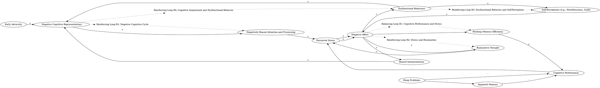

early adversity such as abuse or neglect of a child is processed and stored in the form of negative cognitive representations within an individual’s memory. Negative cognitive representations influence the way in which one attunes to stress stimuli, leading an individual to orient and maintain his/her focus on negative information. Negatively biased attention and processing increases one’s perceived level of stress which leads to negative affect such as sadness and biased interpretations of negative stimuli that often align with one’s negative mental models. The processing of negative thoughts and affect is encoded and stored in one’s memory, further strengthening existing negative cognitive representations. negative affect and interpretations intensify one’s propensity for ruminative thought which further compounds perceptions of stress and increases negative affect.  negative affect and interpretations contribute to dysfunctional behaviors and strengthen negative cognitive models. An example of this is the self perceptions of worthlessness and feelings of guilt one might experience after having shoved his/her partner during a heated argument. The dysfunctional behavior in this example intensifies the perception of oneself as worthless. Increased negative affect inhibits the efficiency of one’s working memory, leading to less optimal cognitive performance. Cognitive performance is weakened by impaired memory and sleep problems and further contributes to dysfunctional behaviors. Dysfunctional behaviors reinforce negative cognitive representations and lead to biased attentional processes, increased perceptions of stress, negative affect and interpretations, and further inhibit the efficiency of  working memory.
### Step 1: Identify Primary Variables  
The key entities or components in the text are:  

1. **Early Adversity**  
2. **Negative Cognitive Representations**  
3. **Stress Stimuli**  
4. **Negatively Biased Attention and Processing**  
5. **Perceived Stress**  
6. **Negative Affect**  
7. **Biased Interpretations**  
8. **Ruminative Thought**  
9. **Dysfunctional Behaviors**  
10. **Self-Perceptions (e.g., Worthlessness, Guilt)**  
11. **Working Memory Efficiency**  
12. **Cognitive Performance**  
13. **Impaired Memory**  
14. **Sleep Problems**  

---

### Step 2: Break Down Sub-Factors  

For each primary variable, here are the nuanced sub-factors:  

1. **Early Adversity**  
   - Types of adversity (e.g., abuse, neglect)  
   - Impact on memory encoding  

2. **Negative Cognitive Representations**  
   - Stored negative mental models  
   - Influence on attention and interpretation  

3. **Stress Stimuli**  
   - External stressors triggering responses  
   - Sensitivity to stress due to negative representations  

4. **Negatively Biased Attention and Processing**  
   - Focus on negative information  
   - Maintenance of attention on stress-inducing stimuli  

5. **Perceived Stress**  
   - Subjective level of stress experienced  
   - Amplification by biased attention  

6. **Negative Affect**  
   - Emotional states such as sadness, guilt, or worthlessness  
   - Dependency on perceived stress and biased interpretations  

7. **Biased Interpretations**  
   - Negative framing of stimuli  
   - Alignment with negative cognitive models  

8. **Ruminative Thought**  
   - Repetitive focus on negative thoughts  
   - Contribution to stress and negative affect  

9. **Dysfunctional Behaviors**  
   - Actions such as aggression or withdrawal  
   - Reinforcement of negative self-perceptions  

10. **Self-Perceptions (e.g., Worthlessness, Guilt)**  
    - Internalized negative self-concept  
    - Influence on emotional and behavioral responses  

11. **Working Memory Efficiency**  
    - Capacity to process and retain information  
    - Inhibition by negative affect and stress  

12. **Cognitive Performance**  
    - Overall mental functioning and decision-making  
    - Dependency on working memory and sleep quality  

13. **Impaired Memory**  
    - Difficulty encoding and retrieving information  
    - Impact on cognitive performance  

14. **Sleep Problems**  
    - Disrupted sleep patterns  
    - Contribution to impaired memory and cognitive performance  

---

### Step 3: Causal Relationships for Causal Loop Diagram (CLD)  

1. **Early Adversity → Negative Cognitive Representations**  
   - Early adversity is encoded as negative cognitive models.  

2. **Negative Cognitive Representations → Negatively Biased Attention and Processing**  
   - Negative models influence attention to focus on negative stimuli.  

3. **Negatively Biased Attention and Processing → Perceived Stress**  
   - Biased attention amplifies the perception of stress.  

4. **Perceived Stress → Negative Affect**  
   - Increased stress leads to negative emotional states.  

5. **Negative Affect → Biased Interpretations**  
   - Negative emotions lead to biased interpretations of stimuli.  

6. **Biased Interpretations → Negative Cognitive Representations**  
   - Biased interpretations reinforce negative cognitive models.  

7. **Negative Affect → Ruminative Thought**  
   - Negative emotions increase the tendency for ruminative thinking.  

8. **Ruminative Thought → Perceived Stress**  
   - Ruminative thought amplifies the perception of stress.  

9. **Negative Affect → Dysfunctional Behaviors**  
   - Negative emotions contribute to maladaptive actions.  

10. **Dysfunctional Behaviors → Self-Perceptions (e.g., Worthlessness, Guilt)**  
    - Dysfunctional actions reinforce negative self-perceptions.  

11. **Self-Perceptions → Negative Affect**  
    - Negative self-perceptions intensify negative emotions.  

12. **Negative Affect → Working Memory Efficiency**  
    - Negative emotions inhibit working memory performance.  

13. **Working Memory Efficiency → Cognitive Performance**  
    - Impaired working memory reduces overall cognitive performance.  

14. **Impaired Memory → Cognitive Performance**  
    - Memory problems further weaken cognitive performance.  

15. **Sleep Problems → Impaired Memory**  
    - Sleep issues contribute to memory impairments.  

16. **Sleep Problems → Cognitive Performance**  
    - Poor sleep directly reduces cognitive functioning.  

17. **Dysfunctional Behaviors → Negative Cognitive Representations**  
    - Dysfunctional actions reinforce negative mental models.  

18. **Negative Cognitive Representations → Biased Attentional Processes**  
    - Negative models perpetuate biased attention and processing.  

19. **Biased Attentional Processes → Perceived Stress**  
    - Biased attention increases stress perception.  

20. **Perceived Stress → Negative Affect**  
    - Stress perception leads to negative emotional states.  

---

This breakdown provides a comprehensive foundation for constructing a Causal Loop Diagram (CLD) that captures the reinforcing feedback loops and interdependencies among the variables. Let me know if you'd like assistance in visualizing the CLD!### Step 3: Causal Relationships for Causal Loop Diagram (CLD)

Here is the detailed breakdown of causal relationships based on the input text:

---

1. **Early Adversity --> (+) Negative Cognitive Representations**  
   **Reasoning:** Early adversity, such as abuse or neglect, is encoded and stored as negative cognitive representations in memory.  
   **Relevant Text:** "Early adversity such as abuse or neglect of a child is processed and stored in the form of negative cognitive representations within an individual’s memory."

---

2. **Negative Cognitive Representations --> (+) Negatively Biased Attention and Processing**  
   **Reasoning:** Negative cognitive representations influence how individuals process information, leading them to focus on and maintain attention on negative stimuli.  
   **Relevant Text:** "Negative cognitive representations influence the way in which one attunes to stress stimuli, leading an individual to orient and maintain his/her focus on negative information."

---

3. **Negatively Biased Attention and Processing --> (+) Perceived Stress**  
   **Reasoning:** A focus on negative information amplifies the perception of stress.  
   **Relevant Text:** "Negatively biased attention and processing increases one’s perceived level of stress..."

---

4. **Perceived Stress --> (+) Negative Affect**  
   **Reasoning:** Higher levels of perceived stress lead to negative emotional states, such as sadness.  
   **Relevant Text:** "...which leads to negative affect such as sadness..."

---

5. **Negative Affect --> (+) Biased Interpretations**  
   **Reasoning:** Negative emotional states result in biased interpretations of stimuli, aligning with existing negative mental models.  
   **Relevant Text:** "...and biased interpretations of negative stimuli that often align with one’s negative mental models."

---

6. **Biased Interpretations --> (+) Negative Cognitive Representations**  
   **Reasoning:** Biased interpretations reinforce and strengthen existing negative cognitive representations.  
   **Relevant Text:** "The processing of negative thoughts and affect is encoded and stored in one’s memory, further strengthening existing negative cognitive representations."

---

7. **Negative Affect --> (+) Ruminative Thought**  
   **Reasoning:** Negative emotions increase the tendency to engage in repetitive, negative thought patterns.  
   **Relevant Text:** "Negative affect and interpretations intensify one’s propensity for ruminative thought..."

---

8. **Ruminative Thought --> (+) Perceived Stress**  
   **Reasoning:** Ruminative thinking compounds perceptions of stress, creating a feedback loop.  
   **Relevant Text:** "...which further compounds perceptions of stress..."

---

9. **Negative Affect --> (+) Dysfunctional Behaviors**  
   **Reasoning:** Negative emotions contribute to maladaptive behaviors, such as aggression or withdrawal.  
   **Relevant Text:** "Negative affect and interpretations contribute to dysfunctional behaviors..."

---

10. **Dysfunctional Behaviors --> (+) Self-Perceptions (e.g., Worthlessness, Guilt)**  
    **Reasoning:** Dysfunctional behaviors, such as aggression, reinforce negative self-perceptions like worthlessness or guilt.  
    **Relevant Text:** "An example of this is the self-perceptions of worthlessness and feelings of guilt one might experience after having shoved his/her partner during a heated argument."

---

11. **Self-Perceptions (e.g., Worthlessness, Guilt) --> (+) Negative Affect**  
    **Reasoning:** Negative self-perceptions intensify negative emotional states.  
    **Relevant Text:** "The dysfunctional behavior in this example intensifies the perception of oneself as worthless."

---

12. **Negative Affect --> (-) Working Memory Efficiency**  
    **Reasoning:** Negative emotions inhibit the efficiency of working memory, reducing cognitive performance.  
    **Relevant Text:** "Increased negative affect inhibits the efficiency of one’s working memory..."

---

13. **Working Memory Efficiency --> (+) Cognitive Performance**  
    **Reasoning:** Efficient working memory is essential for optimal cognitive performance. A decrease in working memory efficiency leads to reduced cognitive performance.  
    **Relevant Text:** "...leading to less optimal cognitive performance."

---

14. **Impaired Memory --> (-) Cognitive Performance**  
    **Reasoning:** Impaired memory weakens cognitive performance by reducing the ability to encode and retrieve information.  
    **Relevant Text:** "Cognitive performance is weakened by impaired memory..."

---

15. **Sleep Problems --> (-) Impaired Memory**  
    **Reasoning:** Sleep problems contribute to memory impairments, further reducing cognitive performance.  
    **Relevant Text:** "...and sleep problems and further contributes to dysfunctional behaviors."

---

16. **Sleep Problems --> (-) Cognitive Performance**  
    **Reasoning:** Poor sleep directly reduces cognitive functioning by impairing memory and mental processes.  
    **Relevant Text:** "Cognitive performance is weakened by impaired memory and sleep problems..."

---

17. **Dysfunctional Behaviors --> (+) Negative Cognitive Representations**  
    **Reasoning:** Dysfunctional behaviors reinforce negative cognitive models, perpetuating the cycle.  
    **Relevant Text:** "Dysfunctional behaviors reinforce negative cognitive representations..."

---

18. **Negative Cognitive Representations --> (+) Negatively Biased Attention and Processing**  
    **Reasoning:** Negative cognitive models perpetuate biased attention and processing, creating a feedback loop.  
    **Relevant Text:** "...and lead to biased attentional processes, increased perceptions of stress, negative affect and interpretations..."

---

19. **Negatively Biased Attention and Processing --> (+) Perceived Stress**  
    **Reasoning:** Biased attention increases stress perception, reinforcing the cycle.  
    **Relevant Text:** "...and lead to biased attentional processes, increased perceptions of stress..."

---

20. **Perceived Stress --> (+) Negative Affect**  
    **Reasoning:** Stress perception leads to negative emotional states, such as sadness or guilt.  
    **Relevant Text:** "...increased perceptions of stress, negative affect and interpretations..."

---

### Summary of Key Feedback Loops

- **Reinforcing Loop 1:**  
  Early Adversity → Negative Cognitive Representations → Negatively Biased Attention → Perceived Stress → Negative Affect → Biased Interpretations → Negative Cognitive Representations  

- **Reinforcing Loop 2:**  
  Negative Affect → Ruminative Thought → Perceived Stress → Negative Affect  

- **Reinforcing Loop 3:**  
  Dysfunctional Behaviors → Self-Perceptions → Negative Affect → Dysfunctional Behaviors  

- **Reinforcing Loop 4:**  
  Negative Cognitive Representations → Dysfunctional Behaviors → Negative Cognitive Representations  

These loops highlight the self-reinforcing nature of the relationships, where negative cognitive and emotional patterns perpetuate themselves over time. Let me know if you'd like further clarification or assistance in visualizing the CLD!### Feedback Loops

#### Loop R1 (Reinforcing): Negative Cognitive Cycle  
**Path:** Early Adversity → (+) Negative Cognitive Representations → (+) Negatively Biased Attention and Processing → (+) Perceived Stress → (+) Negative Affect → (+) Biased Interpretations → (+) Negative Cognitive Representations  
**Explanation:** This loop demonstrates how early adversity creates negative cognitive representations that perpetuate a cycle of biased attention, stress perception, negative emotions, and interpretations, further reinforcing the negative cognitive models.

---

#### Loop R2 (Reinforcing): Stress and Rumination  
**Path:** Negative Affect → (+) Ruminative Thought → (+) Perceived Stress → (+) Negative Affect  
**Explanation:** Negative emotions lead to ruminative thinking, which amplifies stress perception, further intensifying negative emotions. This loop reinforces the emotional and cognitive burden on the individual.

---

#### Loop R3 (Reinforcing): Dysfunctional Behavior and Self-Perception  
**Path:** Dysfunctional Behaviors → (+) Self-Perceptions (e.g., Worthlessness, Guilt) → (+) Negative Affect → (+) Dysfunctional Behaviors  
**Explanation:** Dysfunctional behaviors, such as aggression or withdrawal, reinforce negative self-perceptions, which increase negative emotions and lead to further dysfunctional behaviors.

---

#### Loop R4 (Reinforcing): Cognitive Impairment and Dysfunctional Behavior  
**Path:** Negative Cognitive Representations → (+) Dysfunctional Behaviors → (+) Negative Cognitive Representations  
**Explanation:** Dysfunctional behaviors reinforce negative cognitive representations, perpetuating a cycle of maladaptive actions and negative mental models.

---

#### Loop B1 (Balancing): Cognitive Performance and Stress  
**Path:** Negative Affect → (-) Working Memory Efficiency → (+) Cognitive Performance → (-) Perceived Stress → (-) Negative Affect  
**Explanation:** Negative emotions impair working memory, reducing cognitive performance. However, improved cognitive performance (if achieved) can reduce perceived stress and negative emotions, potentially stabilizing the system.

---

### Delays

1. **Memory Encoding Delay:**  
   - There is a delay between experiencing early adversity and the formation of negative cognitive representations.  
   - **Impact:** This delay means the effects of early adversity may not manifest immediately but can emerge later in life.

2. **Ruminative Thought Delay:**  
   - The impact of ruminative thought on perceived stress and negative affect may take time to accumulate.  
   - **Impact:** This delay can make it harder to identify the source of stress and emotional distress.

3. **Behavioral Feedback Delay:**  
   - Dysfunctional behaviors may not immediately reinforce negative self-perceptions or cognitive representations.  
   - **Impact:** This delay can obscure the connection between actions and their long-term psychological effects.

4. **Sleep and Cognitive Performance Delay:**  
   - Sleep problems may take time to impair memory and cognitive performance.  
   - **Impact:** This delay can lead to gradual declines in functioning that are difficult to detect early.

---

### Suggestions

1. **Early Intervention for Adversity:**  
   - Implement programs to identify and address early adversity (e.g., abuse, neglect) in children to prevent the formation of negative cognitive representations.  
   - **Rationale:** Breaking the cycle early can reduce the long-term impact on attention, stress perception, and emotional health.

2. **Cognitive Behavioral Therapy (CBT):**  
   - Use CBT to challenge and reframe negative cognitive representations and biased interpretations.  
   - **Rationale:** This can disrupt reinforcing loops (R1, R2) by reducing biased attention and negative affect.

3. **Mindfulness Training:**  
   - Introduce mindfulness practices to reduce ruminative thought and improve emotional regulation.  
   - **Rationale:** This can weaken Loop R2 by reducing the impact of rumination on stress and negative affect.

4. **Behavioral Interventions:**  
   - Encourage positive behaviors and coping strategies to counteract dysfunctional behaviors.  
   - **Rationale:** This can weaken Loop R3 by reducing the reinforcement of negative self-perceptions.

5. **Sleep Hygiene Programs:**  
   - Promote better sleep habits and address sleep problems through behavioral and medical interventions.  
   - **Rationale:** Improved sleep can enhance memory and cognitive performance, stabilizing Loop B1.

6. **Working Memory Training:**  
   - Implement cognitive training programs to improve working memory efficiency.  
   - **Rationale:** Enhanced working memory can mitigate the impact of negative affect on cognitive performance, breaking the cycle of cognitive decline.

7. **Stress Management Techniques:**  
   - Teach stress management techniques, such as relaxation exercises or biofeedback, to reduce perceived stress.  
   - **Rationale:** Lowering stress perception can weaken reinforcing loops (R1, R2) and improve emotional well-being.

---

This analysis provides a comprehensive understanding of the system dynamics and actionable interventions to disrupt negative feedback loops and promote positive outcomes. Let me know if you'd like further assistance!

---

Here is the Graphviz script to visualize the causal relationships and feedback loops described in the analysis:

### Explanation of the Script:
1. **Nodes and Edges**:
   - Each variable (e.g., "Early Adversity", "Negative Cognitive Representations") is represented as a node.
   - Causal relationships are represented as directed edges with labels indicating the sign of the relationship (`+` for positive, `-` for negative).

2. **Feedback Loops**:
   - Feedback loops are labeled as plaintext nodes (e.g., `"Loop R1"`) and connected to the relevant variables with dotted lines.
   - Each loop is described with a brief label (e.g., `"Reinforcing Loop R1: Negative Cognitive Cycle"`).

3. **Layout**:
   - The `rankdir=LR` setting ensures a left-to-right layout for better readability.

### How to Render:
1. Save the script to a file, e.g., `causal_loop_diagram.dot`.
2. Use Graphviz to render the diagram:
   - For PNG: `dot -Tpng causal_loop_diagram.dot -o causal_loop_diagram.png`
   - For PDF: `dot -Tpdf causal_loop_diagram.dot -o causal_loop_diagram.pdf`

This script captures the complexity of the system while clearly visualizing the reinforcing and balancing feedback loops. Let me know if you need further adjustments!
