Defects are created by operations (normal wear and tear) and by collateral damage arising from breakdowns (when the oil leaks out of the pump bearing and the bearing seizes, the shaft may be bent, the motor may overheat, and the vibration may break couplings and pipes, introducing new problems).  The stock of defects is drained by two flows: reactive maintenance (repair of failed equipment) and planned maintenance (proactive repair of operable equipment). As equipment defects accumulate, the chance of a breakdown increases. Breakdowns lead to more reactive maintenance, and after repair, the equipment is returned to service and the stock of equipment defects is reduced. Similarly, scheduled maintenance or equipment monitoring may reveal the presence of latent defects. The equipment is then taken out of service and the defects are corrected before a breakdown occurs. Obviously, breakdowns reduce plant uptime. In addition, most planned maintenance activity also reduce uptime since planned maintenance frequently requires operable equipment be taken out of service so the needed work can be done. Breakdowns cause collateral damage, directly increasing the stock of defects further and leading to still more breakdowns in a vicious cycle. Because the total number of mechanics is limited, more breakdowns necessarily pull mechanics off planned work as management reassigns mechanics to repair work. With less planned work, breakdowns increase still more.  When plan uptime is low, operators are less willing to take working equipment down for planned maintenance. 
### Step 1: Identify Primary Variables  
The key entities or components in the text are:  

1. **Defects**  
2. **Breakdowns**  
3. **Reactive Maintenance**  
4. **Planned Maintenance**  
5. **Equipment Uptime**  
6. **Mechanics**  
7. **Collateral Damage**  

---

### Step 2: Break Down Sub-Factors  

For each primary variable, here are the nuanced sub-factors:  

1. **Defects**  
   - Stock of defects (accumulated defects in equipment)  
   - Sources of defects:  
     - Normal wear and tear (operations)  
     - Collateral damage from breakdowns (e.g., bent shafts, overheated motors, broken couplings/pipes)  
   - Reduction of defects:  
     - Reactive maintenance (repair after failure)  
     - Planned maintenance (proactive repair before failure)  

2. **Breakdowns**  
   - Likelihood of breakdowns (increases with accumulated defects)  
   - Consequences of breakdowns:  
     - Collateral damage (introducing new defects)  
     - Reduced plant uptime  
     - Increased reactive maintenance demand  

3. **Reactive Maintenance**  
   - Repairs performed after equipment failure  
   - Reduces the stock of defects after breakdowns  
   - Requires mechanics to be reassigned from planned maintenance  

4. **Planned Maintenance**  
   - Proactive repair of operable equipment  
   - Reduces the stock of defects before breakdowns occur  
   - Requires taking operable equipment out of service (reduces uptime)  
   - May reveal latent defects during equipment monitoring  

5. **Equipment Uptime**  
   - Plant uptime is reduced by:  
     - Breakdowns  
     - Planned maintenance (taking operable equipment out of service)  
   - Low uptime discourages operators from scheduling planned maintenance  

6. **Mechanics**  
   - Limited number of mechanics available  
   - Allocation of mechanics:  
     - Reactive maintenance (increases with breakdowns)  
     - Planned maintenance (decreases when mechanics are reassigned to reactive maintenance)  

7. **Collateral Damage**  
   - Damage caused by breakdowns (e.g., bent shafts, overheated motors, broken couplings/pipes)  
   - Directly increases the stock of defects  
   - Contributes to a vicious cycle of more defects and breakdowns  

---

### Summary of Key Relationships  

- **Defects → Breakdowns**: Accumulated defects increase the likelihood of breakdowns.  
- **Breakdowns → Reactive Maintenance**: Breakdowns require reactive maintenance to repair failed equipment.  
- **Breakdowns → Collateral Damage → Defects**: Breakdowns cause collateral damage, introducing new defects.  
- **Reactive Maintenance → Defects**: Reactive maintenance reduces the stock of defects after breakdowns.  
- **Planned Maintenance → Defects**: Planned maintenance reduces defects proactively before breakdowns occur.  
- **Planned Maintenance → Uptime**: Planned maintenance reduces uptime by taking operable equipment out of service.  
- **Breakdowns → Uptime**: Breakdowns reduce plant uptime.  
- **Uptime → Planned Maintenance**: Low uptime discourages operators from scheduling planned maintenance.  
- **Breakdowns → Mechanics Allocation**: More breakdowns pull mechanics off planned maintenance to perform reactive maintenance.  
- **Mechanics Allocation → Planned Maintenance**: Fewer mechanics available for planned maintenance leads to more breakdowns.  

This system exhibits several reinforcing feedback loops, such as the vicious cycle of defects, breakdowns, collateral damage, and reduced planned maintenance.### Step 3: Map Causal Relationships  

1. **Defects --> (+) Breakdowns**  
   **Reasoning:** As defects accumulate, the likelihood of equipment breakdowns increases.  
   **Relevant Text:** "As equipment defects accumulate, the chance of a breakdown increases."  

2. **Breakdowns --> (+) Reactive Maintenance**  
   **Reasoning:** Breakdowns require reactive maintenance to repair failed equipment.  
   **Relevant Text:** "Breakdowns lead to more reactive maintenance, and after repair, the equipment is returned to service and the stock of equipment defects is reduced."  

3. **Breakdowns --> (+) Collateral Damage**  
   **Reasoning:** Breakdowns cause collateral damage, such as bent shafts, overheated motors, and broken couplings, which introduce new defects.  
   **Relevant Text:** "Breakdowns cause collateral damage, directly increasing the stock of defects further and leading to still more breakdowns in a vicious cycle."  

4. **Collateral Damage --> (+) Defects**  
   **Reasoning:** Collateral damage from breakdowns directly increases the stock of defects.  
   **Relevant Text:** "Breakdowns cause collateral damage, directly increasing the stock of defects further..."  

5. **Reactive Maintenance --> (-) Defects**  
   **Reasoning:** Reactive maintenance repairs failed equipment, reducing the stock of defects.  
   **Relevant Text:** "Breakdowns lead to more reactive maintenance, and after repair, the equipment is returned to service and the stock of equipment defects is reduced."  

6. **Planned Maintenance --> (-) Defects**  
   **Reasoning:** Planned maintenance proactively repairs operable equipment, reducing defects before breakdowns occur.  
   **Relevant Text:** "Similarly, scheduled maintenance or equipment monitoring may reveal the presence of latent defects. The equipment is then taken out of service and the defects are corrected before a breakdown occurs."  

7. **Planned Maintenance --> (-) Uptime**  
   **Reasoning:** Planned maintenance requires taking operable equipment out of service, reducing plant uptime.  
   **Relevant Text:** "In addition, most planned maintenance activity also reduce uptime since planned maintenance frequently requires operable equipment be taken out of service so the needed work can be done."  

8. **Breakdowns --> (-) Uptime**  
   **Reasoning:** Breakdowns reduce plant uptime by taking equipment out of service unexpectedly.  
   **Relevant Text:** "Obviously, breakdowns reduce plant uptime."  

9. **Uptime --> (-) Planned Maintenance**  
   **Reasoning:** When plant uptime is low, operators are less willing to take working equipment out of service for planned maintenance.  
   **Relevant Text:** "When plant uptime is low, operators are less willing to take working equipment down for planned maintenance."  

10. **Breakdowns --> (+) Mechanics Allocation to Reactive Maintenance**  
    **Reasoning:** More breakdowns require mechanics to be reassigned from planned maintenance to reactive maintenance.  
    **Relevant Text:** "Because the total number of mechanics is limited, more breakdowns necessarily pull mechanics off planned work as management reassigns mechanics to repair work."  

11. **Mechanics Allocation to Reactive Maintenance --> (-) Planned Maintenance**  
    **Reasoning:** When mechanics are reassigned to reactive maintenance, fewer mechanics are available for planned maintenance.  
    **Relevant Text:** "Because the total number of mechanics is limited, more breakdowns necessarily pull mechanics off planned work as management reassigns mechanics to repair work."  

12. **Planned Maintenance --> (-) Breakdowns**  
    **Reasoning:** Planned maintenance reduces the likelihood of breakdowns by addressing defects proactively.  
    **Relevant Text:** "Similarly, scheduled maintenance or equipment monitoring may reveal the presence of latent defects. The equipment is then taken out of service and the defects are corrected before a breakdown occurs."  

13. **Breakdowns --> (+) Defects**  
    **Reasoning:** Breakdowns cause collateral damage, which increases the stock of defects, creating a reinforcing loop.  
    **Relevant Text:** "Breakdowns cause collateral damage, directly increasing the stock of defects further and leading to still more breakdowns in a vicious cycle."  

---

### Summary of Feedback Loops  

1. **Reinforcing Loop (Vicious Cycle of Defects and Breakdowns):**  
   - Defects --> (+) Breakdowns --> (+) Collateral Damage --> (+) Defects  

2. **Balancing Loop (Reactive Maintenance):**  
   - Breakdowns --> (+) Reactive Maintenance --> (-) Defects  

3. **Balancing Loop (Planned Maintenance):**  
   - Planned Maintenance --> (-) Defects --> (-) Breakdowns  

4. **Reinforcing Loop (Mechanics Allocation):**  
   - Breakdowns --> (+) Mechanics Allocation to Reactive Maintenance --> (-) Planned Maintenance --> (+) Breakdowns  

5. **Reinforcing Loop (Uptime and Planned Maintenance):**  
   - Breakdowns --> (-) Uptime --> (-) Planned Maintenance --> (+) Breakdowns  ### Feedback Loops  

1. **Reinforcing Loop R1 (Vicious Cycle of Defects and Breakdowns):**  
   - Path: Defects → (+) Breakdowns → (+) Collateral Damage → (+) Defects  
   - Explanation: As defects accumulate, breakdowns become more likely. Breakdowns cause collateral damage, introducing new defects, which further increase the likelihood of breakdowns. This creates a vicious cycle of escalating defects and breakdowns.  

2. **Balancing Loop B1 (Reactive Maintenance):**  
   - Path: Breakdowns → (+) Reactive Maintenance → (-) Defects  
   - Explanation: Breakdowns trigger reactive maintenance, which repairs failed equipment and reduces the stock of defects, helping to stabilize the system.  

3. **Balancing Loop B2 (Planned Maintenance):**  
   - Path: Planned Maintenance → (-) Defects → (-) Breakdowns  
   - Explanation: Planned maintenance proactively reduces defects, preventing breakdowns and stabilizing the system by addressing issues before they escalate.  

4. **Reinforcing Loop R2 (Mechanics Allocation):**  
   - Path: Breakdowns → (+) Mechanics Allocation to Reactive Maintenance → (-) Planned Maintenance → (+) Breakdowns  
   - Explanation: As breakdowns increase, mechanics are reassigned from planned maintenance to reactive maintenance. This reduces the amount of planned maintenance, leading to more defects and breakdowns, reinforcing the cycle.  

5. **Reinforcing Loop R3 (Uptime and Planned Maintenance):**  
   - Path: Breakdowns → (-) Uptime → (-) Planned Maintenance → (+) Breakdowns  
   - Explanation: Breakdowns reduce plant uptime, making operators less willing to schedule planned maintenance. This leads to more defects and breakdowns, further reducing uptime and reinforcing the cycle.  

---

### Delays  

1. **Reactive Maintenance Delay:**  
   - There is a delay between a breakdown occurring and the completion of reactive maintenance. This delay can prolong the period during which defects remain unaddressed, increasing the likelihood of further breakdowns.  

2. **Planned Maintenance Delay:**  
   - Planned maintenance requires scheduling and taking equipment out of service. Delays in scheduling or executing planned maintenance can allow defects to accumulate, increasing the risk of breakdowns.  

3. **Collateral Damage Delay:**  
   - The effects of collateral damage (e.g., bent shafts, broken couplings) may not be immediately apparent, leading to a lag in identifying and addressing the resulting defects.  

4. **Mechanics Reallocation Delay:**  
   - Reassigning mechanics from planned maintenance to reactive maintenance takes time, during which planned maintenance is deferred, allowing defects to accumulate further.  

---

### Suggestions  

1. **Increase Mechanic Capacity:**  
   - Hire additional mechanics or train existing staff to handle both reactive and planned maintenance. This would reduce the need to reallocate mechanics from planned maintenance to reactive maintenance, breaking the reinforcing loop (R2).  

2. **Optimize Maintenance Scheduling:**  
   - Use predictive maintenance tools to identify and address defects before they lead to breakdowns. This would enhance the effectiveness of planned maintenance and reduce the likelihood of breakdowns, strengthening the balancing loop (B2).  

3. **Reduce Collateral Damage:**  
   - Implement design improvements or protective measures (e.g., vibration dampers, better lubrication systems) to minimize collateral damage during breakdowns. This would weaken the reinforcing loop (R1) by reducing the introduction of new defects.  

4. **Improve Uptime Management:**  
   - Introduce policies to ensure a minimum level of planned maintenance even during periods of low uptime. For example, schedule planned maintenance during non-peak hours or use temporary equipment to maintain uptime while repairs are conducted. This would weaken the reinforcing loop (R3).  

5. **Shorten Maintenance Delays:**  
   - Streamline the processes for both reactive and planned maintenance to reduce delays. For example, maintain an inventory of critical spare parts and ensure mechanics are equipped with the necessary tools and training. This would improve the responsiveness of both balancing loops (B1 and B2).  

By addressing these areas, the system can be stabilized, reducing the frequency of breakdowns and improving overall equipment uptime.

---

Here is the Graphviz script to visualize the causal relationships and feedback loops described in the system:

```dot
digraph CausalLoopDiagram {
    rankdir=LR; // Left-to-right layout for better readability

    // Define nodes and relationships
    "Defects" -> "Breakdowns" [label="+"]; // Defects increase likelihood of breakdowns
    "Breakdowns" -> "Reactive Maintenance" [label="+"]; // Breakdowns increase reactive maintenance
    "Breakdowns" -> "Collateral Damage" [label="+"]; // Breakdowns cause collateral damage
    "Collateral Damage" -> "Defects" [label="+"]; // Collateral damage increases defects
    "Reactive Maintenance" -> "Defects" [label="-"]; // Reactive maintenance reduces defects
    "Planned Maintenance" -> "Defects" [label="-"]; // Planned maintenance reduces defects
    "Planned Maintenance" -> "Uptime" [label="-"]; // Planned maintenance reduces uptime
    "Breakdowns" -> "Uptime" [label="-"]; // Breakdowns reduce uptime
    "Uptime" -> "Planned Maintenance" [label="-"]; // Low uptime discourages planned maintenance
    "Breakdowns" -> "Mechanics Allocation to Reactive Maintenance" [label="+"]; // Breakdowns increase reactive maintenance demand
    "Mechanics Allocation to Reactive Maintenance" -> "Planned Maintenance" [label="-"]; // Fewer mechanics for planned maintenance
    "Planned Maintenance" -> "Breakdowns" [label="-"]; // Planned maintenance reduces breakdowns
    "Breakdowns" -> "Defects" [label="+"]; // Breakdowns increase defects via collateral damage

    // Label feedback loops
    "Loop R1" [shape=plaintext, label="Reinforcing Loop R1: Defects → Breakdowns → Collateral Damage → Defects"];
    "Defects" -> "Loop R1" [style=dotted];
    "Breakdowns" -> "Loop R1" [style=dotted];
    "Collateral Damage" -> "Loop R1" [style=dotted];

    "Loop B1" [shape=plaintext, label="Balancing Loop B1: Breakdowns → Reactive Maintenance → Defects"];
    "Breakdowns" -> "Loop B1" [style=dotted];
    "Reactive Maintenance" -> "Loop B1" [style=dotted];

    "Loop B2" [shape=plaintext, label="Balancing Loop B2: Planned Maintenance → Defects → Breakdowns"];
    "Planned Maintenance" -> "Loop B2" [style=dotted];
    "Defects" -> "Loop B2" [style=dotted];

    "Loop R2" [shape=plaintext, label="Reinforcing Loop R2: Breakdowns → Mechanics Allocation → Planned Maintenance → Breakdowns"];
    "Breakdowns" -> "Loop R2" [style=dotted];
    "Mechanics Allocation to Reactive Maintenance" -> "Loop R2" [style=dotted];
    "Planned Maintenance" -> "Loop R2" [style=dotted];

    "Loop R3" [shape=plaintext, label="Reinforcing Loop R3: Breakdowns → Uptime → Planned Maintenance → Breakdowns"];
    "Breakdowns" -> "Loop R3" [style=dotted];
    "Uptime" -> "Loop R3" [style=dotted];
    "Planned Maintenance" -> "Loop R3" [style=dotted];
}
```

### Explanation of the Script:
1. **Nodes and Edges**:
   - Each variable (e.g., "Defects", "Breakdowns") is represented as a node.
   - Causal relationships are represented as directed edges with labels indicating the sign of the relationship (`+` for positive, `-` for negative).

2. **Feedback Loops**:
   - Feedback loops are labeled as plaintext nodes (e.g., "Loop R1", "Loop B1").
   - Dotted edges connect the relevant variables to their respective feedback loop labels for clarity.

3. **Reinforcing and Balancing Loops**:
   - Reinforcing loops (e.g., R1, R2, R3) represent vicious cycles where variables amplify each other.
   - Balancing loops (e.g., B1, B2) represent stabilizing mechanisms that counteract changes in the system.

This script can be rendered using Graphviz to produce a clear visualization of the causal relationships and feedback loops in the system.
