both the firm and the competitor continuously improve the quality of their products in order to keep ahead of one another.  An increase in the Firm’s Quality (FQ) leads to an upwards shift in the competitor’s appreciation of FQ, which in turn leads to a desire for the competitor to generate an improvement in its own quality. After an appropriate time lag, representing the internal workings of the company, this desire to improve quality generates an actual improvement in the Competitor’s Quality (CQ). However, as this improvement in CQ is being realised, a similar chain of events is taking place within the firm, which in turn causes an upward movement in FQ. In both cases the desired improvements in quality are considered to be a function of the difference between the firm’s own quality and its appreciation of its competitor’s quality. However, the lag in generating an actual improvement in quality is considered to be a function of the current level of quality. This implies that it becomes increasingly difficult to improve quality as the overall level of quality becomes higher.
### Step 1: Identify Primary Variables  
The key entities or components in the text are:  

1. **Firm’s Quality (FQ)**  
2. **Competitor’s Quality (CQ)**  
3. **Competitor’s Appreciation of Firm’s Quality (CAFQ)**  
4. **Firm’s Appreciation of Competitor’s Quality (FACQ)**  
5. **Desired Quality Improvement (DQI)**  
6. **Time Lag for Quality Improvement (TLQI)**  

---

### Step 2: Break Down Sub-Factors  

For each primary variable, here are the nuanced sub-factors:  

1. **Firm’s Quality (FQ)**  
   - Current level of the firm’s product quality  
   - Rate of improvement in the firm’s quality  

2. **Competitor’s Quality (CQ)**  
   - Current level of the competitor’s product quality  
   - Rate of improvement in the competitor’s quality  

3. **Competitor’s Appreciation of Firm’s Quality (CAFQ)**  
   - Competitor’s perception of the firm’s quality  
   - Sensitivity of the competitor’s appreciation to changes in FQ  

4. **Firm’s Appreciation of Competitor’s Quality (FACQ)**  
   - Firm’s perception of the competitor’s quality  
   - Sensitivity of the firm’s appreciation to changes in CQ  

5. **Desired Quality Improvement (DQI)**  
   - The gap between a company’s own quality and its appreciation of the competitor’s quality  
   - Drives the motivation to improve quality for both the firm and the competitor  

6. **Time Lag for Quality Improvement (TLQI)**  
   - Time delay in realizing actual quality improvements  
   - Dependency on the current level of quality (higher quality levels lead to longer delays)  

---

### Causal Relationships  

1. **Firm’s Quality (FQ) → Competitor’s Appreciation of Firm’s Quality (CAFQ)**  
   - An increase in FQ leads to an upward shift in CAFQ.  

2. **CAFQ → Competitor’s Desired Quality Improvement (DQI)**  
   - A higher CAFQ increases the competitor’s DQI.  

3. **Competitor’s DQI → Competitor’s Quality (CQ)** (with a time lag)  
   - The competitor’s desire to improve quality eventually leads to an actual improvement in CQ after a time lag.  

4. **Competitor’s Quality (CQ) → Firm’s Appreciation of Competitor’s Quality (FACQ)**  
   - An increase in CQ leads to an upward shift in FACQ.  

5. **FACQ → Firm’s Desired Quality Improvement (DQI)**  
   - A higher FACQ increases the firm’s DQI.  

6. **Firm’s DQI → Firm’s Quality (FQ)** (with a time lag)  
   - The firm’s desire to improve quality eventually leads to an actual improvement in FQ after a time lag.  

7. **Current Quality Level → Time Lag for Quality Improvement (TLQI)**  
   - Higher current quality levels increase the time lag for realizing further quality improvements.  

---

### Feedback Loops  

1. **Reinforcing Loop (R1): Firm’s Quality → Competitor’s Quality**  
   - An increase in FQ leads to an increase in CAFQ → Competitor’s DQI → CQ → FACQ → Firm’s DQI → FQ.  

2. **Balancing Loop (B1): Quality Improvement Difficulty**  
   - As FQ or CQ increases, the time lag for quality improvement (TLQI) increases, slowing down the rate of further quality improvements.  

This system represents a competitive dynamic where both firms are locked in a reinforcing feedback loop of quality improvement, constrained by the balancing effect of increasing difficulty in achieving higher quality levels.### Step 3: Map Causal Relationships  

1. **Firm’s Quality (FQ) --> (+) Competitor’s Appreciation of Firm’s Quality (CAFQ)**  
   **Reasoning:** An increase in the firm’s quality leads to a higher appreciation of the firm’s quality by the competitor. This is because the competitor continuously evaluates the firm’s quality to stay competitive.  
   **Relevant Text:** "An increase in the Firm’s Quality (FQ) leads to an upwards shift in the competitor’s appreciation of FQ..."  

2. **Competitor’s Appreciation of Firm’s Quality (CAFQ) --> (+) Competitor’s Desired Quality Improvement (DQI)**  
   **Reasoning:** As the competitor perceives the firm’s quality to be higher, it increases the competitor’s desire to improve its own quality to stay competitive.  
   **Relevant Text:** "...which in turn leads to a desire for the competitor to generate an improvement in its own quality."  

3. **Competitor’s Desired Quality Improvement (DQI) --> (+) Competitor’s Quality (CQ)** (with a time lag)  
   **Reasoning:** The competitor’s desire to improve quality eventually translates into an actual improvement in its quality, but only after a time lag due to internal processes.  
   **Relevant Text:** "After an appropriate time lag, representing the internal workings of the company, this desire to improve quality generates an actual improvement in the Competitor’s Quality (CQ)."  

4. **Competitor’s Quality (CQ) --> (+) Firm’s Appreciation of Competitor’s Quality (FACQ)**  
   **Reasoning:** As the competitor improves its quality, the firm perceives the competitor’s quality to be higher, prompting the firm to reassess its own position.  
   **Relevant Text:** "...a similar chain of events is taking place within the firm, which in turn causes an upward movement in FQ."  

5. **Firm’s Appreciation of Competitor’s Quality (FACQ) --> (+) Firm’s Desired Quality Improvement (DQI)**  
   **Reasoning:** A higher appreciation of the competitor’s quality by the firm increases the firm’s desire to improve its own quality to maintain competitiveness.  
   **Relevant Text:** "In both cases the desired improvements in quality are considered to be a function of the difference between the firm’s own quality and its appreciation of its competitor’s quality."  

6. **Firm’s Desired Quality Improvement (DQI) --> (+) Firm’s Quality (FQ)** (with a time lag)  
   **Reasoning:** The firm’s desire to improve quality eventually leads to an actual improvement in its quality, but only after a time lag due to internal processes.  
   **Relevant Text:** "...this desire to improve quality generates an actual improvement in the Competitor’s Quality (CQ). However, as this improvement in CQ is being realised, a similar chain of events is taking place within the firm..."  

7. **Current Quality Level (FQ or CQ) --> (+) Time Lag for Quality Improvement (TLQI)**  
   **Reasoning:** As the overall level of quality increases, it becomes more difficult to achieve further improvements, leading to longer delays in realizing quality improvements.  
   **Relevant Text:** "The lag in generating an actual improvement in quality is considered to be a function of the current level of quality. This implies that it becomes increasingly difficult to improve quality as the overall level of quality becomes higher."  

8. **Time Lag for Quality Improvement (TLQI) --> (-) Rate of Quality Improvement (FQ or CQ)**  
   **Reasoning:** Longer time lags reduce the rate at which quality improvements can be realized, slowing down the overall improvement process.  
   **Relevant Text:** "This implies that it becomes increasingly difficult to improve quality as the overall level of quality becomes higher."  

---

### Feedback Loops  

1. **Reinforcing Loop (R1): Firm’s Quality → Competitor’s Quality**  
   - **Causal Path:** Firm’s Quality (FQ) → Competitor’s Appreciation of Firm’s Quality (CAFQ) → Competitor’s Desired Quality Improvement (DQI) → Competitor’s Quality (CQ) → Firm’s Appreciation of Competitor’s Quality (FACQ) → Firm’s Desired Quality Improvement (DQI) → Firm’s Quality (FQ).  
   **Reasoning:** This loop represents a positive feedback cycle where improvements in one firm’s quality drive improvements in the other firm’s quality, perpetuating a cycle of competitive quality enhancement.  

2. **Balancing Loop (B1): Quality Improvement Difficulty**  
   - **Causal Path:** Current Quality Level (FQ or CQ) → Time Lag for Quality Improvement (TLQI) → Rate of Quality Improvement (FQ or CQ).  
   **Reasoning:** As quality levels increase, the time lag for realizing further improvements grows, slowing down the rate of quality improvement and balancing the reinforcing loop.  

---

### Summary  

The system is characterized by a reinforcing feedback loop (R1) that drives continuous quality improvement between the firm and its competitor, constrained by a balancing loop (B1) that reflects the increasing difficulty of achieving higher quality levels. This dynamic captures the competitive interplay and the diminishing returns of quality improvement efforts over time.### Feedback Loops  

1. **Reinforcing Loop (R1): Competitive Quality Race**  
   - **Causal Path:** Firm’s Quality (FQ) → (+) Competitor’s Appreciation of Firm’s Quality (CAFQ) → (+) Competitor’s Desired Quality Improvement (DQI) → (+) Competitor’s Quality (CQ) → (+) Firm’s Appreciation of Competitor’s Quality (FACQ) → (+) Firm’s Desired Quality Improvement (DQI) → (+) Firm’s Quality (FQ).  
   - **Explanation:** This loop represents a reinforcing cycle where improvements in one firm’s quality drive the other firm to improve its quality, creating a continuous cycle of competitive quality enhancement. Each firm’s perception of the other’s quality motivates further improvements, perpetuating the race for higher quality.  

2. **Balancing Loop (B1): Quality Improvement Difficulty**  
   - **Causal Path:** Current Quality Level (FQ or CQ) → (+) Time Lag for Quality Improvement (TLQI) → (-) Rate of Quality Improvement (FQ or CQ).  
   - **Explanation:** As the overall quality level increases, it becomes harder to achieve further improvements, leading to longer delays in realizing quality enhancements. This acts as a balancing mechanism, slowing down the reinforcing loop (R1) and preventing runaway growth in quality improvements.  

---

### Delays  

1. **Time Lag for Quality Improvement (TLQI):**  
   - **Impact:** The time lag between the desire to improve quality and the realization of actual quality improvements slows the response of both firms to changes in the competitive landscape.  
   - **Dependency on Quality Level:** Higher quality levels increase the time lag, making it progressively harder to achieve further improvements. This delay weakens the speed of the reinforcing loop (R1) and contributes to the balancing effect of loop (B1).  

---

### Suggestions  

1. **Invest in Process Efficiency:**  
   - **Rationale:** Reducing the internal time lag for quality improvement (TLQI) can help both firms respond more quickly to competitive pressures. This could involve streamlining R&D processes, adopting advanced manufacturing techniques, or leveraging AI for faster product development.  

2. **Focus on Differentiation:**  
   - **Rationale:** Instead of solely competing on quality, firms could explore other dimensions of competition, such as customer service, branding, or unique features, to reduce the intensity of the reinforcing loop (R1).  

3. **Set Realistic Quality Goals:**  
   - **Rationale:** Recognizing the diminishing returns of quality improvement at higher levels, firms should prioritize improvements that deliver the most value to customers rather than pursuing quality for its own sake.  

4. **Collaborative Benchmarking:**  
   - **Rationale:** Both firms could engage in industry-wide benchmarking initiatives to identify best practices and reduce the inefficiencies associated with competitive duplication of efforts.  

5. **Monitor Competitor Perceptions:**  
   - **Rationale:** Firms should invest in market research to better understand how competitors perceive their quality. This could help them anticipate competitor responses and strategically plan their own quality improvements.  

---

### Summary  

The system is driven by a reinforcing feedback loop (R1) of competitive quality improvement, where each firm’s quality improvements motivate the other to improve. However, this dynamic is constrained by a balancing loop (B1) that reflects the increasing difficulty of achieving higher quality levels. Delays in realizing quality improvements further moderate the system’s response. Strategic interventions, such as reducing internal delays, focusing on differentiation, and setting realistic goals, can help firms navigate this competitive landscape effectively.

---

Here is the Graphviz script to visualize the causal relationships and feedback loops described in the system:

```dot
digraph CausalLoopDiagram {
    rankdir=LR; // Left-to-right layout for better readability

    // Define nodes and relationships
    "Firm's Quality (FQ)" -> "Competitor's Appreciation of Firm's Quality (CAFQ)" [label="+"];
    "Competitor's Appreciation of Firm's Quality (CAFQ)" -> "Competitor's Desired Quality Improvement (DQI)" [label="+"];
    "Competitor's Desired Quality Improvement (DQI)" -> "Competitor's Quality (CQ)" [label="+", style=dashed]; // Dashed line indicates time lag
    "Competitor's Quality (CQ)" -> "Firm's Appreciation of Competitor's Quality (FACQ)" [label="+"];
    "Firm's Appreciation of Competitor's Quality (FACQ)" -> "Firm's Desired Quality Improvement (DQI)" [label="+"];
    "Firm's Desired Quality Improvement (DQI)" -> "Firm's Quality (FQ)" [label="+", style=dashed]; // Dashed line indicates time lag
    "Current Quality Level (FQ or CQ)" -> "Time Lag for Quality Improvement (TLQI)" [label="+"];
    "Time Lag for Quality Improvement (TLQI)" -> "Rate of Quality Improvement (FQ or CQ)" [label="-"];

    // Label feedback loops
    "Loop R1" [shape=plaintext, label="Reinforcing Loop R1: Competitive Quality Race"];
    "Firm's Quality (FQ)" -> "Loop R1" [style=dotted];
    "Competitor's Quality (CQ)" -> "Loop R1" [style=dotted];

    "Loop B1" [shape=plaintext, label="Balancing Loop B1: Quality Improvement Difficulty"];
    "Time Lag for Quality Improvement (TLQI)" -> "Loop B1" [style=dotted];
    "Rate of Quality Improvement (FQ or CQ)" -> "Loop B1" [style=dotted];
}
```

### Explanation of the Script:
1. **Nodes and Relationships**:
   - Each variable (e.g., "Firm's Quality (FQ)", "Competitor's Quality (CQ)") is represented as a node.
   - Arrows between nodes represent causal relationships, with labels indicating the sign of the relationship (`+` for positive, `-` for negative).
   - Dashed arrows indicate time lags in the system.

2. **Feedback Loops**:
   - **Reinforcing Loop (R1)**: This loop captures the competitive quality race between the firm and the competitor. It is labeled as "Loop R1" and connected to the relevant nodes with dotted lines.
   - **Balancing Loop (B1)**: This loop represents the increasing difficulty of quality improvement as quality levels rise. It is labeled as "Loop B1" and connected to the relevant nodes with dotted lines.

3. **Layout**:
   - The `rankdir=LR` directive ensures a left-to-right layout for better readability.
   - Feedback loops are labeled as plaintext nodes to avoid cluttering the diagram.

This script can be rendered using Graphviz to produce a clear and visually intuitive diagram of the causal relationships and feedback loops in the system.
