Individual adjusters in a claims organization constantly adjust the pace of work to control the backlog of pending claims. A high pending pool means more dissatisfied customers as claimants find themselves waiting longer. Claims processing centers carefully monitor the pending pool, regularly reporting various measures of work flow. An increase in incoming claims causes the pending pool to rise, intensifying the time pressure on each adjuster. Time pressure measures the adequacy of the adjuster staff and skills available to handle the current case load. There are only three ways in which high time pressure can be relieved: devote less time to each claim; increase work intensity; add adjuster capacity. Each option forms a balancing feedback process which seeks to restore time pressure to normal. However, the three channels for controlling the work flow involve very different time delays, costs, and side effects. Adding adjuster capacity means hiring additional adjusters, improving training, and reducing turnover, increasing time available and settlements, reducing the pending pool, and relieving time pressure. But building adjuster capacity takes time. New adjusters must be found, hired, and trained. Adjusting is a highly skilled profession, and the ability to handle complex claims effectively requires years of experience. Building capacity is also expensive and requires top-management authorization. Adding adjuster capacity was therefore the last resort in the organization. Increasing work intensity means longer work weeks, fewer breaks, and less time spent in 'nonproductive' activities such as talking with colleagues or training new hires, increasing the time spent settling claims and draining the pending pool. Overtime is frequently used to control the pending pool. However, sustained high work intensity produces stress, low morale, and burnout, lowering productivity and increasing turnover. By far the easiest and quickest way to control time pressure is to settle each claim faster. Individual adjusters have a high degree of control over the time they spend on a claim. They decide how aggressively to pursue investigation, whether to visit the claimant or handle the claim by 'telephone adjusting', how long to negotiate with the claimant, how much time to spend keeping records. When time pressure rises adjusters cut back on all of these activities, quickly cutting the pending pool and easing time pressure. However, spending less time on each claim inevitably erodes the quality of the settlements. Inadequate attention to documentation means the firm is less successful in litigation and subrogation, increasing settlement costs. Effort is wasted trying to locate and reconstruct evidence improperly recorded at the time of the loss, increasing the time required to settle and further intensifying time pressure in a vicious cycle. Less investigation and negotiation means settlements are likely to be inflated. Settlement costs increase as adjusters under time pressure tend to agree to a claimant's initial request, up to the amount they are authorized to pay without a supervisor's approval.
### Step 1: Identify Primary Variables  
The key entities or components in the text are:  

1. **Pending Pool**  
2. **Customer Satisfaction**  
3. **Incoming Claims**  
4. **Time Pressure**  
5. **Adjuster Capacity**  
6. **Work Intensity**  
7. **Time Spent per Claim**  
8. **Settlement Quality**  
9. **Settlement Costs**  
10. **Turnover**  
11. **Productivity**  
12. **Stress and Burnout**  
13. **Training and Experience**  

---

### Step 2: Break Down Sub-Factors  

For each primary variable, here are the nuanced sub-factors:  

1. **Pending Pool**  
   - Number of unprocessed claims  
   - Rate of claims entering the pool  
   - Rate of claims being settled  

2. **Customer Satisfaction**  
   - Dependency on pending pool size  
   - Impact of settlement quality on satisfaction  

3. **Incoming Claims**  
   - Volume of new claims arriving  
   - Variability in claim volume over time  

4. **Time Pressure**  
   - Perceived workload relative to adjuster capacity  
   - Dependency on pending pool size and adjuster capacity  

5. **Adjuster Capacity**  
   - Number of adjusters available  
   - Skill level and experience of adjusters  
   - Dependency on hiring, training, and turnover  

6. **Work Intensity**  
   - Hours worked per week  
   - Frequency of breaks and nonproductive activities  
   - Dependency on time pressure  

7. **Time Spent per Claim**  
   - Time allocated to investigation, negotiation, and documentation  
   - Dependency on time pressure  

8. **Settlement Quality**  
   - Thoroughness of investigation and documentation  
   - Accuracy of settlement amounts  
   - Dependency on time spent per claim  

9. **Settlement Costs**  
   - Costs of inflated settlements due to inadequate investigation  
   - Costs of litigation and subrogation failures  

10. **Turnover**  
    - Rate of adjusters leaving the organization  
    - Dependency on stress, burnout, and morale  

11. **Productivity**  
    - Claims settled per adjuster per unit of time  
    - Dependency on work intensity and stress  

12. **Stress and Burnout**  
    - Impact of sustained high work intensity  
    - Dependency on time pressure and morale  

13. **Training and Experience**  
    - Time required to train new adjusters  
    - Impact of experience on settlement quality and productivity  

---

### Step 3: Causal Relationships (Optional for CLD Construction)  

- **Incoming Claims → Pending Pool**: An increase in incoming claims increases the pending pool.  
- **Pending Pool → Time Pressure**: A larger pending pool increases time pressure on adjusters.  
- **Time Pressure → Work Intensity**: Higher time pressure leads to increased work intensity.  
- **Time Pressure → Time Spent per Claim**: Higher time pressure reduces the time spent per claim.  
- **Time Spent per Claim → Settlement Quality**: Less time spent per claim reduces settlement quality.  
- **Settlement Quality → Settlement Costs**: Lower settlement quality increases settlement costs.  
- **Settlement Costs → Customer Satisfaction**: Higher settlement costs reduce customer satisfaction.  
- **Time Pressure → Stress and Burnout**: Higher time pressure increases stress and burnout.  
- **Stress and Burnout → Turnover**: Increased stress and burnout lead to higher turnover.  
- **Turnover → Adjuster Capacity**: Higher turnover reduces adjuster capacity.  
- **Adjuster Capacity → Time Pressure**: Lower adjuster capacity increases time pressure.  
- **Adjuster Capacity → Pending Pool**: Higher adjuster capacity reduces the pending pool.  
- **Training and Experience → Adjuster Capacity**: Training and experience improve adjuster capacity over time.  
- **Work Intensity → Productivity**: Increased work intensity initially boosts productivity but eventually reduces it due to burnout.  

These relationships can be used to construct a Causal Loop Diagram (CLD) to visualize the feedback loops and dynamics in the claims organization system.### Step 3: Causal Relationships  

1. **Incoming Claims --> (+) Pending Pool**  
   **Reasoning:** An increase in the number of incoming claims directly adds to the pending pool, as these claims need to be processed.  
   **Relevant Text:** "An increase in incoming claims causes the pending pool to rise..."  

2. **Pending Pool --> (-) Customer Satisfaction**  
   **Reasoning:** A larger pending pool means claimants have to wait longer, leading to dissatisfaction.  
   **Relevant Text:** "A high pending pool means more dissatisfied customers as claimants find themselves waiting longer."  

3. **Pending Pool --> (+) Time Pressure**  
   **Reasoning:** A larger pending pool increases the workload for adjusters, intensifying time pressure.  
   **Relevant Text:** "An increase in incoming claims causes the pending pool to rise, intensifying the time pressure on each adjuster."  

4. **Time Pressure --> (-) Time Spent per Claim**  
   **Reasoning:** When time pressure rises, adjusters spend less time on each claim to process more claims quickly.  
   **Relevant Text:** "When time pressure rises adjusters cut back on all of these activities, quickly cutting the pending pool and easing time pressure."  

5. **Time Spent per Claim --> (-) Settlement Quality**  
   **Reasoning:** Spending less time on each claim reduces the thoroughness of investigation and documentation, leading to lower settlement quality.  
   **Relevant Text:** "However, spending less time on each claim inevitably erodes the quality of the settlements."  

6. **Settlement Quality --> (+) Settlement Costs**  
   **Reasoning:** Lower settlement quality leads to inflated settlements, litigation failures, and wasted effort, increasing settlement costs.  
   **Relevant Text:** "Inadequate attention to documentation means the firm is less successful in litigation and subrogation, increasing settlement costs."  

7. **Settlement Costs --> (-) Customer Satisfaction**  
   **Reasoning:** Higher settlement costs can lead to dissatisfaction among customers due to perceived inefficiencies or unfair settlements.  
   **Relevant Text:** "Settlement costs increase as adjusters under time pressure tend to agree to a claimant's initial request..."  

8. **Time Pressure --> (+) Work Intensity**  
   **Reasoning:** Higher time pressure forces adjusters to work longer hours, take fewer breaks, and increase their work intensity.  
   **Relevant Text:** "Increasing work intensity means longer work weeks, fewer breaks, and less time spent in 'nonproductive' activities..."  

9. **Work Intensity --> (+) Productivity**  
   **Reasoning:** Initially, higher work intensity increases the number of claims processed, boosting productivity.  
   **Relevant Text:** "Increasing work intensity means... increasing the time spent settling claims and draining the pending pool."  

10. **Work Intensity --> (+) Stress and Burnout**  
    **Reasoning:** Sustained high work intensity leads to stress, low morale, and burnout among adjusters.  
    **Relevant Text:** "However, sustained high work intensity produces stress, low morale, and burnout..."  

11. **Stress and Burnout --> (-) Productivity**  
    **Reasoning:** Over time, stress and burnout reduce adjusters' efficiency, lowering productivity.  
    **Relevant Text:** "...lowering productivity and increasing turnover."  

12. **Stress and Burnout --> (+) Turnover**  
    **Reasoning:** High stress and burnout increase the likelihood of adjusters leaving the organization.  
    **Relevant Text:** "Sustained high work intensity produces stress, low morale, and burnout, lowering productivity and increasing turnover."  

13. **Turnover --> (-) Adjuster Capacity**  
    **Reasoning:** Higher turnover reduces the number of experienced adjusters available, decreasing adjuster capacity.  
    **Relevant Text:** "Adding adjuster capacity means hiring additional adjusters, improving training, and reducing turnover..."  

14. **Adjuster Capacity --> (-) Time Pressure**  
    **Reasoning:** Increasing adjuster capacity reduces the workload per adjuster, thereby relieving time pressure.  
    **Relevant Text:** "Adding adjuster capacity... reducing the pending pool, and relieving time pressure."  

15. **Adjuster Capacity --> (-) Pending Pool**  
    **Reasoning:** Higher adjuster capacity allows more claims to be processed, reducing the pending pool.  
    **Relevant Text:** "Adding adjuster capacity... increasing time available and settlements, reducing the pending pool..."  

16. **Training and Experience --> (+) Adjuster Capacity**  
    **Reasoning:** Training and experience improve adjusters' skills, increasing their capacity to handle claims effectively.  
    **Relevant Text:** "New adjusters must be found, hired, and trained. Adjusting is a highly skilled profession, and the ability to handle complex claims effectively requires years of experience."  

17. **Time Pressure --> (+) Stress and Burnout**  
    **Reasoning:** Higher time pressure increases the stress and burnout experienced by adjusters.  
    **Relevant Text:** "Time pressure measures the adequacy of the adjuster staff and skills available to handle the current case load."  

18. **Time Pressure --> (-) Settlement Quality**  
    **Reasoning:** Higher time pressure reduces the time spent on claims, which in turn lowers the quality of settlements.  
    **Relevant Text:** "When time pressure rises adjusters cut back on all of these activities, quickly cutting the pending pool and easing time pressure. However, spending less time on each claim inevitably erodes the quality of the settlements."  

19. **Work Intensity --> (+) Turnover**  
    **Reasoning:** Sustained high work intensity contributes to stress and burnout, which increases turnover.  
    **Relevant Text:** "However, sustained high work intensity produces stress, low morale, and burnout, lowering productivity and increasing turnover."  

---

These relationships form a complex system of feedback loops, including balancing loops (e.g., increasing adjuster capacity to reduce time pressure) and reinforcing loops (e.g., stress and burnout leading to turnover, which further reduces capacity and increases time pressure).### Step 4: Feedback Loops  

#### Loop B1 (Balancing): Pending Pool Reduction via Time Spent per Claim  
**Path:** Pending Pool → (+) Time Pressure → (-) Time Spent per Claim → (-) Pending Pool  
**Explanation:** When the pending pool grows, time pressure increases, prompting adjusters to spend less time per claim. This reduces the pending pool, alleviating time pressure. However, this comes at the cost of reduced settlement quality.  

#### Loop B2 (Balancing): Pending Pool Reduction via Work Intensity  
**Path:** Pending Pool → (+) Time Pressure → (+) Work Intensity → (+) Productivity → (-) Pending Pool  
**Explanation:** A larger pending pool increases time pressure, leading to higher work intensity. This initially boosts productivity, reducing the pending pool and easing time pressure. However, sustained high work intensity can lead to stress and burnout, undermining productivity over time.  

#### Loop B3 (Balancing): Pending Pool Reduction via Adjuster Capacity  
**Path:** Pending Pool → (+) Time Pressure → (+) Adjuster Capacity (after delay) → (-) Pending Pool  
**Explanation:** A larger pending pool increases time pressure, prompting the organization to increase adjuster capacity. Over time, this reduces the pending pool and alleviates time pressure. However, delays in hiring and training new adjusters slow the effectiveness of this loop.  

#### Loop R1 (Reinforcing): Stress and Burnout Cycle  
**Path:** Time Pressure → (+) Work Intensity → (+) Stress and Burnout → (-) Productivity → (+) Pending Pool → (+) Time Pressure  
**Explanation:** Higher time pressure increases work intensity, leading to stress and burnout. This reduces productivity, causing the pending pool to grow, which further intensifies time pressure. This vicious cycle exacerbates the system's challenges.  

#### Loop R2 (Reinforcing): Settlement Quality and Costs  
**Path:** Time Pressure → (-) Time Spent per Claim → (-) Settlement Quality → (+) Settlement Costs → (-) Customer Satisfaction  
**Explanation:** Higher time pressure reduces the time spent per claim, lowering settlement quality. This increases settlement costs, which can negatively impact customer satisfaction and the organization's reputation.  

---

### Step 5: Delays  

1. **Adjuster Capacity Delay:**  
   - **Description:** Hiring, training, and developing new adjusters take significant time. Adjusting is a highly skilled profession, and new hires require years of experience to handle complex claims effectively.  
   - **Impact:** This delay weakens the balancing loop (B3), as the organization cannot quickly scale adjuster capacity to address rising time pressure.  

2. **Stress and Burnout Impact on Productivity:**  
   - **Description:** The effects of stress and burnout on productivity are not immediate but accumulate over time.  
   - **Impact:** This delay can cause the reinforcing loop (R1) to spiral out of control before corrective actions are taken.  

3. **Settlement Quality Impact on Costs:**  
   - **Description:** The consequences of reduced settlement quality, such as litigation failures and inflated settlements, may not be immediately apparent.  
   - **Impact:** This delay can mask the long-term financial and reputational damage caused by cutting corners in claim processing.  

---

### Step 6: Suggestions  

1. **Invest in Predictive Workforce Planning:**  
   - Use predictive analytics to forecast claim volumes and proactively hire and train adjusters before time pressure becomes critical. This would reduce the impact of the adjuster capacity delay in Loop B3.  

2. **Implement Stress Management Programs:**  
   - Introduce measures to mitigate stress and burnout, such as flexible work schedules, wellness programs, and regular breaks. This would help stabilize productivity and reduce turnover, weakening the reinforcing loop (R1).  

3. **Optimize Workflows and Technology:**  
   - Invest in technology to streamline claim processing, such as AI-driven tools for documentation and investigation. This would reduce the time spent per claim without compromising settlement quality, improving Loop B1.  

4. **Monitor and Improve Settlement Quality:**  
   - Establish quality assurance processes to ensure that reduced time spent per claim does not erode settlement quality. This would help control settlement costs and maintain customer satisfaction, addressing Loop R2.  

5. **Limit Sustained High Work Intensity:**  
   - Avoid relying on overtime as a long-term solution. Instead, focus on balancing workloads to prevent burnout and turnover, stabilizing Loop B2 and Loop R1.  

6. **Enhance Training Programs:**  
   - Accelerate the development of new adjusters through improved training programs and mentorship. This would shorten the adjuster capacity delay and strengthen Loop B3.  

By addressing these key areas, the organization can better manage the dynamics of the claims process, balancing efficiency with quality and employee well-being.

---

Here is the Graphviz script to visualize the causal relationships and feedback loops described in the claims organization system:

```dot
digraph CausalLoopDiagram {
    rankdir=LR; // Left-to-right layout for better readability

    // Define nodes
    "Incoming Claims";
    "Pending Pool";
    "Customer Satisfaction";
    "Time Pressure";
    "Work Intensity";
    "Time Spent per Claim";
    "Settlement Quality";
    "Settlement Costs";
    "Stress and Burnout";
    "Turnover";
    "Adjuster Capacity";
    "Productivity";
    "Training and Experience";

    // Define relationships
    "Incoming Claims" -> "Pending Pool" [label="+"];
    "Pending Pool" -> "Customer Satisfaction" [label="-"];
    "Pending Pool" -> "Time Pressure" [label="+"];
    "Time Pressure" -> "Time Spent per Claim" [label="-"];
    "Time Spent per Claim" -> "Settlement Quality" [label="-"];
    "Settlement Quality" -> "Settlement Costs" [label="+"];
    "Settlement Costs" -> "Customer Satisfaction" [label="-"];
    "Time Pressure" -> "Work Intensity" [label="+"];
    "Work Intensity" -> "Productivity" [label="+"];
    "Work Intensity" -> "Stress and Burnout" [label="+"];
    "Stress and Burnout" -> "Productivity" [label="-"];
    "Stress and Burnout" -> "Turnover" [label="+"];
    "Turnover" -> "Adjuster Capacity" [label="-"];
    "Adjuster Capacity" -> "Time Pressure" [label="-"];
    "Adjuster Capacity" -> "Pending Pool" [label="-"];
    "Training and Experience" -> "Adjuster Capacity" [label="+"];

    // Feedback loops
    "Loop B1" [shape=plaintext, label="Balancing Loop B1: Pending Pool Reduction via Time Spent per Claim"];
    "Pending Pool" -> "Loop B1" [style=dotted];
    "Loop B1" -> "Time Pressure" [style=dotted];

    "Loop B2" [shape=plaintext, label="Balancing Loop B2: Pending Pool Reduction via Work Intensity"];
    "Pending Pool" -> "Loop B2" [style=dotted];
    "Loop B2" -> "Time Pressure" [style=dotted];

    "Loop B3" [shape=plaintext, label="Balancing Loop B3: Pending Pool Reduction via Adjuster Capacity"];
    "Pending Pool" -> "Loop B3" [style=dotted];
    "Loop B3" -> "Time Pressure" [style=dotted];

    "Loop R1" [shape=plaintext, label="Reinforcing Loop R1: Stress and Burnout Cycle"];
    "Time Pressure" -> "Loop R1" [style=dotted];
    "Loop R1" -> "Stress and Burnout" [style=dotted];

    "Loop R2" [shape=plaintext, label="Reinforcing Loop R2: Settlement Quality and Costs"];
    "Time Pressure" -> "Loop R2" [style=dotted];
    "Loop R2" -> "Settlement Quality" [style=dotted];
}
```

### Explanation of the Script:
1. **Nodes**: Each key variable in the system is represented as a node (e.g., "Pending Pool", "Time Pressure").
2. **Edges**: Arrows between nodes represent causal relationships, labeled with the sign of the relationship (`+` for positive, `-` for negative).
3. **Feedback Loops**:
   - Balancing loops (B1, B2, B3) are labeled and connected to the relevant nodes using dotted lines.
   - Reinforcing loops (R1, R2) are similarly labeled and connected.
4. **Layout**: The `rankdir=LR` directive ensures a left-to-right layout for better readability.

This script can be rendered using Graphviz to produce a clear visualization of the causal relationships and feedback loops in the claims organization system.
