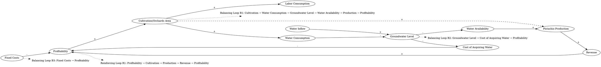

Due to the perfect climatic conditions, government subsidies, and low costs, producers have profited from the pistachio production over the past years. High profitability attracts producers’ attention to more cultivation. Higher rates of cultivation result in an increased level of orchards, which gives rise to the production, with a considerable delay. Increase in orchards area raises labor and water consumption, contributing to production. Since cultivating young orchards requires vast investments and around more than 5 years is needed to reach the highest yield levels, the associated fixed costs prevent the infinite revenue growth and balance the revenue–cost ratio. Moreover, orchards maintenance and materials used for production, labor compensation, and cost of acquiring water control the revenue growth. To have an economically harvestable yield, producers must irrigate orchards frequently. More orchards increase the need for more water; therefore, pumping from the groundwater, as the primary source of water in the region, surges. Accordingly, if the pumping is higher than the inflow to the ground water, which has been the case over the past decades, the ground water level declines, resulting in less available water. Lower water availability reduces pistachio production. Moreover, as the groundwater level decreases, the cost of acquiring water increases. This includes the cost of drilling, pumping, water-well maintenance, and so on, which hugely affects the profitability of farmers. Water inflow includes precipitation and laterflows to the groundwater.
### Step 1: Identify Primary Variables  
The key entities or components in the text are:  

1. **Pistachio Production**  
2. **Profitability**  
3. **Cultivation/Orchards Area**  
4. **Labor Consumption**  
5. **Water Consumption**  
6. **Fixed Costs**  
7. **Revenue**  
8. **Groundwater Level**  
9. **Water Inflow**  
10. **Cost of Acquiring Water**  

---

### Step 2: Break Down Sub-Factors  

For each primary variable, here are the nuanced sub-factors:  

1. **Pistachio Production**  
   - Total pistachio yield  
   - Dependency on orchards area and water availability  
   - Delayed response to increased cultivation  

2. **Profitability**  
   - Revenue minus costs (fixed and variable)  
   - Dependency on production, labor costs, and water costs  

3. **Cultivation/Orchards Area**  
   - Total area of pistachio orchards  
   - Dependency on profitability and investment in new cultivation  
   - Delayed impact on production  

4. **Labor Consumption**  
   - Total labor required for orchard maintenance and harvesting  
   - Dependency on orchards area  

5. **Water Consumption**  
   - Total water required for irrigation  
   - Dependency on orchards area and frequency of irrigation  

6. **Fixed Costs**  
   - Investments in young orchards (e.g., planting, maintenance)  
   - Time delay for orchards to reach peak yield (5+ years)  

7. **Revenue**  
   - Income generated from pistachio production  
   - Dependency on production and market prices  

8. **Groundwater Level**  
   - Total available groundwater in the region  
   - Dependency on water consumption and water inflow  
   - Declines if pumping exceeds inflow  

9. **Water Inflow**  
   - Sources include precipitation and lateral flows to groundwater  
   - Dependency on climatic conditions  

10. **Cost of Acquiring Water**  
   - Includes costs of drilling, pumping, and water-well maintenance  
   - Increases as groundwater levels decline  

---

### Step 3: Causal Relationships  

Here are the causal relationships between the variables:  

1. **Profitability → Cultivation/Orchards Area**  
   - Higher profitability encourages investment in more cultivation.  

2. **Cultivation/Orchards Area → Pistachio Production**  
   - Increased orchards area leads to higher production, with a delay.  

3. **Cultivation/Orchards Area → Labor Consumption**  
   - Larger orchards require more labor for maintenance and harvesting.  

4. **Cultivation/Orchards Area → Water Consumption**  
   - Larger orchards require more water for irrigation.  

5. **Water Consumption → Groundwater Level**  
   - Higher water consumption reduces groundwater levels if pumping exceeds inflow.  

6. **Groundwater Level → Water Availability**  
   - Declining groundwater levels reduce available water for irrigation.  

7. **Water Availability → Pistachio Production**  
   - Lower water availability reduces pistachio production.  

8. **Groundwater Level → Cost of Acquiring Water**  
   - Declining groundwater levels increase the cost of acquiring water.  

9. **Cost of Acquiring Water → Profitability**  
   - Higher water costs reduce profitability.  

10. **Fixed Costs → Profitability**  
    - High fixed costs (e.g., young orchards investment) limit profitability growth.  

11. **Water Inflow → Groundwater Level**  
    - Precipitation and lateral flows replenish groundwater levels.  

12. **Pistachio Production → Revenue**  
    - Higher production increases revenue.  

13. **Revenue → Profitability**  
    - Higher revenue contributes to profitability, but costs (labor, water, fixed) balance it.  

---

### Summary of Key Feedback Loops  

1. **Reinforcing Loop (R1): Profitability → Cultivation → Production → Revenue → Profitability**  
   - Higher profitability encourages more cultivation, leading to higher production and revenue, which further increases profitability.  

2. **Balancing Loop (B1): Cultivation → Water Consumption → Groundwater Level → Water Availability → Production → Profitability**  
   - Increased cultivation raises water consumption, which depletes groundwater levels, reducing water availability and production, ultimately limiting profitability.  

3. **Balancing Loop (B2): Groundwater Level → Cost of Acquiring Water → Profitability**  
   - Declining groundwater levels increase water costs, which reduce profitability and limit further cultivation.  

4. **Balancing Loop (B3): Fixed Costs → Profitability**  
   - High fixed costs for young orchards prevent infinite profitability growth, balancing the system.  

These relationships can be used to construct a detailed Causal Loop Diagram (CLD). Let me know if you'd like further assistance!### Step 3: Causal Relationships  

Here are the causal relationships derived from the text, following the specified format:

---

1. **Profitability --> (+) Cultivation/Orchards Area**  
   **Reasoning:** Higher profitability attracts producers to invest in more cultivation, increasing the total area of orchards.  
   **Relevant Text:** "High profitability attracts producers’ attention to more cultivation."  

---

2. **Cultivation/Orchards Area --> (+) Pistachio Production**  
   **Reasoning:** An increase in the area of orchards leads to higher pistachio production, though with a delay due to the time required for orchards to mature.  
   **Relevant Text:** "Higher rates of cultivation result in an increased level of orchards, which gives rise to the production, with a considerable delay."  

---

3. **Cultivation/Orchards Area --> (+) Labor Consumption**  
   **Reasoning:** Larger orchards require more labor for maintenance and harvesting.  
   **Relevant Text:** "Increase in orchards area raises labor... contributing to production."  

---

4. **Cultivation/Orchards Area --> (+) Water Consumption**  
   **Reasoning:** Larger orchards require more water for irrigation to maintain and grow pistachio trees.  
   **Relevant Text:** "Increase in orchards area raises... water consumption, contributing to production."  

---

5. **Water Consumption --> (-) Groundwater Level**  
   **Reasoning:** Higher water consumption, especially through pumping, reduces the groundwater level if the pumping exceeds natural inflow.  
   **Relevant Text:** "More orchards increase the need for more water; therefore, pumping from the groundwater... surges. Accordingly, if the pumping is higher than the inflow to the groundwater... the groundwater level declines."  

---

6. **Groundwater Level --> (-) Water Availability**  
   **Reasoning:** A decline in groundwater levels reduces the availability of water for irrigation.  
   **Relevant Text:** "The groundwater level declines, resulting in less available water."  

---

7. **Water Availability --> (+) Pistachio Production**  
   **Reasoning:** Adequate water availability is essential for pistachio production, as irrigation is required for an economically viable yield.  
   **Relevant Text:** "Lower water availability reduces pistachio production."  

---

8. **Groundwater Level --> (+) Cost of Acquiring Water**  
   **Reasoning:** As groundwater levels decline, the cost of acquiring water increases due to the need for deeper drilling, more pumping, and maintenance.  
   **Relevant Text:** "As the groundwater level decreases, the cost of acquiring water increases. This includes the cost of drilling, pumping, water-well maintenance, and so on."  

---

9. **Cost of Acquiring Water --> (-) Profitability**  
   **Reasoning:** Higher water costs reduce the overall profitability of pistachio production.  
   **Relevant Text:** "...which hugely affects the profitability of farmers."  

---

10. **Fixed Costs --> (-) Profitability**  
    **Reasoning:** High fixed costs, such as investments in young orchards and maintenance, limit profitability growth.  
    **Relevant Text:** "...the associated fixed costs prevent the infinite revenue growth and balance the revenue–cost ratio."  

---

11. **Water Inflow --> (+) Groundwater Level**  
    **Reasoning:** Precipitation and lateral flows replenish the groundwater level, counteracting the effects of pumping.  
    **Relevant Text:** "Water inflow includes precipitation and lateral flows to the groundwater."  

---

12. **Pistachio Production --> (+) Revenue**  
    **Reasoning:** Higher pistachio production leads to increased revenue from sales.  
    **Relevant Text:** "Producers have profited from the pistachio production over the past years."  

---

13. **Revenue --> (+) Profitability**  
    **Reasoning:** Higher revenue contributes to profitability, though it is balanced by costs such as labor, water, and fixed costs.  
    **Relevant Text:** "Producers have profited from the pistachio production over the past years."  

---

### Summary of Key Feedback Loops  

1. **Reinforcing Loop (R1): Profitability → Cultivation → Production → Revenue → Profitability**  
   - Higher profitability encourages more cultivation, leading to higher production and revenue, which further increases profitability.  

2. **Balancing Loop (B1): Cultivation → Water Consumption → Groundwater Level → Water Availability → Production → Profitability**  
   - Increased cultivation raises water consumption, which depletes groundwater levels, reducing water availability and production, ultimately limiting profitability.  

3. **Balancing Loop (B2): Groundwater Level → Cost of Acquiring Water → Profitability**  
   - Declining groundwater levels increase water costs, which reduce profitability and limit further cultivation.  

4. **Balancing Loop (B3): Fixed Costs → Profitability**  
   - High fixed costs for young orchards prevent infinite profitability growth, balancing the system.  

These relationships and feedback loops can be visualized in a Causal Loop Diagram (CLD) to better understand the dynamics of pistachio production and its sustainability. Let me know if you'd like further clarification or assistance!### Feedback Loops  

1. **Reinforcing Loop (R1): Profitability → Cultivation → Production → Revenue → Profitability**  
   - **Path:** Profitability → (+) Cultivation/Orchards Area → (+) Pistachio Production → (+) Revenue → (+) Profitability  
   - **Explanation:** Higher profitability encourages producers to expand cultivation, which increases pistachio production and revenue, further boosting profitability. This loop drives growth in the system.  

2. **Balancing Loop (B1): Cultivation → Water Consumption → Groundwater Level → Water Availability → Production → Profitability**  
   - **Path:** Cultivation/Orchards Area → (+) Water Consumption → (-) Groundwater Level → (-) Water Availability → (-) Pistachio Production → (-) Profitability  
   - **Explanation:** Increased cultivation raises water consumption, which depletes groundwater levels. This reduces water availability, limiting pistachio production and profitability. This loop stabilizes the system by curbing excessive growth.  

3. **Balancing Loop (B2): Groundwater Level → Cost of Acquiring Water → Profitability**  
   - **Path:** Groundwater Level → (-) Cost of Acquiring Water → (-) Profitability  
   - **Explanation:** Declining groundwater levels increase the cost of acquiring water (e.g., deeper drilling, pumping), which reduces profitability. This loop acts as a constraint on profitability growth.  

4. **Balancing Loop (B3): Fixed Costs → Profitability**  
   - **Path:** Fixed Costs → (-) Profitability  
   - **Explanation:** High fixed costs, such as investments in young orchards and maintenance, limit profitability growth. This loop prevents infinite expansion by balancing revenue and costs.  

---

### Delays  

1. **Cultivation to Production Delay:**  
   - **Description:** There is a significant delay (5+ years) between the establishment of new orchards and their peak production levels. This slows the reinforcing loop (R1) and delays the impact of increased cultivation on profitability.  
   - **Impact:** Producers may overestimate short-term profitability, leading to overinvestment in cultivation.  

2. **Groundwater Replenishment Delay:**  
   - **Description:** Groundwater levels depend on precipitation and lateral flows, which occur over longer timescales. This delay weakens the balancing loops (B1 and B2) by slowing the system’s response to over-pumping.  
   - **Impact:** Groundwater depletion may continue unchecked for years before natural inflows can restore balance.  

3. **Cost Adjustment Delay:**  
   - **Description:** The rising cost of acquiring water (e.g., drilling deeper wells) may not immediately deter cultivation, as producers may initially absorb the costs.  
   - **Impact:** Profitability may decline gradually, delaying the balancing effect of loop B2.  

---

### Suggestions  

1. **Improve Water Efficiency:**  
   - **Action:** Invest in water-saving irrigation technologies (e.g., drip irrigation) to reduce water consumption per unit of cultivation.  
   - **Impact:** This would mitigate the depletion of groundwater levels (B1) and reduce the cost of acquiring water (B2), improving long-term profitability.  

2. **Monitor and Regulate Groundwater Usage:**  
   - **Action:** Implement policies to limit groundwater pumping and encourage sustainable water use.  
   - **Impact:** This would stabilize groundwater levels, ensuring long-term water availability for pistachio production (B1).  

3. **Encourage Diversification:**  
   - **Action:** Promote crop diversification to reduce dependency on pistachio cultivation and its associated water demands.  
   - **Impact:** This would alleviate pressure on groundwater resources and balance the system by reducing water consumption (B1).  

4. **Incentivize Rainwater Harvesting and Recharge:**  
   - **Action:** Provide subsidies or incentives for rainwater harvesting and artificial groundwater recharge projects.  
   - **Impact:** This would increase water inflow to groundwater (B1), counteracting the effects of over-pumping and stabilizing the system.  

5. **Plan Cultivation Growth Strategically:**  
   - **Action:** Use predictive models to align cultivation expansion with water availability and market demand.  
   - **Impact:** This would prevent over-cultivation and ensure that profitability growth (R1) does not outpace resource sustainability.  

By addressing these feedback loops and delays, the pistachio production system can be managed more sustainably, balancing profitability with resource conservation.

---

Here is the Graphviz script to visualize the causal relationships and feedback loops described:

### Explanation of the Script:
1. **Nodes and Edges**:
   - Each variable (e.g., "Profitability", "Cultivation/Orchards Area") is represented as a node.
   - Causal relationships are represented as directed edges with labels indicating the sign of the relationship (`+` for positive, `-` for negative).
   - Delays are indicated with dashed edges (e.g., "Cultivation/Orchards Area" → "Pistachio Production").

2. **Feedback Loops**:
   - Feedback loops are labeled as plaintext nodes (e.g., "Loop R1", "Loop B1").
   - Dotted edges connect the relevant variables to their respective feedback loop labels for clarity.

3. **Layout**:
   - The `rankdir=LR` directive arranges the diagram in a left-to-right layout, making it easier to follow the causal relationships.

### Feedback Loops in the Diagram:
- **Reinforcing Loop R1**: Profitability → Cultivation → Production → Revenue → Profitability.
- **Balancing Loop B1**: Cultivation → Water Consumption → Groundwater Level → Water Availability → Production → Profitability.
- **Balancing Loop B2**: Groundwater Level → Cost of Acquiring Water → Profitability.
- **Balancing Loop B3**: Fixed Costs → Profitability.

This script can be rendered using Graphviz to produce a clear and visually intuitive Causal Loop Diagram (CLD). Let me know if you need further adjustments or explanations!
